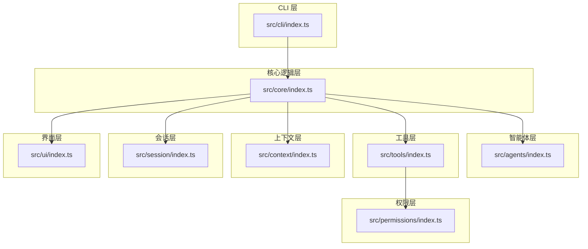
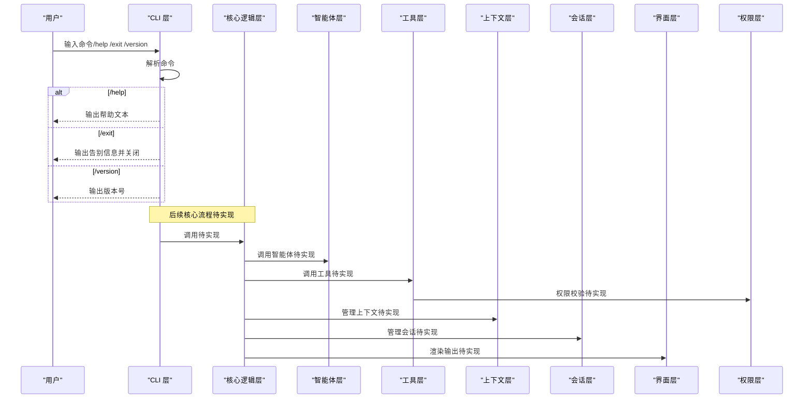
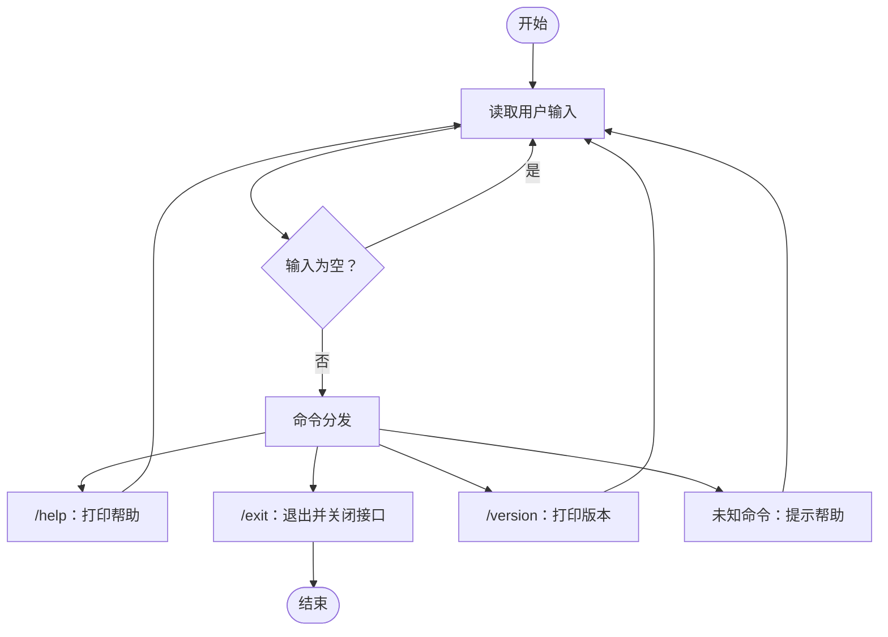
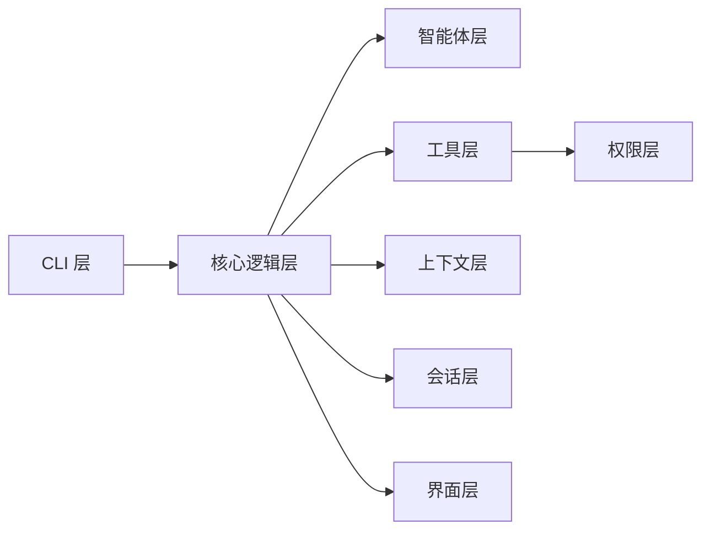

# API参考

<cite>
**本文引用的文件**
- [src/cli/index.ts](file://src/cli/index.ts)
- [src/core/index.ts](file://src/core/index.ts)
- [src/agents/index.ts](file://src/agents/index.ts)
- [src/tools/index.ts](file://src/tools/index.ts)
- [src/context/index.ts](file://src/context/index.ts)
- [src/session/index.ts](file://src/session/index.ts)
- [src/ui/index.ts](file://src/ui/index.ts)
- [src/permissions/index.ts](file://src/permissions/index.ts)
- [package.json](file://package.json)
- [tsconfig.json](file://tsconfig.json)
- [README.md](file://README.md)
- [AGENTS.md](file://AGENTS.md)
</cite>

## 目录
1. [简介](#简介)
2. [项目结构](#项目结构)
3. [核心组件](#核心组件)
4. [架构总览](#架构总览)
5. [详细组件分析](#详细组件分析)
6. [依赖分析](#依赖分析)
7. [性能考虑](#性能考虑)
8. [故障排除指南](#故障排除指南)
9. [结论](#结论)
10. [附录](#附录)

## 简介
本文件为 easy-agent-cli 的 API 参考文档，面向使用者与开发者，系统性梳理 CLI 模块、核心逻辑模块、智能体模块、工具模块等各层的公开接口与端点，提供参数说明、返回值定义、使用示例、错误处理、调用关系、版本信息与变更历史、性能与使用限制、最佳实践与注意事项。

项目当前处于早期阶段，CLI 层已实现基础命令交互；其余模块（core、agents、tools、context、session、ui、permissions）以分层设计预留扩展点，当前仅保留占位文件，后续将按架构规范逐步完善。

**章节来源**
- [README.md:1-3](file://README.md#L1-L3)
- [AGENTS.md:3-42](file://AGENTS.md#L3-L42)

## 项目结构
项目采用分层架构，目录结构清晰，职责边界明确。CLI 作为入口层负责命令解析与 REPL 交互；核心逻辑层负责 Agent 调度与流程编排；智能体层、工具层、上下文层、会话层、UI 层与权限层分别承担各自职责，并遵循“上层可依赖下层”的依赖规则。

**图示来源**
- [AGENTS.md:29-42](file://AGENTS.md#L29-L42)
- [src/cli/index.ts:1-65](file://src/cli/index.ts#L1-L65)
- [src/core/index.ts:1-2](file://src/core/index.ts#L1-L2)
- [src/agents/index.ts:1-2](file://src/agents/index.ts#L1-L2)
- [src/tools/index.ts:1-2](file://src/tools/index.ts#L1-L2)
- [src/context/index.ts:1-2](file://src/context/index.ts#L1-L2)
- [src/session/index.ts:1-2](file://src/session/index.ts#L1-L2)
- [src/ui/index.ts:1-2](file://src/ui/index.ts#L1-L2)
- [src/permissions/index.ts:1-2](file://src/permissions/index.ts#L1-L2)

**章节来源**
- [AGENTS.md:15-42](file://AGENTS.md#L15-L42)
- [tsconfig.json:1-24](file://tsconfig.json#L1-L24)

## 核心组件
本节对各层公开 API 进行系统化梳理，结合 AGENTS.md 的分层职责与依赖规则，给出接口定义、参数、返回值、使用示例、错误处理与最佳实践。

- CLI 层（命令行入口）
  - 公共命令
    - /help：显示帮助文本
      - 参数：无
      - 返回：标准输出打印帮助文本
      - 示例：输入 /help
      - 错误处理：无
      - 最佳实践：在启动后首次交互时提示该命令
    - /exit：退出程序
      - 参数：无
      - 返回：关闭 readline 接口并退出进程
      - 示例：输入 /exit
      - 错误处理：异常时捕获并退出码 1
      - 最佳实践：优雅关闭资源，确保 finally 中释放 readline
    - /version：显示版本号
      - 参数：无
      - 返回：标准输出打印版本号
      - 示例：输入 /version
      - 错误处理：无
      - 最佳实践：与包版本保持一致，便于诊断
  - 版本信息与变更历史
    - 包版本：见 package.json 的 version 字段
    - CLI 内部版本号：见 CLI 文件中的版本常量
    - 变更历史：当前仓库未提供独立变更日志，建议遵循提交规范进行记录
  - 性能与使用限制
    - REPL 循环为同步阻塞式读取，适合小型交互任务
    - 输入为空时跳过处理，避免无效计算
  - 错误处理
    - 主流程异常通过全局 catch 捕获并输出错误信息，随后以非零退出码结束
  - 调用关系
    - CLI 层依赖核心逻辑层（待实现）与 UI 层（终端输出）

- 核心逻辑层（待实现）
  - 当前占位文件，未暴露具体 API
  - 预期职责：Agent 调度、消息路由、流程编排
  - 依赖关系：依赖 agents、tools、context、session、ui
  - 最佳实践：保持纯调度逻辑，避免在该层编写业务实现

- 智能体层（待实现）
  - 当前占位文件，未暴露具体 API
  - 预期职责：Agent 定义、注册与生命周期管理
  - 依赖关系：依赖 tools、context
  - 最佳实践：通过统一 index.ts 导出公共 API，内部实现不对外暴露

- 工具层（待实现）
  - 当前占位文件，未暴露具体 API
  - 预期职责：内置工具与工具注册机制
  - 依赖关系：依赖 permissions
  - 最佳实践：工具注册与调用需经权限层校验

- 上下文层（待实现）
  - 当前占位文件，未暴露具体 API
  - 预期职责：对话上下文管理与记忆
  - 注意事项：需关注 token 限制管理

- 会话层（待实现）
  - 当前占位文件，未暴露具体 API
  - 预期职责：会话状态管理与持久化
  - 注意事项：应考虑持久化场景

- 界面层（待实现）
  - 当前占位文件，未暴露具体 API
  - 预期职责：终端渲染与用户交互
  - 注意事项：无下层依赖

- 权限层（待实现）
  - 当前占位文件，未暴露具体 API
  - 预期职责：工具调用权限与安全控制
  - 注意事项：工具调用必须经过权限层校验

**章节来源**
- [src/cli/index.ts:6-64](file://src/cli/index.ts#L6-L64)
- [src/core/index.ts:1-2](file://src/core/index.ts#L1-L2)
- [src/agents/index.ts:1-2](file://src/agents/index.ts#L1-L2)
- [src/tools/index.ts:1-2](file://src/tools/index.ts#L1-L2)
- [src/context/index.ts:1-2](file://src/context/index.ts#L1-L2)
- [src/session/index.ts:1-2](file://src/session/index.ts#L1-L2)
- [src/ui/index.ts:1-2](file://src/ui/index.ts#L1-L2)
- [src/permissions/index.ts:1-2](file://src/permissions/index.ts#L1-L2)
- [AGENTS.md:29-42](file://AGENTS.md#L29-L42)

## 架构总览
下图展示 CLI 与核心逻辑层的交互流程，以及核心逻辑层对下层模块的依赖关系。

**图示来源**
- [src/cli/index.ts:23-64](file://src/cli/index.ts#L23-L64)
- [AGENTS.md:29-42](file://AGENTS.md#L29-L42)

## 详细组件分析

### CLI 模块 API
- 命令列表与行为
  - /help
    - 功能：打印帮助文本
    - 参数：无
    - 返回：标准输出
    - 使用示例：在 CLI 中输入 /help
    - 错误处理：无
    - 最佳实践：首次进入时自动提示
  - /exit
    - 功能：退出程序
    - 参数：无
    - 返回：关闭 readline 接口并退出
    - 使用示例：在 CLI 中输入 /exit
    - 错误处理：异常时捕获并以退出码 1 结束
    - 最佳实践：确保 finally 中释放资源
  - /version
    - 功能：打印版本号
    - 参数：无
    - 返回：标准输出
    - 使用示例：在 CLI 中输入 /version
    - 错误处理：无
    - 最佳实践：与包版本保持一致

- 版本与变更历史
  - 包版本：参见 package.json 的 version 字段
  - CLI 内部版本号：参见 CLI 文件中的版本常量
  - 变更历史：当前仓库未提供独立变更日志，建议遵循提交规范进行记录

- 错误处理
  - 主流程异常通过全局 catch 捕获并输出错误信息，随后以非零退出码结束

- 性能与使用限制
  - REPL 循环为同步阻塞式读取，适合小型交互任务
  - 输入为空时跳过处理，避免无效计算

**图示来源**
- [src/cli/index.ts:33-59](file://src/cli/index.ts#L33-L59)

**章节来源**
- [src/cli/index.ts:6-64](file://src/cli/index.ts#L6-L64)
- [package.json:1-32](file://package.json#L1-L32)

### 核心逻辑模块 API（待实现）
- 预期职责
  - Agent 调度、消息路由、流程编排
- 依赖关系
  - 依赖 agents、tools、context、session、ui
- 最佳实践
  - 保持纯调度逻辑，避免在该层编写业务实现

**章节来源**
- [AGENTS.md:29-42](file://AGENTS.md#L29-L42)
- [src/core/index.ts:1-2](file://src/core/index.ts#L1-L2)

### 智能体模块 API（待实现）
- 预期职责
  - Agent 定义、注册与生命周期管理
- 依赖关系
  - 依赖 tools、context
- 最佳实践
  - 通过统一 index.ts 导出公共 API，内部实现不对外暴露

**章节来源**
- [AGENTS.md:29-42](file://AGENTS.md#L29-L42)
- [src/agents/index.ts:1-2](file://src/agents/index.ts#L1-L2)

### 工具模块 API（待实现）
- 预期职责
  - 内置工具与工具注册机制
- 依赖关系
  - 依赖 permissions
- 最佳实践
  - 工具注册与调用需经权限层校验

**章节来源**
- [AGENTS.md:29-42](file://AGENTS.md#L29-L42)
- [src/tools/index.ts:1-2](file://src/tools/index.ts#L1-L2)

### 上下文模块 API（待实现）
- 预期职责
  - 对话上下文管理与记忆
- 注意事项
  - 需关注 token 限制管理

**章节来源**
- [AGENTS.md:29-42](file://AGENTS.md#L29-L42)
- [src/context/index.ts:1-2](file://src/context/index.ts#L1-L2)

### 会话模块 API（待实现）
- 预期职责
  - 会话状态管理与持久化
- 注意事项
  - 应考虑持久化场景

**章节来源**
- [AGENTS.md:29-42](file://AGENTS.md#L29-L42)
- [src/session/index.ts:1-2](file://src/session/index.ts#L1-L2)

### 界面模块 API（待实现）
- 预期职责
  - 终端渲染与用户交互
- 注意事项
  - 无下层依赖

**章节来源**
- [AGENTS.md:29-42](file://AGENTS.md#L29-L42)
- [src/ui/index.ts:1-2](file://src/ui/index.ts#L1-L2)

### 权限模块 API（待实现）
- 预期职责
  - 工具调用权限与安全控制
- 注意事项
  - 工具调用必须经过权限层校验

**章节来源**
- [AGENTS.md:29-42](file://AGENTS.md#L29-L42)
- [src/permissions/index.ts:1-2](file://src/permissions/index.ts#L1-L2)

## 依赖分析
- 分层依赖规则
  - 上层可依赖下层，下层不可依赖上层
  - 同层之间尽量避免直接依赖
- 具体依赖
  - CLI → core, ui
  - core → agents, tools, context, session, ui
  - tools → permissions
  - 其余层为无下层依赖或内部协作

**图示来源**
- [AGENTS.md:29-42](file://AGENTS.md#L29-L42)

**章节来源**
- [AGENTS.md:29-42](file://AGENTS.md#L29-L42)

## 性能考虑
- CLI 层
  - REPL 循环为同步阻塞式读取，适合小型交互任务
  - 输入为空时跳过处理，避免无效计算
- 上下文层
  - 需注意 token 限制管理，避免上下文过大导致性能问题
- 会话层
  - 应考虑持久化场景，减少重复加载成本
- 工具层
  - 工具调用需经权限层校验，避免不必要的开销

[本节为通用指导，无需特定文件来源]

## 故障排除指南
- CLI 层
  - 若出现异常，主流程会捕获并输出错误信息，随后以非零退出码结束
  - 建议在 finally 中确保 readline 接口被正确关闭
- 权限层
  - 工具调用必须经过权限层校验，若权限不足会导致调用失败
- 会话层
  - 若会话数据异常，建议检查持久化存储与序列化方式

**章节来源**
- [src/cli/index.ts:61-64](file://src/cli/index.ts#L61-L64)
- [AGENTS.md:95-101](file://AGENTS.md#L95-L101)

## 结论
easy-agent-cli 当前以 CLI 层为核心入口，提供基础命令交互；其余模块以占位文件形式预留扩展空间。建议按照 AGENTS.md 的分层职责与依赖规则，逐步完善各层 API 设计与实现，确保接口清晰、职责单一、依赖可控，并遵循编码规范与最佳实践。

[本节为总结性内容，无需特定文件来源]

## 附录

### 版本与变更历史
- 包版本：见 package.json 的 version 字段
- CLI 内部版本号：见 CLI 文件中的版本常量
- 变更历史：当前仓库未提供独立变更日志，建议遵循提交规范进行记录

**章节来源**
- [package.json:1-32](file://package.json#L1-L32)
- [src/cli/index.ts:21](file://src/cli/index.ts#L21)

### 开发与运行命令
- 安装依赖：npm install
- 开发模式（热重载）：npm run dev
- 构建：npm run build
- 运行构建产物：npm start

**章节来源**
- [AGENTS.md:68-82](file://AGENTS.md#L68-L82)