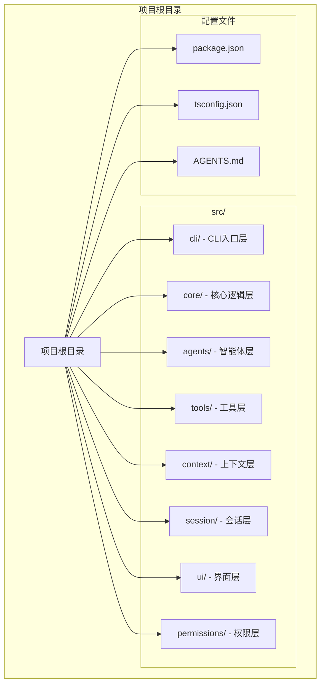
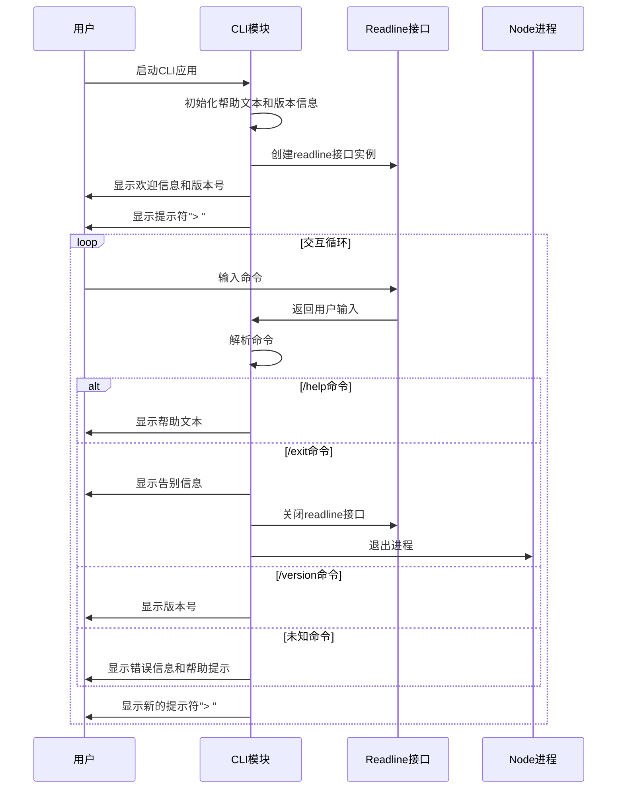
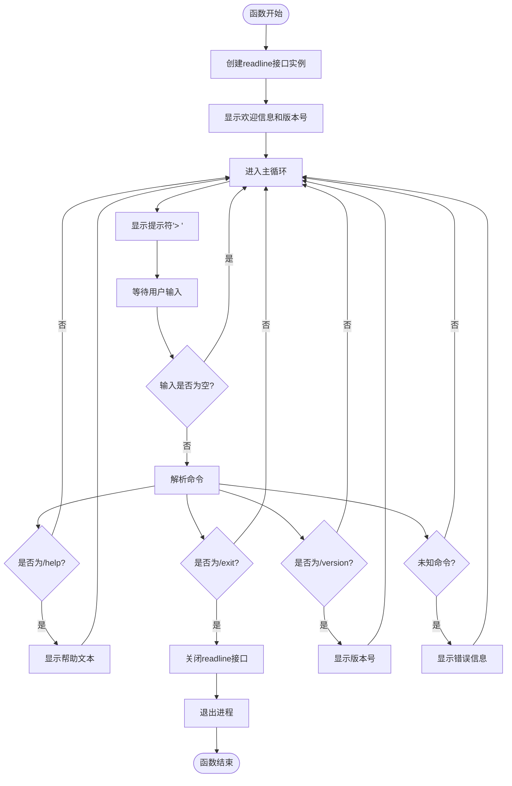
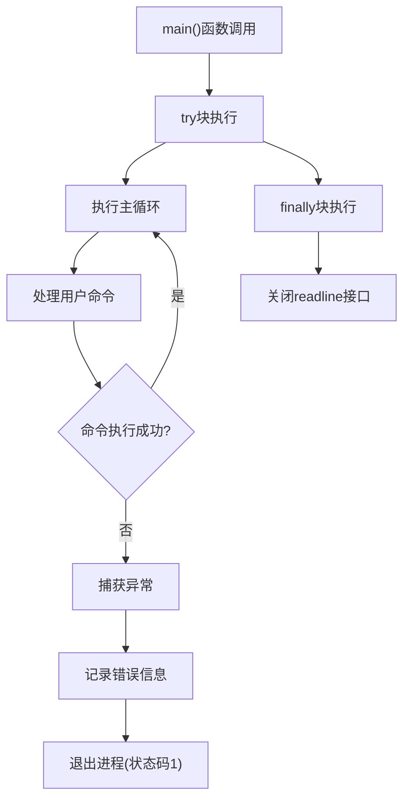
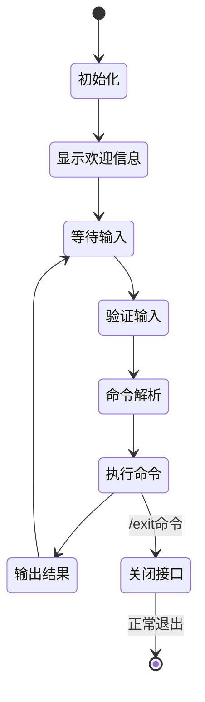
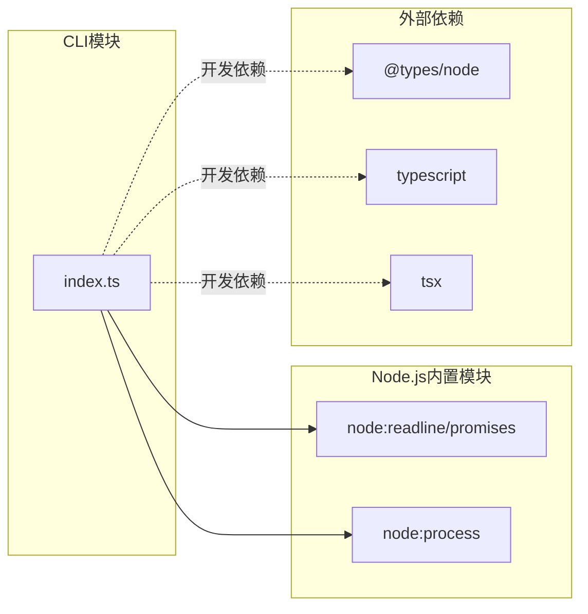
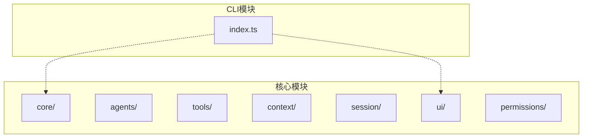

# CLI模块API

<cite>
**本文档引用的文件**
- [src/cli/index.ts](file://src/cli/index.ts)
- [package.json](file://package.json)
- [README.md](file://README.md)
- [AGENTS.md](file://AGENTS.md)
- [tsconfig.json](file://tsconfig.json)
</cite>

## 更新摘要
**变更内容**
- 完整实现了CLI模块的REPL交互功能
- 新增了帮助文本常量和版本号常量
- 实现了完整的命令处理机制
- 添加了错误处理和资源清理机制
- 更新了项目架构说明以反映实际实现

## 目录
1. [简介](#简介)
2. [项目结构](#项目结构)
3. [核心组件](#核心组件)
4. [架构概览](#架构概览)
5. [详细组件分析](#详细组件分析)
6. [依赖关系分析](#依赖关系分析)
7. [性能考虑](#性能考虑)
8. [故障排除指南](#故障排除指南)
9. [结论](#结论)

## 简介

CLI模块是easy-agent-cli项目的核心入口点，提供了一个基于Node.js readline模块的命令行交互界面。该模块实现了REPL（读取-求值-打印循环）交互模式，允许用户通过命令行与智能体进行多轮对话。CLI模块采用分层架构设计，遵循ESM（ECMAScript Modules）标准，支持TypeScript开发和构建。

**章节来源**
- [AGENTS.md:15-27](file://AGENTS.md#L15-L27)
- [package.json:1-32](file://package.json#L1-L32)

## 项目结构

CLI模块位于`src/cli/`目录下，是整个应用的入口点。项目采用清晰的分层架构，CLI模块作为最外层负责用户交互和命令路由。



**图表来源**
- [AGENTS.md:15-27](file://AGENTS.md#L15-L27)
- [package.json:1-32](file://package.json#L1-L32)

**章节来源**
- [AGENTS.md:15-27](file://AGENTS.md#L15-L27)
- [package.json:1-32](file://package.json#L1-L32)

## 核心组件

CLI模块包含以下核心组件：

### 主入口函数
- **名称**: `main()`
- **类型**: `async function`
- **返回值**: `Promise<void>`
- **作用**: CLI模块的主要执行入口，启动REPL交互循环

### 帮助文本常量
- **名称**: `HELP_TEXT`
- **类型**: `string`
- **作用**: 存储CLI帮助信息的完整文本内容

### 版本号常量
- **名称**: `VERSION`
- **类型**: `string`
- **值**: `"0.0.01"`
- **作用**: 存储CLI模块的版本信息

### 命令处理器
- **名称**: `/help` - 显示帮助信息
- **名称**: `/exit` - 退出程序
- **名称**: `/version` - 显示版本号

**章节来源**
- [src/cli/index.ts:6-21](file://src/cli/index.ts#L6-L21)
- [src/cli/index.ts:23-59](file://src/cli/index.ts#L23-L59)

## 架构概览

CLI模块采用事件驱动的REPL架构，通过Node.js readline模块实现异步输入输出处理。



**图表来源**
- [src/cli/index.ts:23-59](file://src/cli/index.ts#L23-L59)

**章节来源**
- [src/cli/index.ts:23-59](file://src/cli/index.ts#L23-L59)

## 详细组件分析

### 主入口函数 main()

主入口函数是CLI模块的核心执行逻辑，负责启动REPL交互循环和处理用户输入。

#### 函数签名
```typescript
async function main(): Promise<void>
```

#### 参数说明
- 无参数

#### 返回值定义
- 返回Promise<void>，表示异步执行完成

#### 处理流程



**图表来源**
- [src/cli/index.ts:23-59](file://src/cli/index.ts#L23-L59)

#### 使用示例

**章节来源**
- [src/cli/index.ts:23-59](file://src/cli/index.ts#L23-L59)

### 帮助文本常量 HELP_TEXT

帮助文本常量存储了CLI应用的完整帮助信息，包括使用说明、可用命令列表和功能描述。

#### 常量定义
```typescript
const HELP_TEXT = `
easy-agent-cli - 简易 CLI 智能体

用法:
  easy-agent [命令]

可用命令:
  /help       显示帮助信息
  /exit       退出程序
  /version    显示版本号

描述:
  一个轻量级的命令行智能体工具，支持多轮对话与工具调用。
`;
```

#### 结构说明
- 包含应用名称和简要描述
- 提供基本使用语法
- 列出所有可用命令及其功能
- 描述应用的核心功能特性

**章节来源**
- [src/cli/index.ts:6-19](file://src/cli/index.ts#L6-L19)

### 版本号常量 VERSION

版本号常量存储CLI模块的当前版本信息。

#### 常量定义
```typescript
const VERSION = "0.0.01";
```

#### 使用场景
- 在应用启动时显示版本信息
- 在用户请求版本信息时输出
- 用于调试和问题排查

**章节来源**
- [src/cli/index.ts:21](file://src/cli/index.ts#L21)

### 错误处理机制

CLI模块采用了完善的错误处理策略，确保应用程序的稳定性和用户体验。



**图表来源**
- [src/cli/index.ts:61-64](file://src/cli/index.ts#L61-L64)

#### 错误处理策略
- 使用try-catch块包装主循环
- 在finally块中确保资源清理
- 通过process.exit(1)优雅退出
- 提供友好的错误信息输出

**章节来源**
- [src/cli/index.ts:61-64](file://src/cli/index.ts#L61-L64)

### REPL交互模式实现

CLI模块实现了完整的REPL（读取-求值-打印循环）交互模式，提供了流畅的用户交互体验。

#### 交互特性
- **异步输入**: 使用`rl.question()`实现非阻塞输入
- **自动补全**: 通过readline模块提供基础的输入补全功能
- **历史记录**: 支持上下箭头键浏览历史输入
- **实时响应**: 命令执行后立即反馈结果

#### 事件循环机制



**图表来源**
- [src/cli/index.ts:33-58](file://src/cli/index.ts#L33-L58)

**章节来源**
- [src/cli/index.ts:33-58](file://src/cli/index.ts#L33-L58)

## 依赖关系分析

CLI模块的依赖关系相对简单，主要依赖于Node.js内置的readline模块和进程模块。



**图表来源**
- [src/cli/index.ts:3-4](file://src/cli/index.ts#L3-L4)
- [package.json:26-30](file://package.json#L26-L30)

### 内部依赖关系

根据项目的分层架构设计，CLI模块与其他模块存在以下依赖关系：



**图表来源**
- [AGENTS.md:29-41](file://AGENTS.md#L29-L41)

**章节来源**
- [src/cli/index.ts:3-4](file://src/cli/index.ts#L3-L4)
- [package.json:26-30](file://package.json#L26-L30)
- [AGENTS.md:29-41](file://AGENTS.md#L29-L41)

## 性能考虑

CLI模块在设计时充分考虑了性能和用户体验：

### 内存管理
- 使用`finally`块确保readline接口正确关闭
- 避免在主循环中创建不必要的对象
- 及时释放内存资源

### I/O优化
- 使用异步I/O操作避免阻塞
- 合理的缓冲区大小设置
- 及时刷新输出流

### 错误恢复
- 单个命令失败不影响整体运行
- 自动重启机制确保服务连续性

## 故障排除指南

### 常见问题及解决方案

#### 1. 应用无法启动
**症状**: 执行`easy-agent`命令时报错
**原因**: 
- Node.js版本不兼容
- 模块未正确安装
- 权限问题

**解决方案**:
- 确认Node.js版本符合要求
- 重新安装依赖包
- 检查文件执行权限

#### 2. REPL界面异常
**症状**: 输入无响应或显示异常字符
**原因**:
- 终端编码问题
- readline模块初始化失败

**解决方案**:
- 检查终端编码设置
- 更新Node.js版本
- 重启应用

#### 3. 命令执行错误
**症状**: 输入有效命令但出现错误
**原因**:
- 代码逻辑错误
- 环境配置问题

**解决方案**:
- 查看错误日志
- 检查环境变量
- 重新构建项目

**章节来源**
- [src/cli/index.ts:61-64](file://src/cli/index.ts#L61-L64)

## 结论

CLI模块作为easy-agent-cli项目的核心入口，成功实现了简洁而功能完整的命令行交互界面。该模块具有以下特点：

### 设计优势
- **简洁明了**: 仅包含必要的功能，避免过度复杂化
- **易于维护**: 清晰的代码结构和完善的错误处理
- **扩展性强**: 为后续功能扩展预留了良好的架构基础

### 功能完整性
- 完整的REPL交互模式
- 标准化的命令处理机制
- 友好的用户界面和错误提示

### 发展前景
随着项目架构的完善，CLI模块可以进一步扩展：
- 支持更多命令和功能
- 集成更丰富的工具调用能力
- 提供更高级的会话管理和上下文处理

该模块为整个easy-agent-cli项目奠定了坚实的基础，为用户提供了一个高效、可靠的命令行交互平台。

**章节来源**
- [AGENTS.md:15-27](file://AGENTS.md#L15-L27)
- [package.json:1-32](file://package.json#L1-L32)