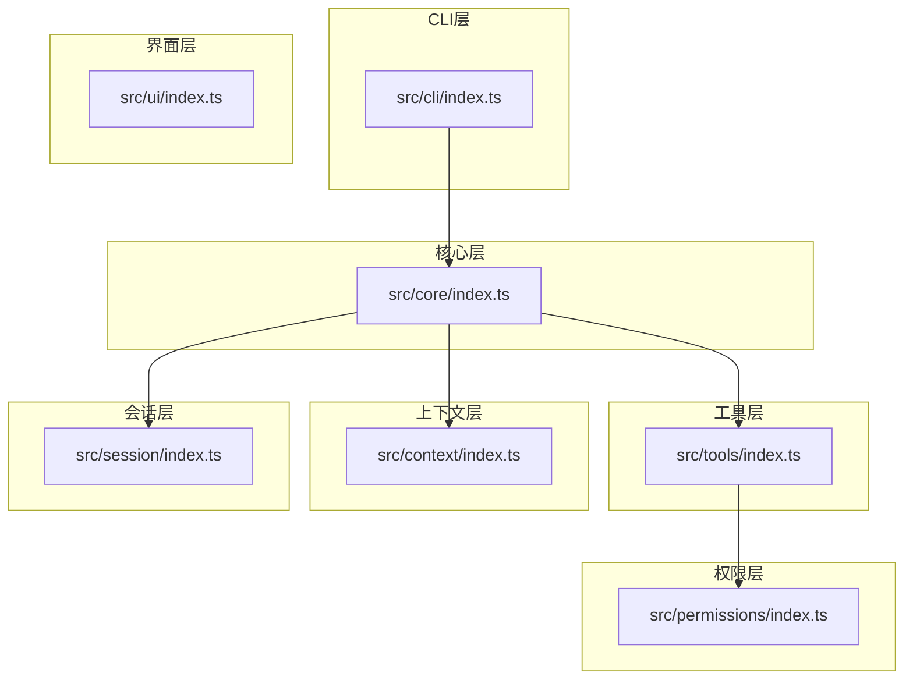
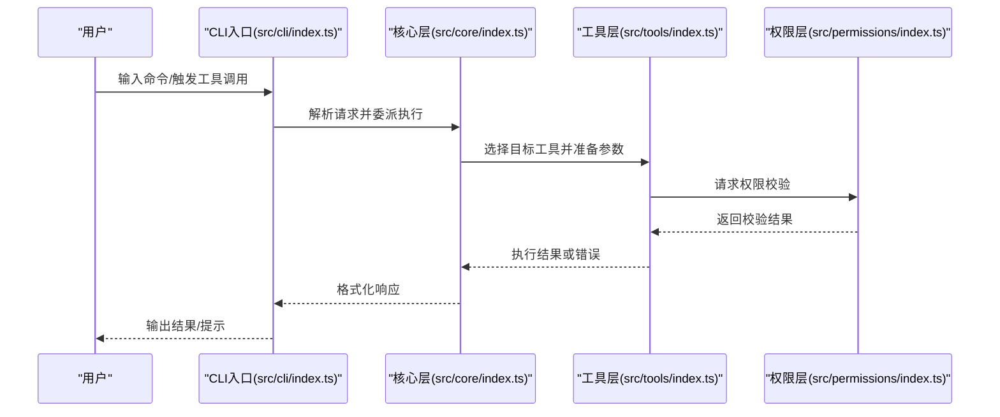
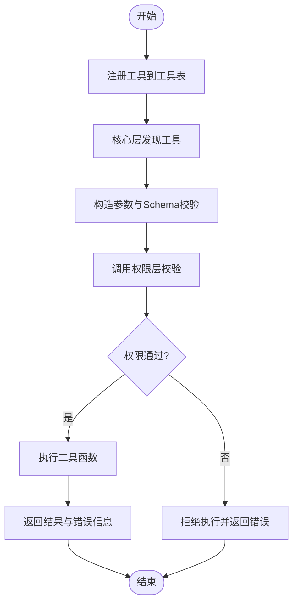
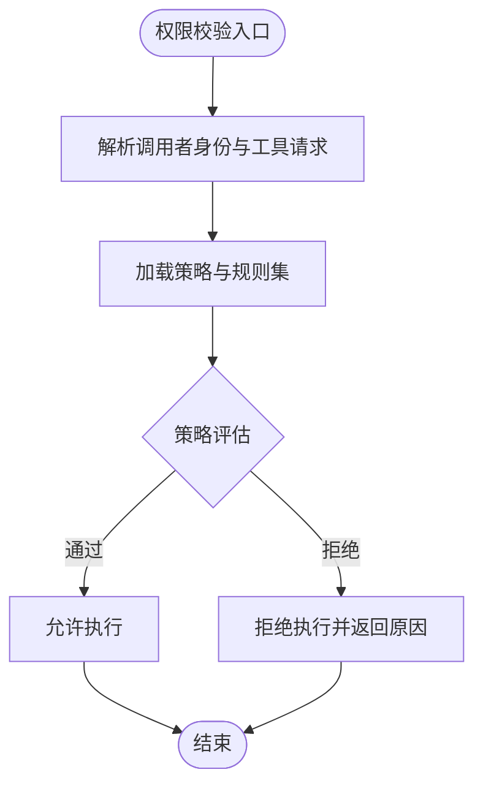
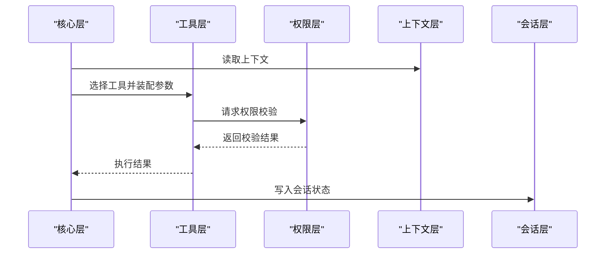
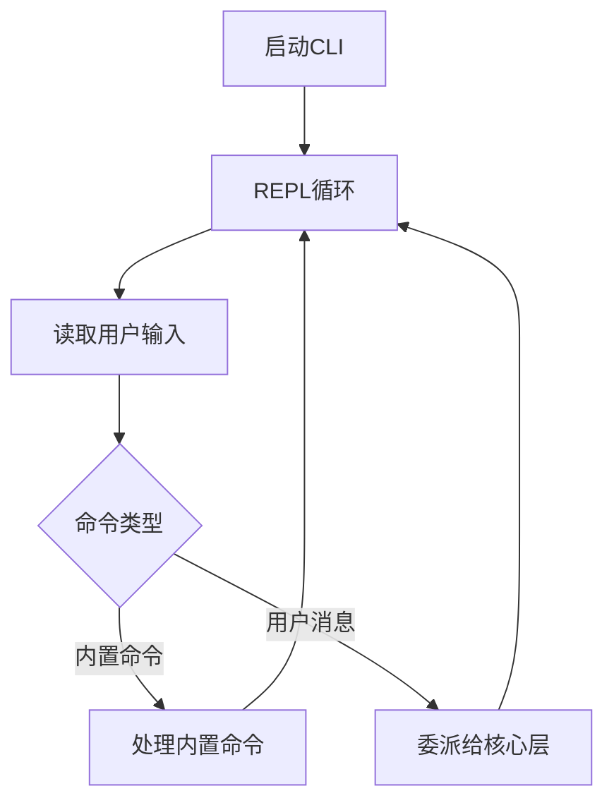
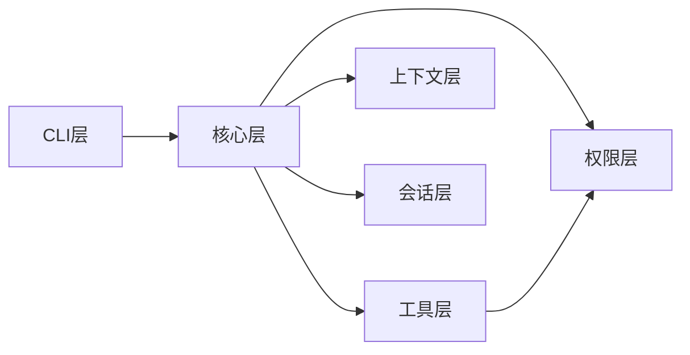

# 工具模块API

<cite>
**本文引用的文件**
- [src/tools/index.ts](file://src/tools/index.ts)
- [src/permissions/index.ts](file://src/permissions/index.ts)
- [src/core/index.ts](file://src/core/index.ts)
- [src/context/index.ts](file://src/context/index.ts)
- [src/session/index.ts](file://src/session/index.ts)
- [src/ui/index.ts](file://src/ui/index.ts)
- [src/cli/index.ts](file://src/cli/index.ts)
- [AGENTS.md](file://AGENTS.md)
- [package.json](file://package.json)
</cite>

## 目录
1. [简介](#简介)
2. [项目结构](#项目结构)
3. [核心组件](#核心组件)
4. [架构总览](#架构总览)
5. [详细组件分析](#详细组件分析)
6. [依赖分析](#依赖分析)
7. [性能考虑](#性能考虑)
8. [故障排查指南](#故障排查指南)
9. [结论](#结论)
10. [附录](#附录)

## 简介
本文件面向“工具模块”的API文档，聚焦于工具的注册、执行与管理接口，涵盖工具定义、调用流程、权限控制、安全策略、扩展与自定义开发指南、工具间依赖与调用链路、性能监控与错误处理机制等。  
根据仓库现有内容，工具层（tools）与权限层（permissions）在架构上被明确划分：工具层负责工具实现与注册，权限层负责工具调用的权限校验与安全策略；核心层（core）作为调度中枢，协调工具与权限层完成工具执行。

## 项目结构
仓库采用分层架构，工具模块位于 tools 层，权限模块位于 permissions 层，核心模块位于 core 层，CLI 入口位于 cli 层。各层职责清晰，遵循“上层可依赖下层，下层不可依赖上层”的依赖规则。

图表来源
- [AGENTS.md:31-41](file://AGENTS.md#L31-L41)
- [src/cli/index.ts:1-65](file://src/cli/index.ts#L1-L65)
- [src/core/index.ts:1-2](file://src/core/index.ts#L1-L2)
- [src/tools/index.ts:1-2](file://src/tools/index.ts#L1-L2)
- [src/permissions/index.ts:1-2](file://src/permissions/index.ts#L1-L2)
- [src/context/index.ts:1-2](file://src/context/index.ts#L1-L2)
- [src/session/index.ts:1-2](file://src/session/index.ts#L1-L2)
- [src/ui/index.ts](file://src/ui/index.ts)

章节来源
- [AGENTS.md:15-41](file://AGENTS.md#L15-L41)
- [src/cli/index.ts:1-65](file://src/cli/index.ts#L1-L65)

## 核心组件
- 工具层（tools）
  - 职责：工具实现与注册机制
  - 依赖：权限层（permissions），用于调用前的权限校验
- 权限层（permissions）
  - 职责：工具调用权限校验与安全策略
  - 依赖：无下层依赖
- 核心层（core）
  - 职责：Agent 调度、消息路由、流程编排
  - 依赖：agents、tools、context、session
- CLI层（cli）
  - 职责：命令解析与交互入口
  - 依赖：core、ui

章节来源
- [AGENTS.md:29-41](file://AGENTS.md#L29-L41)
- [src/tools/index.ts:1-2](file://src/tools/index.ts#L1-L2)
- [src/permissions/index.ts:1-2](file://src/permissions/index.ts#L1-L2)
- [src/core/index.ts:1-2](file://src/core/index.ts#L1-L2)
- [src/cli/index.ts:1-65](file://src/cli/index.ts#L1-L65)

## 架构总览
工具模块的调用链路从 CLI 层进入，经核心层调度，选择合适的工具并进行权限校验，最终由工具层执行具体动作。权限层贯穿工具执行前后，确保安全策略生效。

图表来源
- [AGENTS.md:31-41](file://AGENTS.md#L31-L41)
- [src/cli/index.ts:23-59](file://src/cli/index.ts#L23-L59)
- [src/core/index.ts:1-2](file://src/core/index.ts#L1-L2)
- [src/tools/index.ts:1-2](file://src/tools/index.ts#L1-L2)
- [src/permissions/index.ts:1-2](file://src/permissions/index.ts#L1-L2)

## 详细组件分析

### 工具层（tools）API
- 注册机制
  - 工具注册：通过工具层的注册接口将工具加入全局工具表，供核心层调度使用。注册时建议提供工具元数据（名称、描述、参数Schema、权限标识等）。
  - 工具发现：核心层通过工具表查询目标工具，按名称或类别匹配，决定是否执行及如何传递参数。
- 工具定义
  - 工具签名：工具函数应具备统一的调用签名，包含输入参数对象与返回值对象，便于权限层与核心层统一对接。
  - 参数Schema：对输入参数进行Schema约束，确保权限校验与执行阶段的数据一致性。
  - 返回值约定：工具返回值应包含成功标志、结果数据与错误信息，便于上层统一处理。
- 工具执行
  - 执行入口：核心层根据工具名称从工具表中定位工具，构造参数并调用工具函数。
  - 执行上下文：工具执行可读取上下文层提供的上下文信息（如历史消息、用户角色等），以增强语义理解与行为控制。
- 工具管理
  - 生命周期：工具注册后可被多次复用；支持禁用/启用、版本化管理与动态卸载。
  - 配置化：工具可通过配置项调整行为（如超时、并发数、缓存策略等）。

图表来源
- [src/tools/index.ts:1-2](file://src/tools/index.ts#L1-L2)
- [src/permissions/index.ts:1-2](file://src/permissions/index.ts#L1-L2)
- [src/core/index.ts:1-2](file://src/core/index.ts#L1-L2)

章节来源
- [src/tools/index.ts:1-2](file://src/tools/index.ts#L1-L2)
- [AGENTS.md:36](file://AGENTS.md#L36)

### 权限层（permissions）API
- 权限模型
  - 角色/资源/动作（RRA）模型：定义角色对工具资源的访问权限集合。
  - 动态授权：支持基于上下文的动态授权决策（如时间窗口、配额、黑白名单）。
- 校验流程
  - 入参校验：接收工具名称、调用者身份、请求参数等，进行基础合法性检查。
  - 策略评估：依据预设策略（白名单/黑名单、角色映射、配额限制）进行评估。
  - 结果回传：返回允许/拒绝与原因码，供工具层与核心层处理。
- 安全策略
  - 最小权限原则：默认拒绝，显式授权才放行。
  - 失败即阻断：权限校验失败时立即中断工具执行。
  - 可审计性：记录每次权限校验的日志，便于追踪与审计。

图表来源
- [src/permissions/index.ts:1-2](file://src/permissions/index.ts#L1-L2)
- [AGENTS.md:98](file://AGENTS.md#L98)

章节来源
- [src/permissions/index.ts:1-2](file://src/permissions/index.ts#L1-L2)
- [AGENTS.md:98](file://AGENTS.md#L98)

### 核心层（core）API
- 调度职责
  - 工具选择：根据用户意图、上下文与工具表，选择最合适的工具。
  - 参数装配：将上下文与用户输入整合为工具所需参数，并进行Schema校验。
  - 执行编排：串并行组合多个工具，形成复杂工作流。
- 与工具层/权限层协作
  - 在调用工具前先请求权限校验，再执行工具；若失败则中断并反馈错误。
  - 将工具执行结果标准化，交由UI层渲染或继续后续流程。
- 与上下文/会话层集成
  - 读取上下文以提升工具语义理解；将工具执行结果写入会话，支撑多轮对话。

图表来源
- [src/core/index.ts:1-2](file://src/core/index.ts#L1-L2)
- [src/tools/index.ts:1-2](file://src/tools/index.ts#L1-L2)
- [src/permissions/index.ts:1-2](file://src/permissions/index.ts#L1-L2)
- [src/context/index.ts:1-2](file://src/context/index.ts#L1-L2)
- [src/session/index.ts:1-2](file://src/session/index.ts#L1-L2)

章节来源
- [src/core/index.ts:1-2](file://src/core/index.ts#L1-L2)
- [AGENTS.md:34](file://AGENTS.md#L34)

### CLI层（cli）API
- 命令解析
  - 支持内置命令：帮助、退出、版本等；用户输入的自然语言或指令将由核心层进一步解析。
- 交互体验
  - REPL循环：持续读取用户输入，展示帮助与版本信息，处理异常并优雅退出。
- 与核心层集成
  - CLI仅负责输入输出与命令路由，实际业务逻辑由核心层完成。

图表来源
- [src/cli/index.ts:23-59](file://src/cli/index.ts#L23-L59)

章节来源
- [src/cli/index.ts:1-65](file://src/cli/index.ts#L1-L65)

## 依赖分析
- 层级依赖
  - CLI → 核心层
  - 核心层 → 工具层、权限层、上下文层、会话层
  - 工具层 → 权限层
- 耦合与内聚
  - 工具层与权限层通过统一的校验接口耦合，保持高内聚与低耦合。
  - 核心层作为编排中心，聚合多层能力，避免直接依赖底层实现细节。
- 循环依赖
  - 严格遵循“上层可依赖下层”的规则，未见循环依赖迹象。

图表来源
- [AGENTS.md:31-41](file://AGENTS.md#L31-L41)

章节来源
- [AGENTS.md:31-41](file://AGENTS.md#L31-L41)

## 性能考虑
- 工具执行性能
  - 并发控制：对高开销工具设置并发上限，避免资源争用。
  - 缓存策略：对重复计算或外部依赖调用结果进行缓存，减少延迟。
  - 超时与重试：为外部调用设置合理超时与指数退避重试。
- 权限校验性能
  - 短路策略：快速失败路径优先，避免不必要的策略评估。
  - 规则索引：对常用规则建立索引，加速匹配。
- 核心层编排性能
  - 工具组合：对可并行工具进行并行执行，对串行工具进行流水线编排。
  - 上下文裁剪：仅保留必要上下文，降低序列化与传输成本。
- 监控指标
  - 关键指标：工具执行耗时、成功率、失败率、并发数、缓存命中率。
  - 告警阈值：为关键指标设定阈值，异常时自动告警。

## 故障排查指南
- 常见问题
  - 工具未注册：确认工具已在工具层完成注册，且名称一致。
  - 权限拒绝：检查权限层策略配置，核对调用者角色与工具权限映射。
  - 参数不合法：检查参数Schema与必填字段，确保类型与范围正确。
  - 执行超时：优化工具内部逻辑或增加超时阈值，必要时引入缓存。
- 排查步骤
  - 启用调试日志：记录工具选择、参数装配、权限校验与执行结果。
  - 分段测试：分别测试工具层与权限层的独立功能，定位问题边界。
  - 回滚策略：对新工具或策略变更进行灰度发布，快速回滚。
- 错误处理
  - 统一错误码：为不同错误场景定义清晰的错误码与提示。
  - 降级策略：在网络或外部服务不稳定时，提供降级方案（如本地缓存、默认值）。

## 结论
工具模块通过“工具层 + 权限层 + 核心层”的协作，实现了可扩展、可审计、可监控的工具调用体系。工具注册与发现、权限校验与安全策略、以及跨层的调用链路均在现有架构中得到清晰体现。建议在后续迭代中补充具体的工具接口定义、权限策略配置样例与性能监控埋点示例，以完善API文档的落地性与可操作性。

## 附录
- 快速开始
  - 安装与运行：参考开发命令与构建脚本，使用 npm run dev 或 npm run build。
  - 扩展工具：在工具层新增工具实现并通过注册接口接入，确保提供参数Schema与最小权限策略。
- 参考命令
  - 开发模式：npm run dev
  - 构建产物：npm run build
  - 运行构建：npm start

章节来源
- [AGENTS.md:68-82](file://AGENTS.md#L68-L82)
- [package.json:10-14](file://package.json#L10-L14)