# 智能体模块API

<cite>
**本文引用的文件**
- [src/agents/index.ts](file://src/agents/index.ts)
- [src/core/index.ts](file://src/core/index.ts)
- [src/cli/index.ts](file://src/cli/index.ts)
- [src/context/index.ts](file://src/context/index.ts)
- [src/session/index.ts](file://src/session/index.ts)
- [src/tools/index.ts](file://src/tools/index.ts)
- [src/ui/index.ts](file://src/ui/index.ts)
- [src/permissions/index.ts](file://src/permissions/index.ts)
- [AGENTS.md](file://AGENTS.md)
- [package.json](file://package.json)
</cite>

## 更新摘要
**变更内容**
- 基于新增的智能体架构文档AGENTS.md更新了架构设计
- 更新了七层架构设计规范和模块交互机制
- 完善了编码规范和开发命令说明
- 重新组织了模块依赖关系和职责边界

## 目录
1. [简介](#简介)
2. [项目概述](#项目概述)
3. [技术栈](#技术栈)
4. [目录结构](#目录结构)
5. [架构分层说明](#架构分层说明)
6. [编码规范](#编码规范)
7. [核心组件](#核心组件)
8. [架构总览](#架构总览)
9. [详细组件分析](#详细组件分析)
10. [依赖分析](#依赖分析)
11. [开发命令](#开发命令)
12. [性能考量](#性能考量)
13. [故障排查指南](#故障排查指南)
14. [结论](#结论)
15. [附录](#附录)

## 简介
本文件面向"智能体模块"的API与开发实践，基于全新的七层架构设计，聚焦于Agent的定义、注册与生命周期管理接口，涵盖Agent创建、配置、启动、停止等能力；解释Agent注册机制与动态加载过程；提供状态管理与监控接口；给出Agent扩展与自定义开发指南；记录Agent间通信协议与消息传递机制。

## 项目概述
easy-agent-cli 是一个基于 TypeScript + Node.js 的轻量级命令行智能体工具。采用分层架构设计，支持多轮对话与工具调用。

## 技术栈
- **语言**: TypeScript 5.5+
- **运行时**: Node.js 20+
- **模块系统**: ESM (`"type": "module"`)
- **构建工具**: tsc
- **开发工具**: tsx (热重载)

## 目录结构
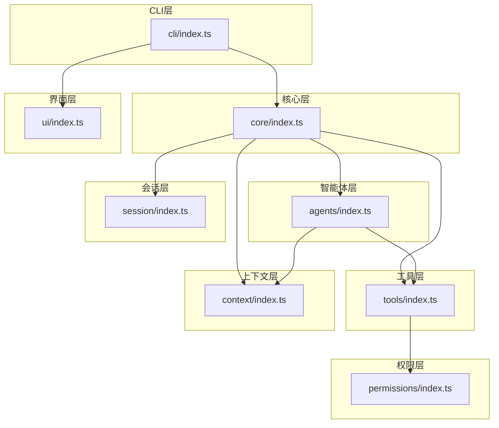

**章节来源**
- [AGENTS.md:15-27](file://AGENTS.md#L15-L27)
- [package.json:1-32](file://package.json#L1-L32)

## 架构分层说明
| 层级 | 职责 | 依赖方向 |
|------|------|----------|
| cli | 入口、命令路由、REPL 交互 | → core, ui |
| core | Agent 调度、消息路由、流程编排 | → agents, tools, context, session |
| agents | Agent 实现、能力定义 | → tools, context |
| tools | 工具实现与注册 | → permissions |
| context | 上下文构建与管理 | 无下层依赖 |
| session | 会话状态与历史管理 | 无下层依赖 |
| ui | 终端渲染、格式化输出 | 无下层依赖 |
| permissions | 权限校验与安全策略 | 无下层依赖 |

**依赖规则**: 上层可依赖下层，下层不可依赖上层。同层之间尽量避免直接依赖。

**章节来源**
- [AGENTS.md:29-42](file://AGENTS.md#L29-L42)

## 编码规范

### 命名约定
- **文件名**: `kebab-case.ts` (如 `agent-runner.ts`)
- **类名**: `PascalCase` (如 `AgentRunner`)
- **函数/变量**: `camelCase` (如 `runAgent`)
- **常量**: `UPPER_SNAKE_CASE` (如 `MAX_RETRIES`)
- **接口**: `I` 前缀 (如 `IAgent`)
- **类型**: `PascalCase` (如 `AgentConfig`)

### 代码风格
- 使用 ESM `import/export`，禁止 `require()`
- 优先使用 `interface` 定义类型，复杂联合类型用 `type`
- 所有函数必须有明确的返回类型注解
- 异步操作统一使用 `async/await`
- 错误处理使用自定义 Error 类

### 模块导出
- 每个层通过 `index.ts` 统一导出公共 API
- 内部实现文件不直接对外暴露

**章节来源**
- [AGENTS.md:44-67](file://AGENTS.md#L44-L67)

## 核心组件
- **智能体层（agents）**：负责Agent的定义、注册与生命周期管理，向上依赖tools与context，向下不依赖其他层。
- **核心层（core）**：负责Agent调度、消息路由与流程编orchestration，向上依赖agents、tools、context、session，向下不依赖其他层。
- **工具层（tools）**：负责工具实现与注册，向上依赖permissions。
- **上下文层（context）**：负责上下文构建与管理，独立存在。
- **会话层（session）**：负责会话状态与历史管理，独立存在。
- **权限层（permissions）**：负责权限校验与安全策略，独立存在。
- **界面层（ui）**：负责终端渲染与格式化输出，独立存在。
- **CLI层（cli）**：负责命令解析与REPL交互，向上依赖core与ui。

**章节来源**
- [AGENTS.md:29-42](file://AGENTS.md#L29-L42)

## 架构总览
下图展示各层之间的依赖方向与职责边界，体现"上层可依赖下层，下层不可依赖上层"的约束。

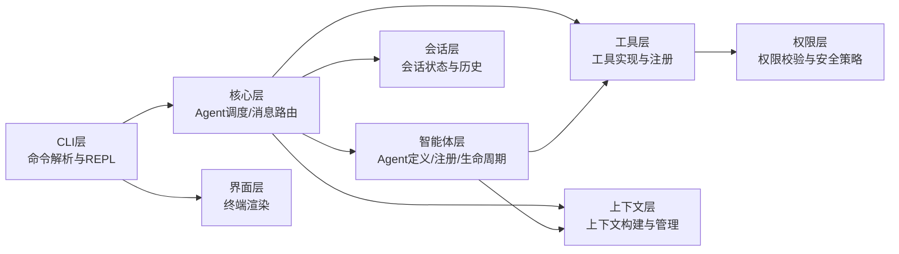

**图表来源**
- [AGENTS.md:29-42](file://AGENTS.md#L29-L42)
- [src/cli/index.ts:1-65](file://src/cli/index.ts#L1-L65)
- [src/core/index.ts:1-2](file://src/core/index.ts#L1-L2)
- [src/agents/index.ts:1-2](file://src/agents/index.ts#L1-L2)
- [src/tools/index.ts:1-1](file://src/tools/index.ts#L1-L1)
- [src/context/index.ts:1-1](file://src/context/index.ts#L1-L1)
- [src/session/index.ts:1-1](file://src/session/index.ts#L1-L1)
- [src/ui/index.ts:1-1](file://src/ui/index.ts#L1-L1)
- [src/permissions/index.ts:1-1](file://src/permissions/index.ts#L1-L1)

## 详细组件分析

### 智能体层（agents）API设计建议
- **设计目标**
  - 提供Agent的统一定义接口与生命周期管理方法
  - 支持Agent注册、动态加载与卸载
  - 提供状态查询与监控接口
  - 保证与tools、context的解耦协作

- **推荐接口（基于规范命名约定与职责）**
  - `IAgent`：智能体接口，定义能力与生命周期钩子
  - `AgentConfig`：智能体配置类型
  - `AgentRegistry`：智能体注册表，提供注册、注销、查找、枚举等方法
  - `AgentRunner`：智能体运行器，负责启动、停止、重启、状态查询
  - `AgentMonitor`：智能体监控器，提供指标采集与告警

- **关键流程示意（概念性）**
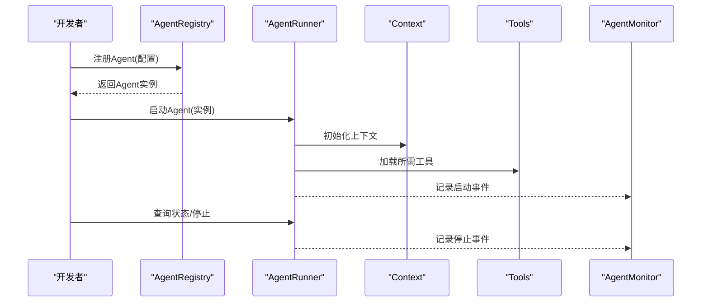

**说明**
- 该图为概念流程，用于指导API设计与调用顺序，非现有实现映射。

**章节来源**
- [AGENTS.md:44-67](file://AGENTS.md#L44-L67)

### 核心层（core）API设计建议
- **设计目标**
  - 统一调度Agent，进行消息路由与流程编排
  - 协调agents、tools、context、session的协作

- **推荐接口**
  - `AgentScheduler`：Agent调度器，负责任务派发与优先级管理
  - `MessageRouter`：消息路由器，负责消息分发与转发
  - `WorkflowEngine`：工作流引擎，负责流程编排与状态机

- **关键流程示意（概念性）**
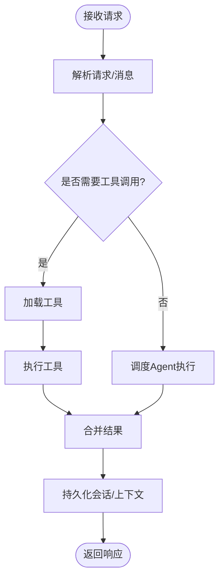

**说明**
- 该图为概念流程，用于指导核心调度与消息路由的设计思路。

**章节来源**
- [AGENTS.md:29-42](file://AGENTS.md#L29-L42)

### 工具层（tools）API设计建议
- **设计目标**
  - 提供工具注册与发现机制
  - 与权限层集成，确保调用安全

- **推荐接口**
  - `ITool`：工具接口，定义工具签名与元数据
  - `ToolRegistry`：工具注册表，提供注册、查找、禁用等方法
  - `ToolExecutor`：工具执行器，负责执行与结果封装

- **关键流程示意（概念性）**
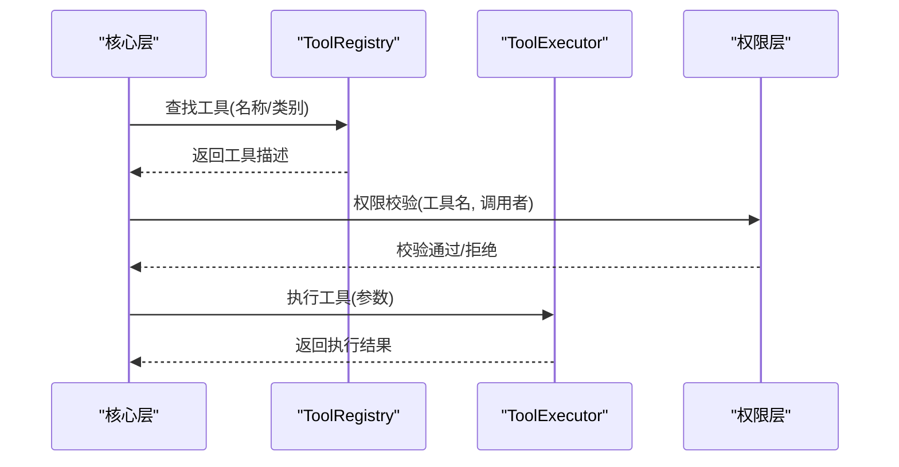

**说明**
- 该图为概念流程，用于指导工具注册与调用的安全控制。

**章节来源**
- [AGENTS.md:29-42](file://AGENTS.md#L29-L42)

### 上下文层（context）API设计建议
- **设计目标**
  - 构建与管理对话上下文，控制token上限与截断策略

- **推荐接口**
  - `IContext`：上下文接口，定义上下文构建与裁剪
  - `TokenManager`：Token管理器，负责token统计与阈值控制

- **关键流程示意（概念性）**
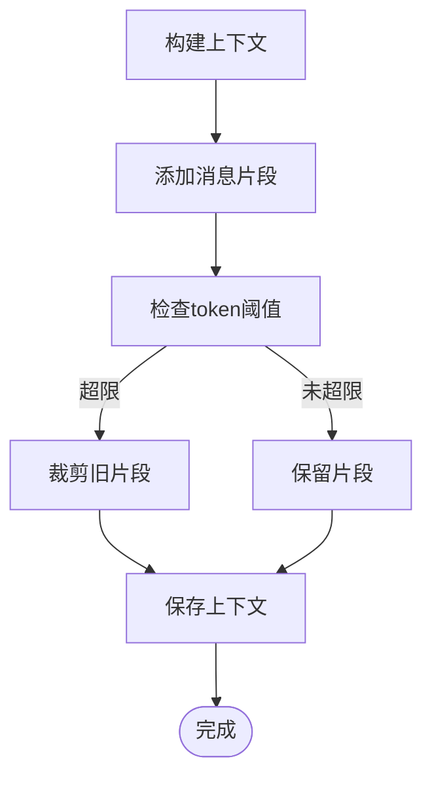

**说明**
- 该图为概念流程，用于指导上下文构建与token管理。

**章节来源**
- [AGENTS.md:95-100](file://AGENTS.md#L95-L100)

### 会话层（session）API设计建议
- **设计目标**
  - 管理会话状态与历史，支持持久化与恢复

- **推荐接口**
  - `ISession`：会话接口，定义会话创建、更新、查询、删除
  - `SessionStore`：会话存储器，负责持久化与检索

- **关键流程示意（概念性）**
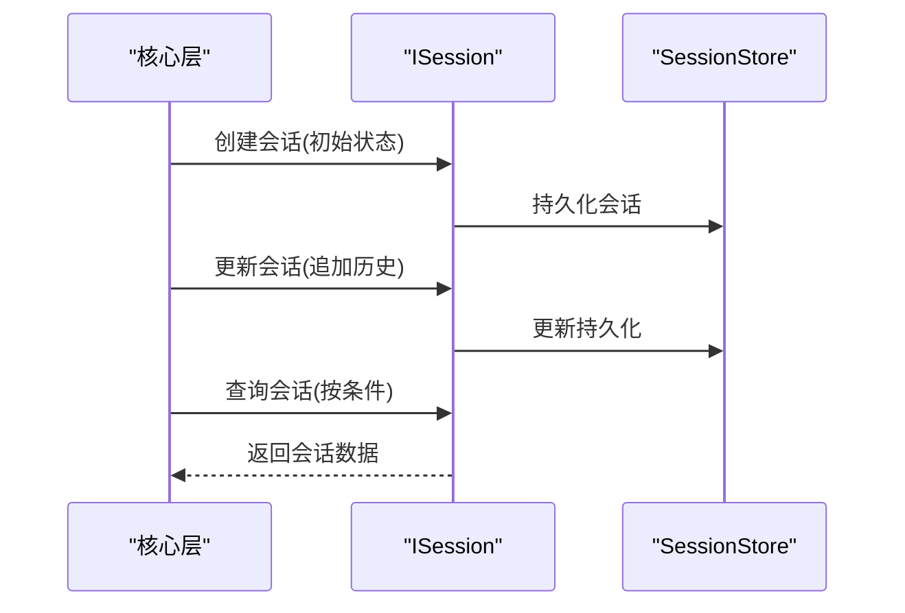

**说明**
- 该图为概念流程，用于指导会话状态管理与持久化。

**章节来源**
- [AGENTS.md:99-100](file://AGENTS.md#L99-L100)

### 权限层（permissions）API设计建议
- **设计目标**
  - 提供权限校验与安全策略，确保工具调用安全

- **推荐接口**
  - `IPermission`：权限接口，定义权限模型与策略
  - `PermissionChecker`：权限检查器，负责校验与决策

- **关键流程示意（概念性）**
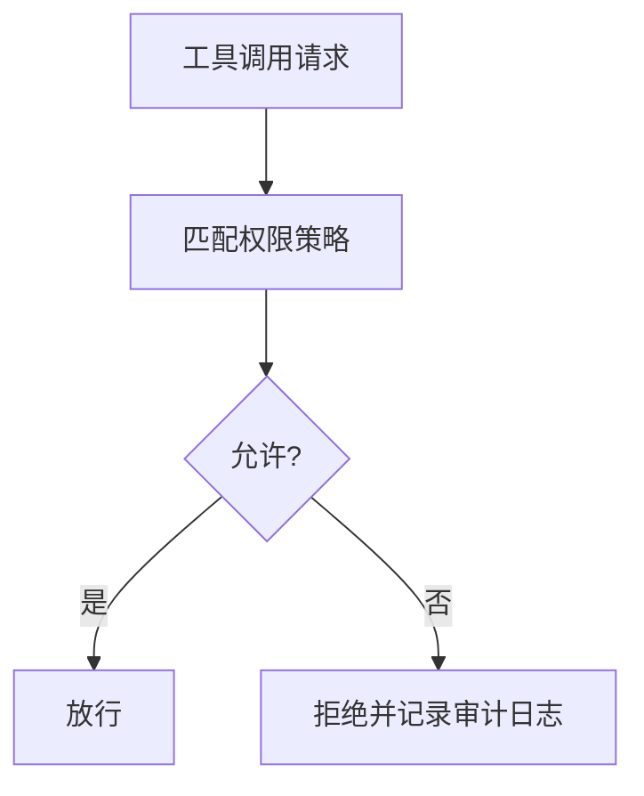

**说明**
- 该图为概念流程，用于指导权限校验与审计。

**章节来源**
- [AGENTS.md:97-98](file://AGENTS.md#L97-L98)

### 界面层（ui）API设计建议
- **设计目标**
  - 提供终端渲染与格式化输出，提升用户体验

- **推荐接口**
  - `IRenderer`：渲染器接口，定义输出格式与样式
  - `Formatter`：格式化器，负责消息与状态的格式化

- **关键流程示意（概念性）**
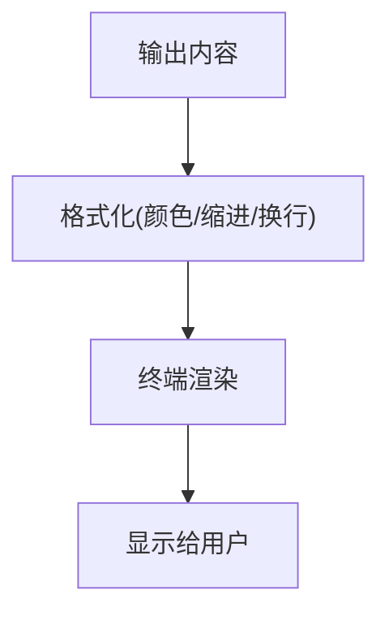

**说明**
- 该图为概念流程，用于指导UI渲染与输出。

**章节来源**
- [AGENTS.md:33-39](file://AGENTS.md#L33-L39)

### CLI层（cli）API设计建议
- **当前实现**
  - 提供基础命令：/help、/exit、/version
  - 使用Node readline实现REPL交互

- **可扩展点**
  - 增加Agent管理命令：创建、启动、停止、列表、状态查询
  - 增加工具管理命令：注册、卸载、列表
  - 增加会话管理命令：新建、切换、清空、导出

- **关键流程示意（概念性）**
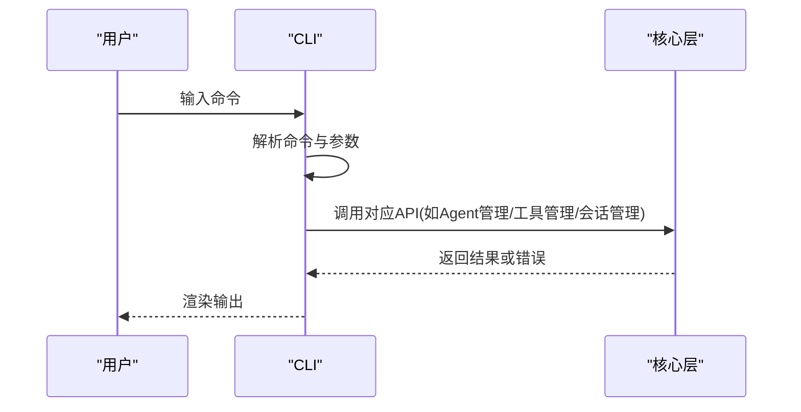

**说明**
- 该图为概念流程，用于指导CLI命令扩展与交互设计。

**章节来源**
- [src/cli/index.ts:1-65](file://src/cli/index.ts#L1-L65)

## 依赖分析
- **依赖规则**
  - 上层可依赖下层，下层不可依赖上层
  - 同层之间尽量避免直接依赖
- **依赖关系**
  - CLI → 核心层、界面层
  - 核心层 → 智能体层、工具层、上下文层、会话层
  - 智能体层 → 工具层、上下文层
  - 工具层 → 权限层
  - 上下文层、会话层、权限层、界面层：无下层依赖

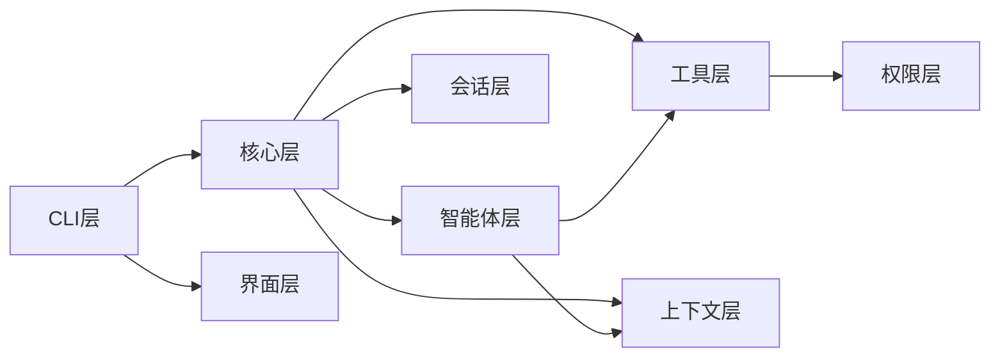

**图表来源**
- [AGENTS.md:42-42](file://AGENTS.md#L42-L42)

**章节来源**
- [AGENTS.md:42-42](file://AGENTS.md#L42-L42)

## 开发命令
```bash
# 安装依赖
npm install

# 开发模式 (热重载)
npm run dev

# 构建
npm run build

# 运行构建产物
npm start
```

**章节来源**
- [AGENTS.md:68-82](file://AGENTS.md#L68-L82)
- [package.json:10-14](file://package.json#L10-L14)

## 性能考量
- 分层解耦降低耦合度，提高可维护性与可测试性
- 上下文与会话的持久化应考虑异步与缓存策略，避免阻塞主流程
- 工具调用应引入超时与重试机制，结合权限校验减少无效调用
- CLI交互建议采用非阻塞IO与批量输出，优化用户体验

## 故障排查指南
- **常见问题**
  - 命令解析失败：检查CLI命令表与参数解析逻辑
  - Agent启动失败：检查Agent注册表、配置与依赖工具
  - 工具调用被拒绝：检查权限策略与调用者身份
  - 上下文溢出：检查token阈值与裁剪策略
  - 会话持久化异常：检查存储后端与并发写入

- **建议措施**
  - 在核心层增加统一错误包装与日志记录
  - 在AgentRunner中增加健康检查与自动重启策略
  - 在ToolExecutor中增加超时与熔断保护
  - 在CLI层增加命令帮助与参数校验

## 结论
本项目以清晰的七层架构为基础，为Agent模块预留了充分的扩展空间。尽管当前源码仍以占位文件为主，但通过规范化的接口设计与流程图示，可以指导后续实现。建议优先完成核心层与智能体层的接口定义与最小可用实现，再逐步完善工具层、上下文层、会话层与权限层的配套能力。

## 附录
- **开发命令**
  - 安装依赖：npm install
  - 开发模式（热重载）：npm run dev
  - 构建：npm run build
  - 运行构建产物：npm start

**章节来源**
- [AGENTS.md:68-82](file://AGENTS.md#L68-L82)
- [package.json:10-14](file://package.json#L10-L14)