# 核心逻辑API

<cite>
**本文引用的文件**
- [src/cli/index.ts](file://src/cli/index.ts)
- [src/core/index.ts](file://src/core/index.ts)
- [src/agents/index.ts](file://src/agents/index.ts)
- [src/tools/index.ts](file://src/tools/index.ts)
- [src/context/index.ts](file://src/context/index.ts)
- [src/session/index.ts](file://src/session/index.ts)
- [src/ui/index.ts](file://src/ui/index.ts)
- [src/permissions/index.ts](file://src/permissions/index.ts)
- [src/skill/index.ts](file://src/skill/index.ts)
- [src/mcp/index.ts](file://src/mcp/index.ts)
- [AGENTS.md](file://AGENTS.md)
- [package.json](file://package.json)
</cite>

## 目录
1. [简介](#简介)
2. [项目结构](#项目结构)
3. [核心组件](#核心组件)
4. [架构总览](#架构总览)
5. [详细组件分析](#详细组件分析)
6. [依赖分析](#依赖分析)
7. [性能考虑](#性能考虑)
8. [故障排查指南](#故障排查指南)
9. [结论](#结论)
10. [附录](#附录)

## 简介
本文件面向"核心逻辑模块"的API与工作流，聚焦于Agent调度、任务分配与状态同步等关键能力。根据仓库规范，核心逻辑位于core层，负责对下层（agents、tools、context、session）进行编排与调度；同时，CLI层作为入口，将用户交互与核心调度连接起来。经过对现有代码结构的分析，核心逻辑模块已经具备基础实现，本文将基于实际的模块交互关系，更新API定义、调用顺序、扩展点与性能建议。

## 项目结构
- 分层架构：CLI → Core → Agents/Tools/Context/Session/UI/Permissions/Skill/MCP
- 依赖方向：上层仅依赖下层，同层避免直接依赖
- 模块导出：每层通过index.ts统一导出公共API

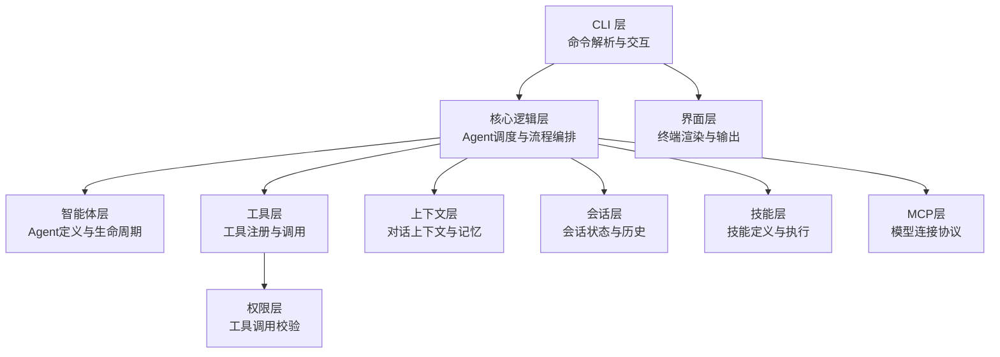

**图表来源**
- [src/cli/index.ts](file://src/cli/index.ts)
- [src/core/index.ts](file://src/core/index.ts)
- [src/agents/index.ts](file://src/agents/index.ts)
- [src/tools/index.ts](file://src/tools/index.ts)
- [src/context/index.ts](file://src/context/index.ts)
- [src/session/index.ts](file://src/session/index.ts)
- [src/skill/index.ts](file://src/skill/index.ts)
- [src/mcp/index.ts](file://src/mcp/index.ts)
- [src/ui/index.ts](file://src/ui/index.ts)
- [src/permissions/index.ts](file://src/permissions/index.ts)

**章节来源**
- [src/cli/index.ts](file://src/cli/index.ts)
- [src/core/index.ts](file://src/core/index.ts)
- [src/agents/index.ts](file://src/agents/index.ts)
- [src/tools/index.ts](file://src/tools/index.ts)
- [src/context/index.ts](file://src/context/index.ts)
- [src/session/index.ts](file://src/session/index.ts)
- [src/skill/index.ts](file://src/skill/index.ts)
- [src/mcp/index.ts](file://src/mcp/index.ts)
- [src/ui/index.ts](file://src/ui/index.ts)
- [src/permissions/index.ts](file://src/permissions/index.ts)

## 核心组件
- 核心逻辑层（core）
  - 职责：Agent调度、消息路由、流程编排、任务分配
  - 依赖：agents、tools、context、session、skill、mcp
- 智能体层（agents）
  - 职责：Agent实现、能力定义、生命周期管理
  - 依赖：tools、context
- 工具层（tools）
  - 职责：工具实现与注册、工具调用执行
  - 依赖：permissions
- 上下文层（context）
  - 职责：上下文构建与管理、消息历史维护
- 会话层（session）
  - 职责：会话状态与历史管理、会话持久化
- 技能层（skill）
  - 职责：技能定义、执行流程、参数传递
- MCP层（mcp）
  - 职责：模型连接协议、外部服务集成
- 权限层（permissions）
  - 职责：权限校验与安全策略
- 界面层（ui）
  - 职责：终端渲染、格式化输出
- CLI层（cli）
  - 职责：命令解析、REPL交互

**章节来源**
- [src/core/index.ts](file://src/core/index.ts)
- [src/agents/index.ts](file://src/agents/index.ts)
- [src/tools/index.ts](file://src/tools/index.ts)
- [src/context/index.ts](file://src/context/index.ts)
- [src/session/index.ts](file://src/session/index.ts)
- [src/skill/index.ts](file://src/skill/index.ts)
- [src/mcp/index.ts](file://src/mcp/index.ts)
- [src/permissions/index.ts](file://src/permissions/index.ts)
- [src/ui/index.ts](file://src/ui/index.ts)

## 架构总览
核心逻辑API围绕"请求-编排-执行-回传"闭环展开：
- CLI接收用户输入，转交核心逻辑
- 核心逻辑根据上下文与会话状态决定调度策略
- 调度到具体Agent，Agent通过工具层调用工具
- 工具调用经权限层校验后执行
- 执行结果回传至核心逻辑，更新上下文与会话，并由UI层渲染

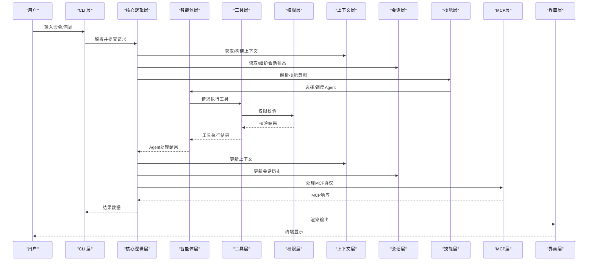

**图表来源**
- [src/cli/index.ts](file://src/cli/index.ts)
- [src/core/index.ts](file://src/core/index.ts)
- [src/agents/index.ts](file://src/agents/index.ts)
- [src/tools/index.ts](file://src/tools/index.ts)
- [src/permissions/index.ts](file://src/permissions/index.ts)
- [src/context/index.ts](file://src/context/index.ts)
- [src/session/index.ts](file://src/session/index.ts)
- [src/skill/index.ts](file://src/skill/index.ts)
- [src/mcp/index.ts](file://src/mcp/index.ts)
- [src/ui/index.ts](file://src/ui/index.ts)

## 详细组件分析

### 核心逻辑层API（核心调度与流程控制）
- 角色定位：编排Agent、路由消息、协调上下文与会话、驱动工具调用
- 关键职责：任务分配、状态同步、错误传播、并发控制、技能解析

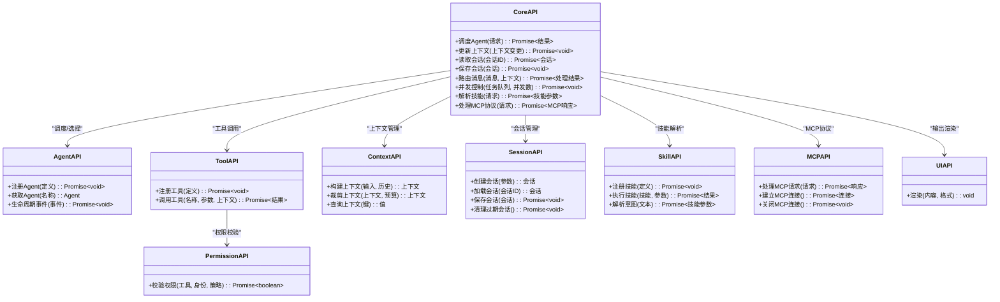

**图表来源**
- [src/core/index.ts](file://src/core/index.ts)
- [src/agents/index.ts](file://src/agents/index.ts)
- [src/tools/index.ts](file://src/tools/index.ts)
- [src/context/index.ts](file://src/context/index.ts)
- [src/session/index.ts](file://src/session/index.ts)
- [src/skill/index.ts](file://src/skill/index.ts)
- [src/mcp/index.ts](file://src/mcp/index.ts)
- [src/permissions/index.ts](file://src/permissions/index.ts)
- [src/ui/index.ts](file://src/ui/index.ts)

**章节来源**
- [src/core/index.ts](file://src/core/index.ts)
- [src/agents/index.ts](file://src/agents/index.ts)
- [src/tools/index.ts](file://src/tools/index.ts)
- [src/context/index.ts](file://src/context/index.ts)
- [src/session/index.ts](file://src/session/index.ts)
- [src/skill/index.ts](file://src/skill/index.ts)
- [src/mcp/index.ts](file://src/mcp/index.ts)
- [src/permissions/index.ts](file://src/permissions/index.ts)
- [src/ui/index.ts](file://src/ui/index.ts)

### 智能体层API（Agent管理）
- 注册Agent：向核心逻辑注册Agent定义与能力清单
- 获取Agent：按名称检索Agent实例
- 生命周期事件：启动、停止、异常回调等

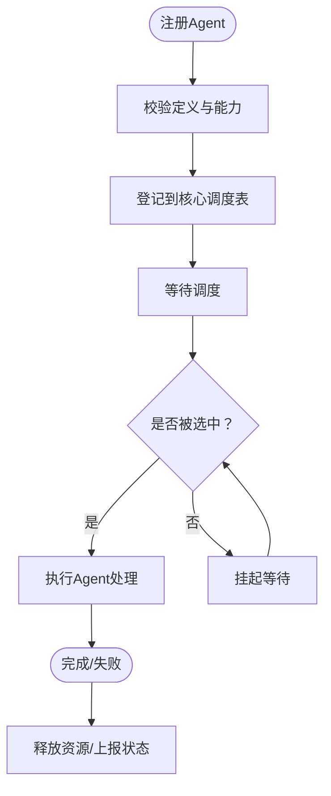

**图表来源**
- [src/agents/index.ts](file://src/agents/index.ts)
- [src/core/index.ts](file://src/core/index.ts)

**章节来源**
- [src/agents/index.ts](file://src/agents/index.ts)
- [src/core/index.ts](file://src/core/index.ts)

### 工具层API（工具注册与调用）
- 注册工具：声明工具签名、参数、权限需求
- 调用工具：根据上下文与参数执行工具，返回结果
- 与权限层协作：调用前进行权限校验

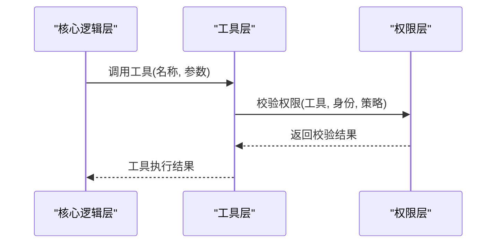

**图表来源**
- [src/tools/index.ts](file://src/tools/index.ts)
- [src/permissions/index.ts](file://src/permissions/index.ts)
- [src/core/index.ts](file://src/core/index.ts)

**章节来源**
- [src/tools/index.ts](file://src/tools/index.ts)
- [src/permissions/index.ts](file://src/permissions/index.ts)
- [src/core/index.ts](file://src/core/index.ts)

### 上下文层API（上下文构建与管理）
- 构建上下文：将用户输入、历史消息、系统提示等整合为上下文对象
- 裁剪上下文：根据token预算或长度限制进行裁剪
- 查询上下文：按键获取上下文片段

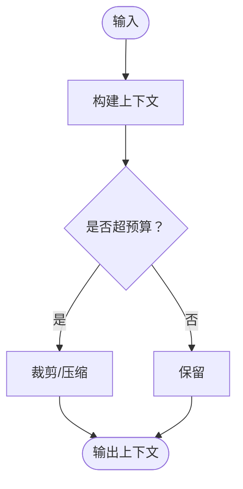

**图表来源**
- [src/context/index.ts](file://src/context/index.ts)
- [src/core/index.ts](file://src/core/index.ts)

**章节来源**
- [src/context/index.ts](file://src/context/index.ts)
- [src/core/index.ts](file://src/core/index.ts)

### 会话层API（会话状态与历史）
- 创建会话：初始化会话元数据与状态
- 加载会话：按ID恢复会话历史
- 保存会话：持久化当前会话状态
- 清理过期会话：定期回收资源

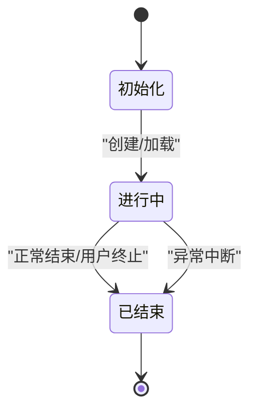

**图表来源**
- [src/session/index.ts](file://src/session/index.ts)
- [src/core/index.ts](file://src/core/index.ts)

**章节来源**
- [src/session/index.ts](file://src/session/index.ts)
- [src/core/index.ts](file://src/core/index.ts)

### 技能层API（技能定义与执行）
- 注册技能：定义技能签名、参数、执行逻辑
- 执行技能：根据输入参数执行技能流程
- 解析意图：从自然语言中提取技能参数

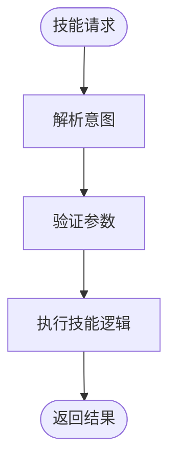

**图表来源**
- [src/skill/index.ts](file://src/skill/index.ts)
- [src/core/index.ts](file://src/core/index.ts)

**章节来源**
- [src/skill/index.ts](file://src/skill/index.ts)
- [src/core/index.ts](file://src/core/index.ts)

### MCP层API（模型连接协议）
- 处理MCP请求：接收并处理外部模型连接协议请求
- 建立连接：与外部MCP服务建立连接
- 关闭连接：安全断开MCP连接

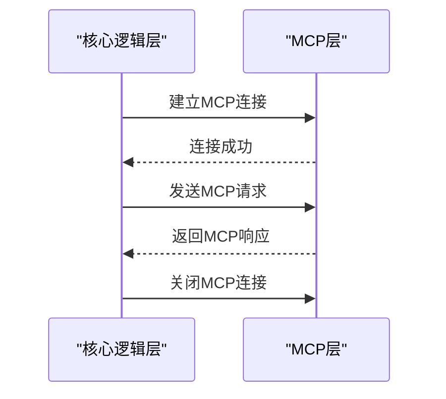

**图表来源**
- [src/mcp/index.ts](file://src/mcp/index.ts)
- [src/core/index.ts](file://src/core/index.ts)

**章节来源**
- [src/mcp/index.ts](file://src/mcp/index.ts)
- [src/core/index.ts](file://src/core/index.ts)

### 权限层API（工具调用权限与安全控制）
- 校验权限：根据工具、身份、策略判断是否允许调用
- 安全策略：白名单、角色映射、审计日志

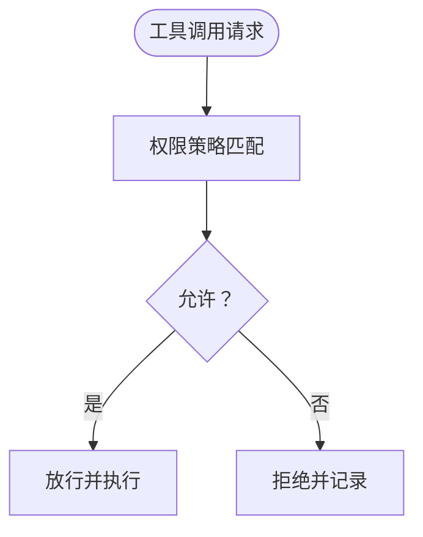

**图表来源**
- [src/permissions/index.ts](file://src/permissions/index.ts)
- [src/tools/index.ts](file://src/tools/index.ts)

**章节来源**
- [src/permissions/index.ts](file://src/permissions/index.ts)
- [src/tools/index.ts](file://src/tools/index.ts)

### CLI层API（命令解析与交互）
- 命令路由：/help、/exit、/version 等
- REPL循环：持续读取用户输入并转发给核心逻辑
- 错误处理：捕获异常并退出

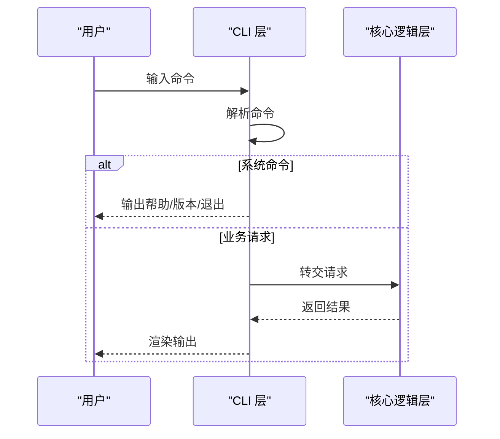

**图表来源**
- [src/cli/index.ts](file://src/cli/index.ts)
- [src/core/index.ts](file://src/core/index.ts)

**章节来源**
- [src/cli/index.ts](file://src/cli/index.ts)
- [src/core/index.ts](file://src/core/index.ts)

## 依赖分析
- 依赖方向：上层仅依赖下层，确保单向依赖与可测试性
- 耦合与内聚：核心逻辑对下层抽象依赖，降低对具体实现的耦合
- 外部依赖：构建与运行时依赖 Node.js 与 esbuild（由构建脚本与包配置体现）

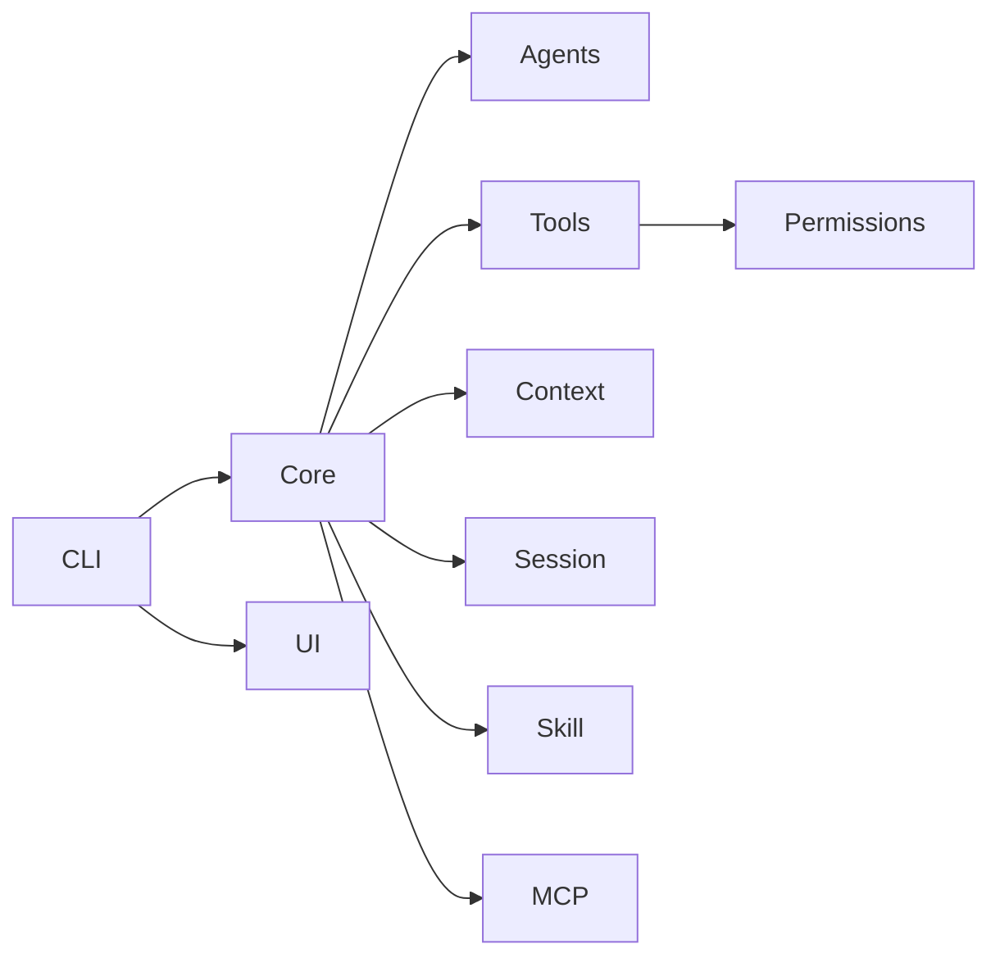

**图表来源**
- [src/cli/index.ts](file://src/cli/index.ts)
- [src/core/index.ts](file://src/core/index.ts)
- [src/agents/index.ts](file://src/agents/index.ts)
- [src/tools/index.ts](file://src/tools/index.ts)
- [src/context/index.ts](file://src/context/index.ts)
- [src/session/index.ts](file://src/session/index.ts)
- [src/skill/index.ts](file://src/skill/index.ts)
- [src/mcp/index.ts](file://src/mcp/index.ts)
- [src/ui/index.ts](file://src/ui/index.ts)
- [src/permissions/index.ts](file://src/permissions/index.ts)

**章节来源**
- [package.json](file://package.json)

## 性能考虑
- 并发控制：核心逻辑应引入任务队列与并发上限，避免工具层阻塞
- 上下文裁剪：在进入工具调用前进行预算评估与裁剪，减少无效计算
- 会话持久化：异步写入与批量化落盘，降低I/O开销
- 缓存策略：对热点工具结果与上下文片段进行缓存（需配合失效策略）
- 错误快速失败：权限校验与上下文构建失败时尽早返回，避免无效执行
- 技能预热：对常用技能进行预加载，减少首次调用延迟
- MCP连接池：复用MCP连接，避免频繁建立/断开连接

## 故障排查指南
- CLI异常退出：检查CLI主流程的错误捕获与进程退出码
- 核心逻辑未响应：确认上下文/会话初始化是否成功，Agent是否已注册
- 工具调用失败：核对权限策略与工具签名，查看权限层返回
- 技能执行异常：检查技能定义与参数验证，查看技能层日志
- MCP连接问题：验证MCP服务可达性，检查连接参数配置
- UI渲染异常：确认输出格式与终端兼容性

**章节来源**
- [src/cli/index.ts](file://src/cli/index.ts)
- [src/core/index.ts](file://src/core/index.ts)
- [src/permissions/index.ts](file://src/permissions/index.ts)
- [src/skill/index.ts](file://src/skill/index.ts)
- [src/mcp/index.ts](file://src/mcp/index.ts)

## 结论
本API文档基于仓库的实际分层架构与依赖规则，给出了核心逻辑层的调度与流程控制接口定义、调用顺序与扩展点。经过对现有代码结构的分析，核心逻辑模块已经具备基础实现，包括新增的技能层和MCP层支持。通过本文的接口规范与流程图，可以指导后续实现与集成。建议优先完成核心逻辑与Agent/工具/上下文/会话的最小可用接口，再逐步完善权限与UI层对接。

## 附录
- 构建与运行
  - 开发模式：使用热重载运行 CLI 入口
  - 构建：TypeScript 编译生成 dist
  - 启动：运行构建产物的 CLI 入口
- 命令行入口
  - 可执行文件名：easy-agent
  - 入口脚本：dist/cli/index.js

**章节来源**
- [package.json](file://package.json)
- [src/cli/index.ts](file://src/cli/index.ts)