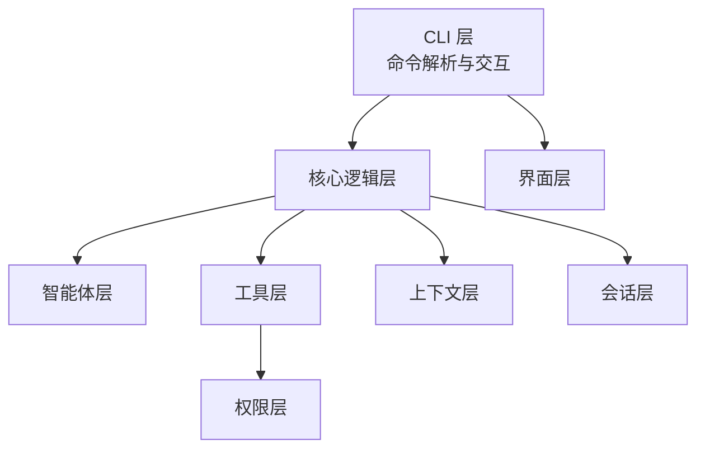
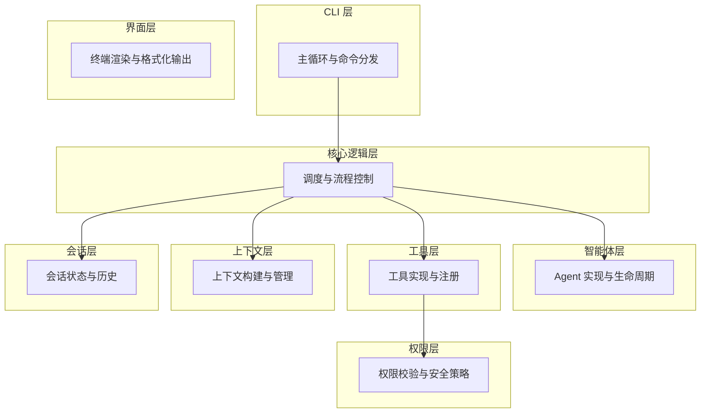
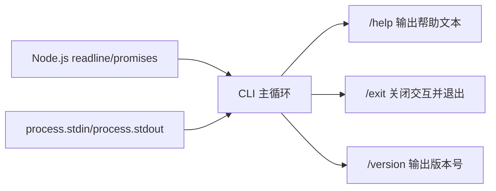

# 命令参考

<cite>
**本文引用的文件**
- [src/cli/index.ts](file://src/cli/index.ts)
- [package.json](file://package.json)
- [AGENTS.md](file://AGENTS.md)
- [README.md](file://README.md)
</cite>

## 目录
1. [简介](#简介)
2. [项目结构](#项目结构)
3. [核心组件](#核心组件)
4. [架构总览](#架构总览)
5. [详细命令分析](#详细命令分析)
6. [依赖关系分析](#依赖关系分析)
7. [性能与行为特性](#性能与行为特性)
8. [故障排除指南](#故障排除指南)
9. [结论](#结论)
10. [附录：安装与运行](#附录安装与运行)

## 简介
本文件为 easy-agent-cli 的命令参考文档，聚焦于当前已实现的基础命令：/help、/exit、/version。文档从命令功能、使用语法、参数选项、执行流程、内部处理机制、组合使用与高级技巧、故障排除等方面进行系统化说明，并结合项目架构与开发规范，帮助用户快速掌握并高效使用该 CLI 工具。

## 项目结构
easy-agent-cli 采用分层架构，CLI 入口负责命令解析与 REPL 交互，其余层分别承担核心调度、智能体、工具、上下文、会话、UI 渲染与权限控制等职责。当前仓库中，CLI 层已实现基础命令处理；其他层为后续扩展预留接口。

图表来源
- [AGENTS.md:15-42](file://AGENTS.md#L15-L42)

章节来源
- [AGENTS.md:15-42](file://AGENTS.md#L15-L42)

## 核心组件
- CLI 入口层：负责启动 REPL、读取用户输入、解析基础命令并输出帮助信息、版本号或退出交互循环。
- 版本常量：在 CLI 入口中定义版本号字符串，供 /version 命令使用。
- 帮助文本：集中维护帮助信息，供 /help 命令输出。

章节来源
- [src/cli/index.ts:6-19](file://src/cli/index.ts#L6-L19)
- [src/cli/index.ts:21](file://src/cli/index.ts#L21)

## 架构总览
CLI 层作为入口，仅负责命令路由与交互；核心逻辑层负责 Agent 调度、消息路由与流程编排；工具层提供内置工具并通过权限层校验；上下文与会话层分别管理对话记忆与会话状态；UI 层负责终端渲染；权限层保障工具调用的安全性。

图表来源
- [AGENTS.md:29-42](file://AGENTS.md#L29-L42)

章节来源
- [AGENTS.md:29-42](file://AGENTS.md#L29-L42)

## 详细命令分析

### /help 命令
- 功能说明
  - 输出帮助信息，包含工具名称、用法、可用命令列表与简要描述。
- 使用语法
  - 在 CLI 中输入 /help 并回车。
- 参数选项
  - 无额外参数。
- 执行流程
  - CLI 主循环读取输入后，匹配到 /help 分支，直接打印预定义的帮助文本。
- 内部处理机制
  - 帮助文本在模块顶层定义，CLI 主循环通过条件分支输出该文本。
- 使用示例
  - 输入 /help 后，终端显示帮助信息与可用命令提示。
- 实际应用场景
  - 初次使用或需要快速查阅命令列表时。
- 组合使用与高级技巧
  - 可与其他命令配合使用，例如先输入 /help，再根据提示输入 /version 或 /exit。
- 故障排除
  - 若未显示帮助，请确认 CLI 已正确启动且未被异常中断。

章节来源
- [src/cli/index.ts:6-19](file://src/cli/index.ts#L6-L19)
- [src/cli/index.ts:39-41](file://src/cli/index.ts#L39-L41)

### /exit 命令
- 功能说明
  - 退出 CLI 交互循环，关闭输入输出流并结束进程。
- 使用语法
  - 在 CLI 中输入 /exit 并回车。
- 参数选项
  - 无额外参数。
- 执行流程
  - CLI 主循环读取输入后，匹配到 /exit 分支：
    - 输出告别语；
    - 关闭 readline 接口；
    - 返回主函数，结束程序。
- 内部处理机制
  - 使用 readline 接口的 close 方法终止交互；主函数返回后进程退出。
- 使用示例
  - 输入 /exit 后，CLI 输出告别信息并退出。
- 实际应用场景
  - 结束当前会话或退出程序。
- 组合使用与高级技巧
  - 可在任意时刻输入 /exit 以快速退出；也可与 /help 配合用于“查看帮助—退出”的工作流。
- 故障排除
  - 若无法退出，检查是否处于阻塞状态或存在未完成的异步任务；必要时重启 CLI。

章节来源
- [src/cli/index.ts:43-46](file://src/cli/index.ts#L43-L46)
- [src/cli/index.ts:56-58](file://src/cli/index.ts#L56-L58)

### /version 命令
- 功能说明
  - 输出当前 CLI 版本号。
- 使用语法
  - 在 CLI 中输入 /version 并回车。
- 参数选项
  - 无额外参数。
- 执行流程
  - CLI 主循环读取输入后，匹配到 /version 分支，输出预定义版本号字符串。
- 内部处理机制
  - 版本号在模块顶层定义为常量，CLI 主循环直接读取并输出。
- 使用示例
  - 输入 /version 后，终端显示版本号。
- 实际应用场景
  - 确认当前 CLI 版本，便于问题排查与升级决策。
- 组合使用与高级技巧
  - 可与 /help 配合，先查看帮助再核对版本。
- 故障排除
  - 若版本号显示异常，检查版本常量定义与构建产物是否一致。

章节来源
- [src/cli/index.ts:21](file://src/cli/index.ts#L21)
- [src/cli/index.ts:47-48](file://src/cli/index.ts#L47-L48)

### 未知命令处理
- 行为说明
  - 当输入非预定义命令时，CLI 输出“未知命令”提示，并引导用户输入 /help 查看可用命令。
- 处理机制
  - 在主循环的默认分支中输出提示信息。
- 故障排除
  - 确认命令拼写正确；若仍提示未知命令，输入 /help 获取帮助。

章节来源
- [src/cli/index.ts:50-53](file://src/cli/index.ts#L50-L53)

## 依赖关系分析
- CLI 层依赖
  - Node.js readline/promises 用于交互式输入输出。
  - process.stdin/process.stdout 作为标准输入输出流。
- 版本与帮助文本
  - 版本号与帮助文本在 CLI 模块内定义，供命令处理逻辑直接使用。
- 架构约束
  - AGENTS.md 规定“上层可依赖下层，下层不可依赖上层”，CLI 层当前仅负责命令路由，不包含业务逻辑。

图表来源
- [src/cli/index.ts:3-4](file://src/cli/index.ts#L3-L4)
- [src/cli/index.ts:33-54](file://src/cli/index.ts#L33-L54)

章节来源
- [src/cli/index.ts:3-4](file://src/cli/index.ts#L3-L4)
- [src/cli/index.ts:33-54](file://src/cli/index.ts#L33-L54)
- [AGENTS.md:42](file://AGENTS.md#L42)

## 性能与行为特性
- REPL 循环
  - CLI 采用 while(true) 循环持续读取输入，直到收到 /exit 或异常中断。
- I/O 行为
  - 使用 readline 接口进行同步等待输入，输出采用同步 console.log。
- 错误处理
  - 主函数捕获异常并输出错误信息后退出进程，保证稳定性。
- 版本与帮助文本
  - 帮助文本与版本号在模块初始化时加载，避免重复计算。

章节来源
- [src/cli/index.ts:23-59](file://src/cli/index.ts#L23-L59)
- [src/cli/index.ts:61-64](file://src/cli/index.ts#L61-L64)

## 故障排除指南
- 无法看到帮助信息
  - 确认已正确启动 CLI；若终端被覆盖或缓冲区异常，尝试重新启动。
- /exit 无效
  - 检查是否存在未完成的异步任务；必要时重启 CLI；确认 readline 接口未被外部代码占用。
- /version 输出异常
  - 检查版本常量定义与构建产物；确认运行的是最新构建版本。
- 未知命令提示频繁出现
  - 确认命令拼写；输入 /help 获取可用命令列表；避免多余空格或特殊字符。
- CLI 启动失败
  - 检查 Node.js 版本与依赖安装情况；参考安装与运行章节进行排查。

章节来源
- [src/cli/index.ts:33-54](file://src/cli/index.ts#L33-L54)
- [src/cli/index.ts:61-64](file://src/cli/index.ts#L61-L64)

## 结论
当前版本的 easy-agent-cli 提供了简洁而稳定的三个基础命令：/help、/exit、/version。它们构成了 CLI 的交互入口与基本控制面。随着项目演进，CLI 层将继续承担命令路由职责，核心层与工具层将逐步实现更丰富的功能，权限层与上下文/会话层将完善安全与状态管理。建议用户在日常使用中优先掌握这三个命令，并结合 AGENTS.md 的架构规范理解各层职责，以便更好地扩展与维护。

## 附录：安装与运行
- 安装依赖
  - 使用 npm install 安装项目依赖。
- 开发模式
  - 使用 npm run dev 以热重载方式运行 CLI。
- 构建
  - 使用 npm run build 生成发布产物。
- 运行构建产物
  - 使用 npm start 运行已构建的 CLI。

章节来源
- [AGENTS.md:68-82](file://AGENTS.md#L68-L82)
- [package.json:10-13](file://package.json#L10-L13)