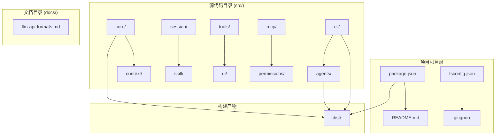
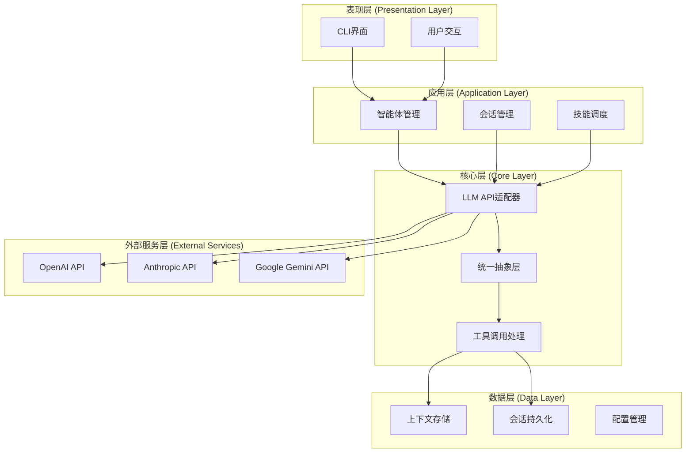
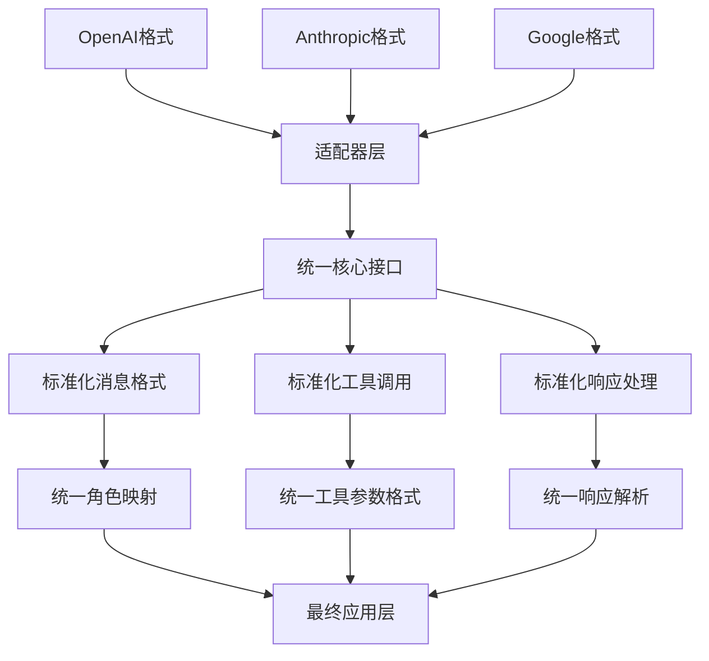
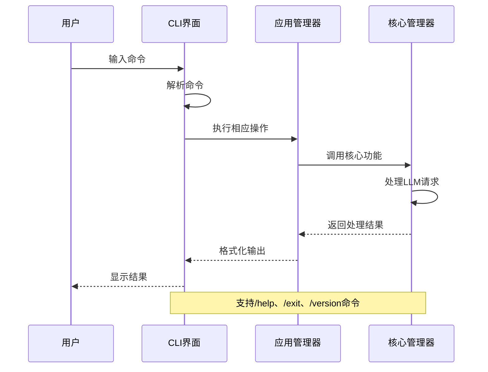
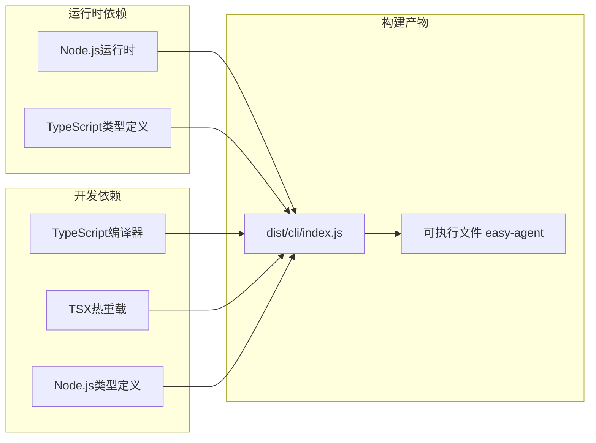

# LLM API格式对比

<cite>
**本文档引用的文件**
- [README.md](file://README.md)
- [package.json](file://package.json)
- [docs/llm-api-formats.md](file://docs/llm-api-formats.md)
- [src/cli/index.ts](file://src/cli/index.ts)
- [src/core/index.ts](file://src/core/index.ts)
- [src/agents/index.ts](file://src/agents/index.ts)
- [src/context/index.ts](file://src/context/index.ts)
- [src/session/index.ts](file://src/session/index.ts)
- [src/skill/index.ts](file://src/skill/index.ts)
- [src/tools/index.ts](file://src/tools/index.ts)
- [src/ui/index.ts](file://src/ui/index.ts)
- [src/mcp/index.ts](file://src/mcp/index.ts)
</cite>

## 目录
1. [简介](#简介)
2. [项目结构](#项目结构)
3. [核心组件](#核心组件)
4. [架构概览](#架构概览)
5. [详细组件分析](#详细组件分析)
6. [依赖关系分析](#依赖关系分析)
7. [性能考虑](#性能考虑)
8. [故障排除指南](#故障排除指南)
9. [结论](#结论)

## 简介

这是一个基于TypeScript的CLI智能体项目，专注于LLM（大语言模型）API格式的标准化和统一化。项目的核心目标是为不同厂商的LLM API提供统一的抽象层，特别是针对OpenAI、Anthropic和Google这三大主流厂商的API格式进行深入对比和适配。

该项目目前处于早期开发阶段，主要包含以下特点：
- 基于Node.js的CLI应用程序
- 支持多轮对话和工具调用功能
- 为后续的LLM API统一抽象奠定基础
- 提供详细的LLM API格式对比文档

## 项目结构

项目采用模块化的目录结构，按照功能层次进行组织：

**图表来源**
- [package.json:1-32](file://package.json#L1-L32)
- [src/cli/index.ts:1-65](file://src/cli/index.ts#L1-L65)

**章节来源**
- [package.json:1-32](file://package.json#L1-L32)
- [README.md:1-3](file://README.md#L1-L3)

## 核心组件

### CLI交互层
CLI层提供了用户与智能体交互的入口点，支持基本的命令行操作和帮助信息展示。

### 核心逻辑层
核心层负责处理LLM API的统一抽象和适配逻辑，为不同厂商的API提供一致的接口。

### 智能体管理层
智能体层管理各种类型的智能体，包括对话智能体、工具智能体等。

### 上下文管理层
上下文层负责维护对话历史、系统提示和其他上下文信息。

### 会话管理层
会话层处理用户的会话状态管理和持久化。

### 技能层
技能层定义了智能体可以执行的各种技能和工具。

### 工具层
工具层提供了具体的工具实现，支持外部服务调用和数据处理。

### 用户界面层
UI层负责用户界面的渲染和交互。

### MCP层
MCP（Model Context Protocol）层提供模型上下文协议的支持。

**章节来源**
- [src/cli/index.ts:1-65](file://src/cli/index.ts#L1-L65)
- [src/core/index.ts:1-2](file://src/core/index.ts#L1-L2)
- [src/agents/index.ts:1-2](file://src/agents/index.ts#L1-L2)
- [src/context/index.ts:1-2](file://src/context/index.ts#L1-L2)
- [src/session/index.ts:1-2](file://src/session/index.ts#L1-L2)
- [src/skill/index.ts:1-1](file://src/skill/index.ts#L1-L1)
- [src/tools/index.ts](file://src/tools/index.ts)
- [src/ui/index.ts](file://src/ui/index.ts)
- [src/mcp/index.ts:1-1](file://src/mcp/index.ts#L1-L1)

## 架构概览

项目采用分层架构设计，从上到下分别为：

**图表来源**
- [docs/llm-api-formats.md:437-462](file://docs/llm-api-formats.md#L437-L462)
- [src/cli/index.ts:23-59](file://src/cli/index.ts#L23-L59)

## 详细组件分析

### LLM API格式对比分析

项目的核心价值在于其详尽的LLM API格式对比文档，该文档对比了三大主流厂商的API格式差异：

#### OpenAI Chat Completions API
- **端点**: `POST https://api.openai.com/v1/chat/completions`
- **鉴权方式**: `Authorization: Bearer sk-xxx`
- **消息结构**: 使用`messages`数组，支持`system`、`user`、`assistant`、`tool`角色
- **工具调用**: 通过`tool_calls`字段，参数为JSON字符串

#### Anthropic Messages API
- **端点**: `POST https://api.anthropic.com/v1/messages`
- **鉴权方式**: `x-api-key: sk-ant-xxx`，需要`anthropic-version`头部
- **消息结构**: 顶层`system`字段，消息必须按`user/assistant`交替
- **工具调用**: 通过`content[].tool_use`，参数为直接对象而非JSON字符串

#### Google Gemini API
- **端点**: `POST https://generativelanguage.googleapis.com/v1beta/models/{model}:generateContent?key={API_KEY}`
- **鉴权方式**: 通过URL查询参数传递API Key
- **消息结构**: 使用`contents`数组，角色为`user`和`model`
- **工具调用**: 通过`parts[].function_call`，参数为直接对象

### 统一抽象设计

基于对三大厂商API的深入分析，项目提出了统一抽象的设计建议：

**图表来源**
- [docs/llm-api-formats.md:445-461](file://docs/llm-api-formats.md#L445-L461)

**章节来源**
- [docs/llm-api-formats.md:1-462](file://docs/llm-api-formats.md#L1-L462)

### CLI交互流程

CLI层提供了简单的命令行交互界面：

**图表来源**
- [src/cli/index.ts:23-59](file://src/cli/index.ts#L23-L59)

**章节来源**
- [src/cli/index.ts:1-65](file://src/cli/index.ts#L1-L65)

## 依赖关系分析

项目的主要依赖关系如下：

**图表来源**
- [package.json:10-14](file://package.json#L10-L14)
- [package.json:26-30](file://package.json#L26-L30)

**章节来源**
- [package.json:1-32](file://package.json#L1-L32)

## 性能考虑

基于LLM API格式对比分析，以下是主要的性能优化建议：

### API调用优化
- **连接复用**: 建议实现HTTP连接池，减少重复建立连接的开销
- **批量处理**: 对于多个工具调用，考虑批量处理以减少API调用次数
- **缓存策略**: 实现响应缓存机制，特别是对于重复的系统提示和工具定义

### 内存管理
- **流式处理**: 对于大型响应，实现流式处理避免内存溢出
- **垃圾回收**: 及时清理不再使用的上下文和会话数据

### 错误处理
- **重试机制**: 实现指数退避的重试策略
- **超时控制**: 为每个API调用设置合理的超时时间

## 故障排除指南

### 常见问题及解决方案

#### API密钥认证失败
- **症状**: 401未授权错误
- **原因**: API密钥格式不正确或过期
- **解决方案**: 检查环境变量配置，确认API密钥格式符合各厂商要求

#### 消息格式错误
- **症状**: 400请求错误，提示消息格式无效
- **原因**: 不同厂商的消息格式差异
- **解决方案**: 使用统一的适配器层转换消息格式

#### 工具调用参数错误
- **症状**: 工具调用失败，参数格式不匹配
- **原因**: OpenAI使用JSON字符串，Anthropic使用直接对象
- **解决方案**: 在适配器层进行参数格式转换

**章节来源**
- [docs/llm-api-formats.md:414-434](file://docs/llm-api-formats.md#L414-L434)

## 结论

该项目为LLM API的标准化和统一化提供了重要的基础设施。通过详细的API格式对比分析，项目明确了不同厂商API之间的关键差异，并提出了可行的统一抽象方案。

### 主要成就
1. **完整的API对比文档**: 提供了OpenAI、Anthropic、Google三大厂商API的详细对比
2. **统一抽象设计**: 提出了以OpenAI格式为基础的统一接口设计方案
3. **适配器模式**: 为不同厂商API提供清晰的适配路径
4. **模块化架构**: 清晰的分层架构为后续功能扩展奠定了基础

### 未来发展方向
1. **完整实现**: 将文档中的设计转化为完整的代码实现
2. **测试覆盖**: 建立全面的单元测试和集成测试
3. **性能优化**: 实现连接池、缓存等性能优化措施
4. **错误处理**: 完善错误处理和重试机制
5. **监控日志**: 添加详细的监控和日志记录功能

该项目为构建跨平台的LLM应用提供了宝贵的参考和基础框架。