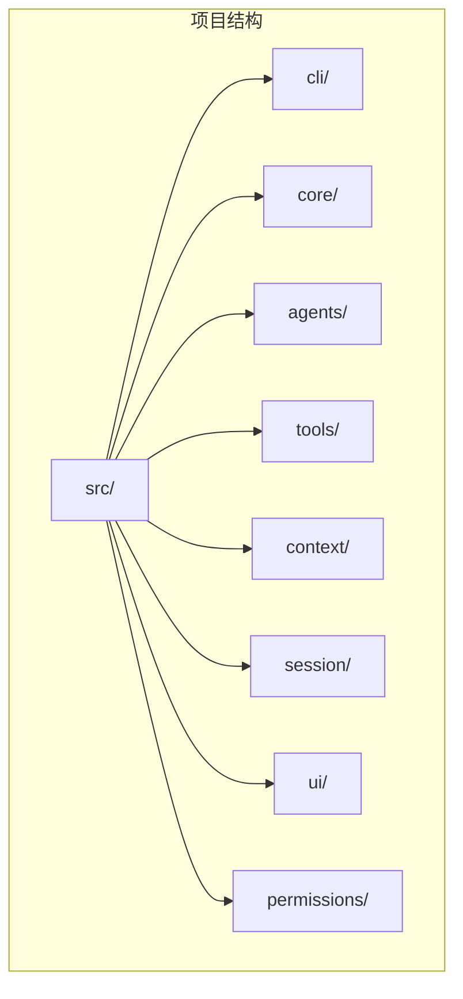
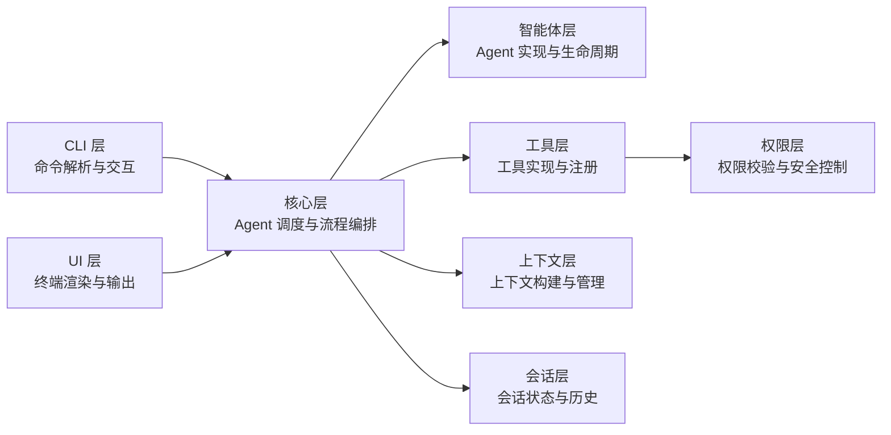
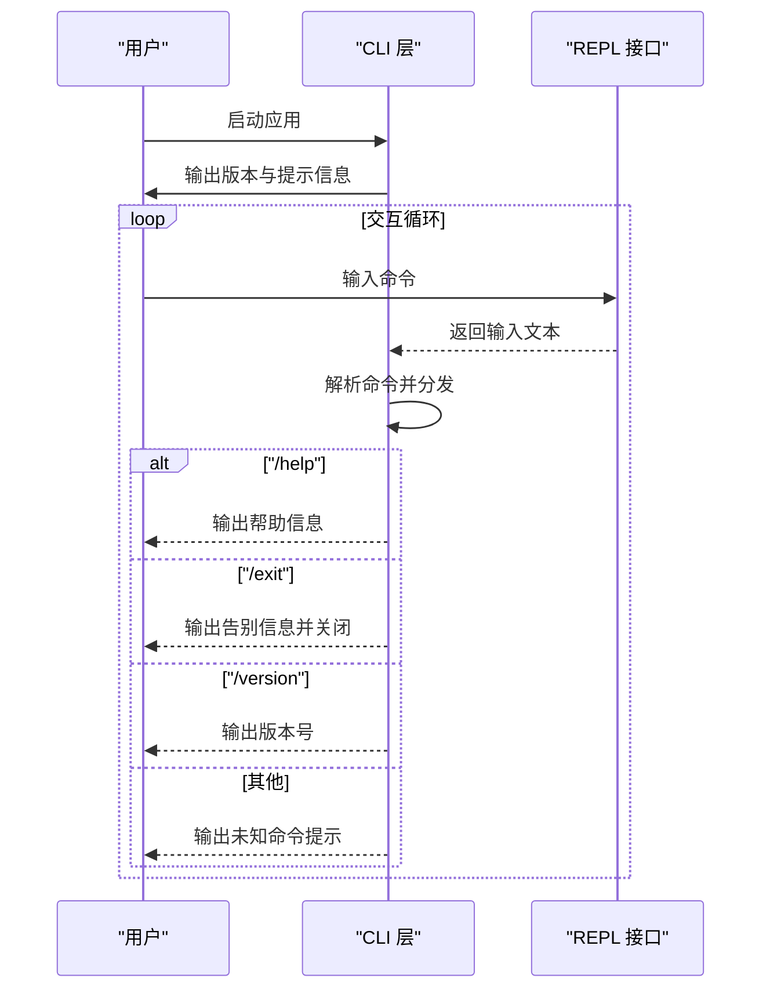

# 代码结构说明

<cite>
**本文档引用的文件**
- [package.json](file://package.json)
- [tsconfig.json](file://tsconfig.json)
- [README.md](file://README.md)
- [AGENTS.md](file://AGENTS.md)
- [src/cli/index.ts](file://src/cli/index.ts)
- [src/core/index.ts](file://src/core/index.ts)
- [src/agents/index.ts](file://src/agents/index.ts)
- [src/tools/index.ts](file://src/tools/index.ts)
- [src/context/index.ts](file://src/context/index.ts)
- [src/session/index.ts](file://src/session/index.ts)
- [src/ui/index.ts](file://src/ui/index.ts)
- [src/permissions/index.ts](file://src/permissions/index.ts)
</cite>

## 目录
1. [引言](#引言)
2. [项目结构](#项目结构)
3. [核心组件](#核心组件)
4. [架构总览](#架构总览)
5. [详细组件分析](#详细组件分析)
6. [依赖分析](#依赖分析)
7. [性能考虑](#性能考虑)
8. [故障排除指南](#故障排除指南)
9. [结论](#结论)
10. [附录](#附录)

## 引言
本项目是一个基于 TypeScript 和 Node.js 的轻量级命令行智能体工具，采用分层架构设计，支持多轮对话与工具调用。项目通过明确的分层职责划分（CLI 层、核心层、智能体层、工具层、上下文层、会话层、UI 层、权限层）以及严格的依赖方向约束，确保了良好的可维护性与扩展性。

**章节来源**
- [README.md:1-3](file://README.md#L1-L3)
- [AGENTS.md:3-6](file://AGENTS.md#L3-L6)

## 项目结构
项目采用按层组织的目录结构，每个层通过独立的目录进行隔离，并在根目录提供统一的入口文件以暴露公共 API。该结构遵循“上层可依赖下层，下层不可依赖上层”的依赖规则，减少层间耦合，提升模块内聚。



**图表来源**
- [AGENTS.md:15-27](file://AGENTS.md#L15-L27)

**章节来源**
- [AGENTS.md:15-27](file://AGENTS.md#L15-L27)

## 核心组件
本节对各层的核心职责进行概览说明，为后续深入分析提供基础。

- CLI 层：作为应用入口，负责命令解析、REPL 交互与帮助信息展示，不包含业务逻辑。
- 核心层：负责 Agent 调度、消息路由与流程编排，协调智能体、工具、上下文与会话。
- 智能体层：定义 Agent 的实现与生命周期管理，依赖工具与上下文。
- 工具层：提供内置工具与工具注册机制，依赖权限层进行安全控制。
- 上下文层：管理对话上下文与记忆，为智能体提供语境支持。
- 会话层：管理会话状态与历史记录，支持持久化场景。
- UI 层：负责终端渲染与格式化输出，提供用户可见的交互反馈。
- 权限层：执行工具调用权限校验与安全策略，保障系统安全。

**章节来源**
- [AGENTS.md:29-42](file://AGENTS.md#L29-L42)

## 架构总览
下图展示了各层之间的依赖关系与数据流向。上层仅能依赖下层，下层不依赖上层；同层之间尽量避免直接依赖，保持清晰的单向依赖链。



**图表来源**
- [AGENTS.md:29-42](file://AGENTS.md#L29-L42)

**章节来源**
- [AGENTS.md:29-42](file://AGENTS.md#L29-L42)

## 详细组件分析

### CLI 层分析
CLI 层是应用的唯一入口，负责读取用户输入、解析命令并输出帮助信息。其职责严格限定于命令路由与交互，不包含任何业务逻辑。

- 关键职责
  - 初始化 REPL 交互环境
  - 解析用户输入并分发到对应命令处理
  - 输出帮助信息与版本信息
  - 处理退出流程

- 交互流程
  - 启动后打印版本与提示信息
  - 循环读取用户输入，根据命令分支执行相应逻辑
  - 支持 /help、/exit、/version 等内置命令



**图表来源**
- [src/cli/index.ts:23-59](file://src/cli/index.ts#L23-L59)

**章节来源**
- [src/cli/index.ts:1-65](file://src/cli/index.ts#L1-L65)

### 核心层分析
核心层负责整体流程编排，协调智能体、工具、上下文与会话，是系统的大脑。它向上层提供统一的调度接口，向下层聚合各子系统的能力。

- 关键职责
  - Agent 调度与消息路由
  - 流程编排与状态管理
  - 与智能体层、工具层、上下文层、会话层协作

- 设计要点
  - 通过统一接口与上层交互
  - 通过各层的 index.ts 暴露公共 API
  - 避免直接依赖上层，确保依赖方向正确

**章节来源**
- [src/core/index.ts:1-2](file://src/core/index.ts#L1-L2)

### 智能体层分析
智能体层负责具体 Agent 的实现与生命周期管理，依赖工具层与上下文层提供能力与语境支持。

- 关键职责
  - Agent 定义与实现
  - 生命周期管理（初始化、运行、销毁）
  - 与工具层协作完成任务执行
  - 与上下文层协作管理对话语境

- 设计要点
  - 通过工具层获取执行能力
  - 通过上下文层获取历史与当前语境
  - 保持对上层的低耦合

**章节来源**
- [src/agents/index.ts:1-2](file://src/agents/index.ts#L1-L2)

### 工具层分析
工具层提供内置工具与工具注册机制，所有工具调用均需经过权限层校验，确保安全性。

- 关键职责
  - 工具实现与注册
  - 工具调用的统一入口
  - 与权限层协作进行安全控制

- 设计要点
  - 工具注册与发现机制
  - 与权限层的强依赖关系
  - 为智能体层提供可复用能力

**章节来源**
- [src/tools/index.ts:1-2](file://src/tools/index.ts#L1-L2)

### 上下文层分析
上下文层负责构建与管理对话上下文，为智能体提供必要的语境信息，如历史消息、角色设定等。

- 关键职责
  - 上下文构建与更新
  - 记忆与语境管理
  - 与智能体层协作提供语境支持

- 设计要点
  - 无下层依赖，专注数据管理
  - 需关注 Token 限制与性能优化

**章节来源**
- [src/context/index.ts:1-2](file://src/context/index.ts#L1-L2)

### 会话层分析
会话层负责管理会话状态与历史记录，支持持久化场景，确保用户在不同时间点的连续体验。

- 关键职责
  - 会话状态管理
  - 历史记录存储与恢复
  - 持久化策略设计

- 设计要点
  - 无下层依赖，专注状态管理
  - 需考虑数据一致性与性能

**章节来源**
- [src/session/index.ts:1-2](file://src/session/index.ts#L1-L2)

### UI 层分析
UI 层负责终端渲染与格式化输出，提供用户可见的交互反馈，确保良好的用户体验。

- 关键职责
  - 终端渲染与格式化输出
  - 用户反馈与提示信息展示
  - 与 CLI 层协作提供交互体验

- 设计要点
  - 无下层依赖，专注展示层
  - 与 CLI 层的紧密协作

**章节来源**
- [src/ui/index.ts:1-2](file://src/ui/index.ts#L1-L2)

### 权限层分析
权限层负责工具调用权限校验与安全策略，是系统安全的最后防线。

- 关键职责
  - 工具调用权限校验
  - 安全策略执行
  - 与工具层协作保障安全

- 设计要点
  - 无下层依赖，专注安全控制
  - 与工具层形成强依赖关系

**章节来源**
- [src/permissions/index.ts:1-2](file://src/permissions/index.ts#L1-L2)

## 依赖分析
本节从模块系统与依赖方向两个维度分析项目的依赖关系。

- 模块系统
  - 项目采用 ESM 模块系统，通过 `"type": "module"` 在 package.json 中声明
  - TypeScript 编译器选项设置为 NodeNext，模块解析采用 NodeNext
  - 使用路径映射 @/* 指向 src/*，便于跨层导入

- 依赖方向
  - 遵循“上层可依赖下层，下层不可依赖上层”的规则
  - CLI 层依赖核心层与 UI 层
  - 核心层依赖智能体层、工具层、上下文层与会话层
  - 工具层依赖权限层
  - 其余层均为无下层依赖的纯数据/服务层

```mermaid
graph LR
subgraph "模块系统"
PJSON["package.json<br/>\"type\": \"module\""]
TSCONFIG["tsconfig.json<br/>module: NodeNext<br/>paths: @/* -> src/*"]
PJSON --> TSCONFIG
end
subgraph "依赖方向"
CLI["CLI 层"] --> CORE["核心层"]
UI["UI 层"] --> CORE
CORE --> AGENTS["智能体层"]
CORE --> TOOLS["工具层"]
CORE --> CONTEXT["上下文层"]
CORE --> SESSION["会话层"]
TOOLS --> PERMISSIONS["权限层"]
end
```

**图表来源**
- [package.json:5-6](file://package.json#L5-L6)
- [tsconfig.json:4-5](file://tsconfig.json#L4-L5)
- [tsconfig.json:17-19](file://tsconfig.json#L17-L19)
- [AGENTS.md:42](file://AGENTS.md#L42)

**章节来源**
- [package.json:5-6](file://package.json#L5-L6)
- [tsconfig.json:4-5](file://tsconfig.json#L4-L5)
- [tsconfig.json:17-19](file://tsconfig.json#L17-L19)
- [AGENTS.md:42](file://AGENTS.md#L42)

## 性能考虑
- 模块加载与打包
  - 使用 ESM 与 NodeNext 模块解析，有助于 Tree Shaking 与按需加载
  - 建议在构建阶段启用最小化与压缩，减少运行时开销

- 交互性能
  - REPL 循环应避免阻塞式 IO，保持响应速度
  - 对长耗时操作建议异步化并提供进度反馈

- 数据管理
  - 上下文层需关注 Token 限制，避免过长的历史导致性能问题
  - 会话层的数据持久化应考虑增量写入与缓存策略

- 并发与资源
  - 工具调用可能涉及外部资源访问，建议引入超时与重试机制
  - 权限层的校验应尽量轻量化，避免成为性能瓶颈

## 故障排除指南
- 常见问题
  - 模块导入失败：确认 package.json 中的 type 为 module，tsconfig.json 的 module 与 moduleResolution 设置为 NodeNext
  - 路径别名无效：检查 tsconfig.json 中的 paths 配置是否正确指向 src/*
  - REPL 无法退出：检查 CLI 层的退出逻辑与资源释放

- 调试建议
  - 使用开发脚本 npm run dev 进行热重载调试
  - 在核心层的关键节点添加日志，追踪消息流转
  - 对工具调用与权限校验增加异常捕获与错误上报

**章节来源**
- [package.json:10-13](file://package.json#L10-L13)
- [AGENTS.md:95-101](file://AGENTS.md#L95-L101)

## 结论
本项目通过清晰的分层架构与严格的依赖规则，实现了 CLI 智能体的模块化设计。CLI 层专注于交互，核心层负责编排，智能体层、工具层、上下文层、会话层、UI 层与权限层各司其职，共同构成一个高内聚、低耦合的系统。配合 ESM 模块系统与路径别名，项目具备良好的可维护性与扩展性。建议在后续开发中继续遵循既定的编码规范与依赖规则，确保架构的一致性与稳定性。

## 附录

### 编码规范与命名约定
- 文件名：kebab-case.ts（如 agent-runner.ts）
- 类名：PascalCase（如 AgentRunner）
- 函数/变量：camelCase（如 runAgent）
- 常量：UPPER_SNAKE_CASE（如 MAX_RETRIES）
- 接口：I 前缀（如 IAgent）
- 类型：PascalCase（如 AgentConfig）

- 代码风格
  - 使用 ESM import/export，禁止 require()
  - 优先使用 interface 定义类型，复杂联合类型用 type
  - 所有函数必须有明确的返回类型注解
  - 异步操作统一使用 async/await
  - 错误处理使用自定义 Error 类

- 模块导出
  - 每个层通过 index.ts 统一导出公共 API
  - 内部实现文件不直接对外暴露

**章节来源**
- [AGENTS.md:44-67](file://AGENTS.md#L44-L67)