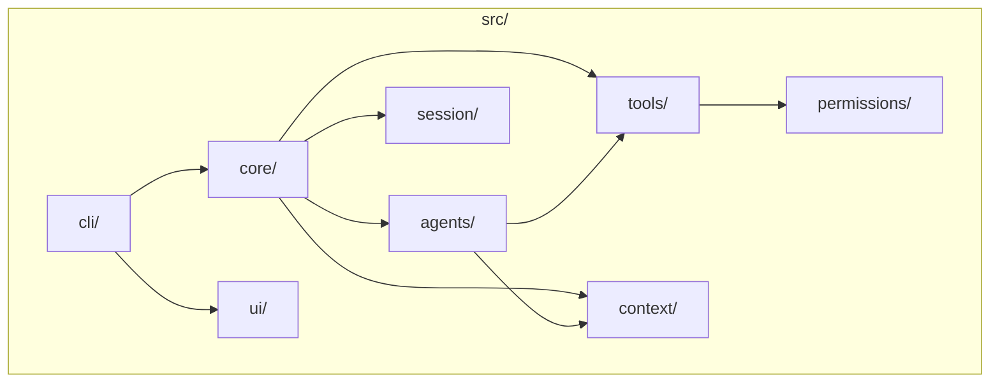
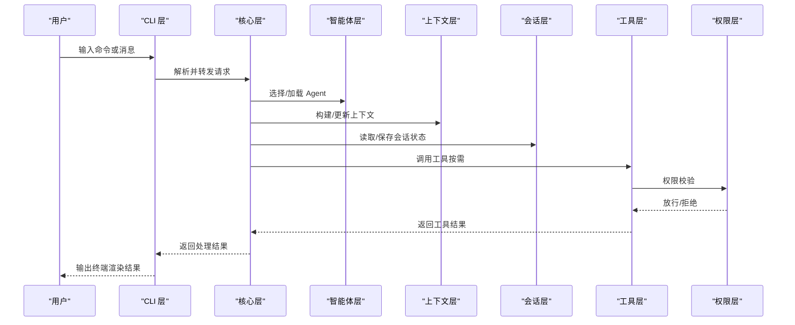
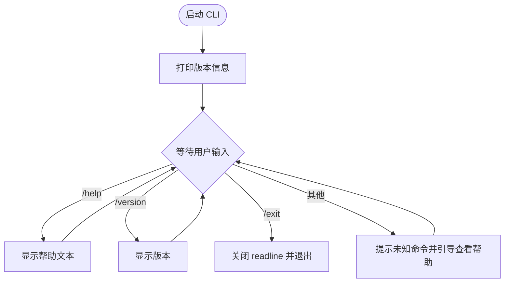
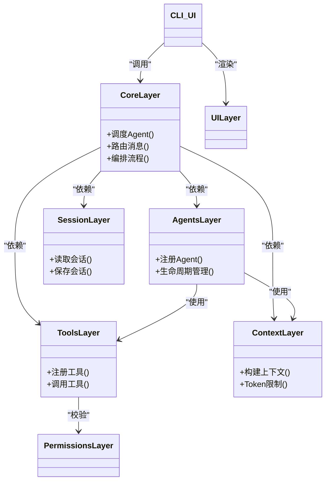
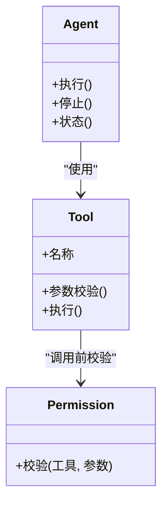
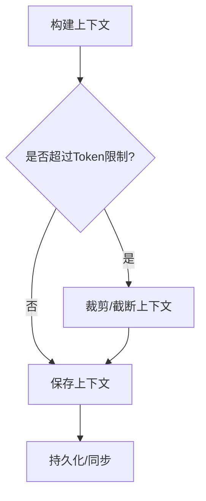
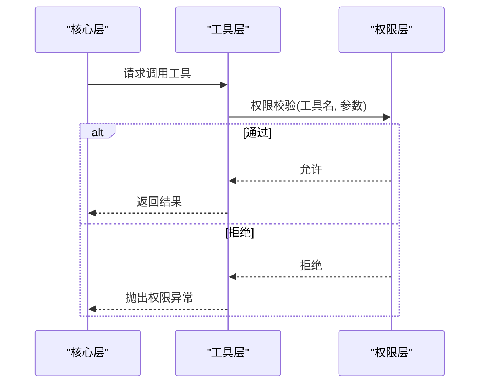
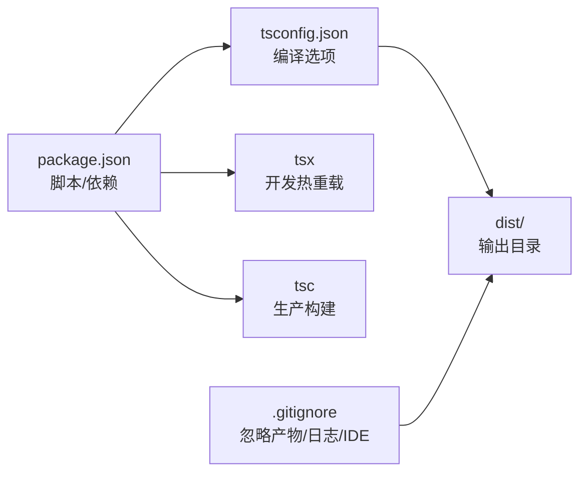

# 开发指南

<cite>
**本文引用的文件**
- [package.json](file://package.json)
- [tsconfig.json](file://tsconfig.json)
- [README.md](file://README.md)
- [AGENTS.md](file://AGENTS.md)
- [src/cli/index.ts](file://src/cli/index.ts)
- [src/agents/index.ts](file://src/agents/index.ts)
- [src/core/index.ts](file://src/core/index.ts)
- [src/tools/index.ts](file://src/tools/index.ts)
- [src/context/index.ts](file://src/context/index.ts)
- [src/session/index.ts](file://src/session/index.ts)
- [src/ui/index.ts](file://src/ui/index.ts)
- [src/permissions/index.ts](file://src/permissions/index.ts)
- [.gitignore](file://.gitignore)
</cite>

## 目录
1. [简介](#简介)
2. [项目结构](#项目结构)
3. [核心组件](#核心组件)
4. [架构总览](#架构总览)
5. [详细组件分析](#详细组件分析)
6. [依赖分析](#依赖分析)
7. [性能考虑](#性能考虑)
8. [故障排查指南](#故障排查指南)
9. [结论](#结论)
10. [附录](#附录)

## 简介
本指南面向参与 easy-agent-cli 项目的开发者，目标是帮助你快速搭建开发环境、理解项目分层架构与模块职责、掌握编码规范与最佳实践，并提供扩展智能体与工具系统的方法、安全控制机制、调试技巧以及贡献流程说明。项目采用 TypeScript + Node.js（ESM）实现，具备清晰的分层设计与模块化组织。

## 项目结构
项目采用“按层划分”的目录组织方式，各层职责明确、边界清晰，遵循“上层可依赖下层，下层不可依赖上层”的依赖规则，减少耦合并提升可维护性。

图示来源
- [AGENTS.md:15-42](file://AGENTS.md#L15-L42)
- [src/cli/index.ts:1-65](file://src/cli/index.ts#L1-L65)
- [src/core/index.ts:1-2](file://src/core/index.ts#L1-L2)
- [src/agents/index.ts:1-2](file://src/agents/index.ts#L1-L2)
- [src/tools/index.ts:1-2](file://src/tools/index.ts#L1-L2)
- [src/context/index.ts:1-2](file://src/context/index.ts#L1-L2)
- [src/session/index.ts:1-2](file://src/session/index.ts#L1-L2)
- [src/ui/index.ts:1-2](file://src/ui/index.ts#L1-L2)
- [src/permissions/index.ts:1-2](file://src/permissions/index.ts#L1-L2)

章节来源
- [AGENTS.md:15-42](file://AGENTS.md#L15-L42)
- [README.md:1-3](file://README.md#L1-L3)

## 核心组件
- CLI 层：负责命令解析、REPL 交互与入口控制流，当前已实现基础帮助、退出、版本等命令。
- 核心层：负责 Agent 调度、消息路由与流程编排，作为上层依赖注入点。
- 智能体层：承载 Agent 的定义、注册与生命周期管理，依赖工具与上下文。
- 工具层：承载内置工具与工具注册机制，依赖权限层进行安全控制。
- 上下文层：负责对话上下文构建与管理，关注 Token 限制与上下文长度控制。
- 会话层：负责会话状态与历史管理，建议考虑持久化方案。
- UI 层：负责终端渲染与格式化输出，独立于业务逻辑。
- 权限层：负责工具调用权限校验与安全策略，贯穿工具调用链路。

章节来源
- [AGENTS.md:29-42](file://AGENTS.md#L29-L42)
- [src/cli/index.ts:6-19](file://src/cli/index.ts#L6-L19)
- [src/agents/index.ts:1-2](file://src/agents/index.ts#L1-L2)
- [src/tools/index.ts:1-2](file://src/tools/index.ts#L1-L2)
- [src/context/index.ts:1-2](file://src/context/index.ts#L1-L2)
- [src/session/index.ts:1-2](file://src/session/index.ts#L1-L2)
- [src/ui/index.ts:1-2](file://src/ui/index.ts#L1-L2)
- [src/permissions/index.ts:1-2](file://src/permissions/index.ts#L1-L2)

## 架构总览
下图展示 CLI 与核心层之间的交互流程，体现命令解析到核心调度的典型路径。

图示来源
- [src/cli/index.ts:23-59](file://src/cli/index.ts#L23-L59)
- [AGENTS.md:29-42](file://AGENTS.md#L29-L42)

## 详细组件分析

### CLI 组件分析
- 职责：命令解析、REPL 循环、帮助/退出/版本等基础命令处理。
- 当前实现：支持 /help、/exit、/version；未接入核心层调度。
- 扩展建议：在主循环中增加对用户输入的进一步解析，将非命令文本转交核心层处理；在 finally 中确保资源释放。

图示来源
- [src/cli/index.ts:23-59](file://src/cli/index.ts#L23-L59)

章节来源
- [src/cli/index.ts:1-65](file://src/cli/index.ts#L1-L65)

### 核心组件分析
- 职责：Agent 调度、消息路由、流程编排；向上依赖 agents、tools、context、session；向下不依赖其他层。
- 当前实现：占位文件，尚未实现具体调度逻辑。
- 扩展建议：实现 Agent 注册表、消息路由、上下文裁剪与 Token 限制、会话持久化接口、工具调用编排与错误恢复。

图示来源
- [AGENTS.md:29-42](file://AGENTS.md#L29-L42)
- [src/core/index.ts:1-2](file://src/core/index.ts#L1-L2)
- [src/agents/index.ts:1-2](file://src/agents/index.ts#L1-L2)
- [src/tools/index.ts:1-2](file://src/tools/index.ts#L1-L2)
- [src/context/index.ts:1-2](file://src/context/index.ts#L1-L2)
- [src/session/index.ts:1-2](file://src/session/index.ts#L1-L2)
- [src/ui/index.ts:1-2](file://src/ui/index.ts#L1-L2)
- [src/permissions/index.ts:1-2](file://src/permissions/index.ts#L1-L2)

章节来源
- [AGENTS.md:29-42](file://AGENTS.md#L29-L42)
- [src/core/index.ts:1-2](file://src/core/index.ts#L1-L2)

### 智能体层与工具层分析
- 智能体层：负责 Agent 的定义、注册与生命周期管理；依赖工具与上下文。
- 工具层：负责工具实现与注册；调用前必须经权限层校验。
- 扩展建议：为 Agent 定义统一接口与工厂模式；为工具提供注册表与参数校验；引入工具缓存与超时控制。

图示来源
- [AGENTS.md:35-36](file://AGENTS.md#L35-L36)
- [src/agents/index.ts:1-2](file://src/agents/index.ts#L1-L2)
- [src/tools/index.ts:1-2](file://src/tools/index.ts#L1-L2)
- [src/permissions/index.ts:1-2](file://src/permissions/index.ts#L1-L2)

章节来源
- [AGENTS.md:35-36](file://AGENTS.md#L35-L36)
- [src/agents/index.ts:1-2](file://src/agents/index.ts#L1-L2)
- [src/tools/index.ts:1-2](file://src/tools/index.ts#L1-L2)
- [src/permissions/index.ts:1-2](file://src/permissions/index.ts#L1-L2)

### 上下文层与会话层分析
- 上下文层：负责上下文构建与管理，需关注 Token 限制与上下文长度控制。
- 会话层：负责会话状态与历史管理，建议考虑持久化方案以提升用户体验。
- 扩展建议：实现上下文压缩、摘要截断、消息权重与过期策略；会话数据可落盘或云端同步。

图示来源
- [AGENTS.md:99-100](file://AGENTS.md#L99-L100)
- [src/context/index.ts:1-2](file://src/context/index.ts#L1-L2)
- [src/session/index.ts:1-2](file://src/session/index.ts#L1-L2)

章节来源
- [AGENTS.md:99-100](file://AGENTS.md#L99-L100)
- [src/context/index.ts:1-2](file://src/context/index.ts#L1-L2)
- [src/session/index.ts:1-2](file://src/session/index.ts#L1-L2)

### UI 层与权限层分析
- UI 层：负责终端渲染与格式化输出，保持与业务逻辑解耦。
- 权限层：负责工具调用权限与安全策略，所有工具调用必须经过校验。
- 扩展建议：UI 支持富文本/表格渲染；权限策略可配置白名单/黑名单与配额控制。

图示来源
- [AGENTS.md:97-98](file://AGENTS.md#L97-L98)
- [src/ui/index.ts:1-2](file://src/ui/index.ts#L1-L2)
- [src/permissions/index.ts:1-2](file://src/permissions/index.ts#L1-L2)

章节来源
- [AGENTS.md:97-98](file://AGENTS.md#L97-L98)
- [src/ui/index.ts:1-2](file://src/ui/index.ts#L1-L2)
- [src/permissions/index.ts:1-2](file://src/permissions/index.ts#L1-L2)

## 依赖分析
- 构建与运行时：ESM 模块系统、TypeScript 编译器、Node.js 运行时。
- 开发工具：tsx 提供热重载开发体验，tsc 负责生产构建。
- 依赖规则：严格遵循“上层可依赖下层”的单向依赖，避免跨层耦合。

图示来源
- [package.json:10-14](file://package.json#L10-L14)
- [tsconfig.json:1-24](file://tsconfig.json#L1-L24)
- [.gitignore:1-11](file://.gitignore#L1-L11)

章节来源
- [package.json:1-32](file://package.json#L1-L32)
- [tsconfig.json:1-24](file://tsconfig.json#L1-L24)
- [.gitignore:1-11](file://.gitignore#L1-L11)

## 性能考虑
- 编译目标与模块系统：ES2022 + NodeNext，兼顾现代特性与 Node 生态兼容。
- 严格模式与类型声明：开启 strict、declaration、declarationMap、sourceMap，提升类型安全与调试体验。
- 路径别名：通过 baseUrl 与 paths 简化导入路径，降低层级过深导致的相对路径复杂度。
- 上下文与 Token 限制：在上下文层实施裁剪与截断策略，避免超长上下文影响响应时间与成本。
- 会话持久化：建议将会话历史与状态持久化，减少重复计算与网络请求。

章节来源
- [tsconfig.json:2-20](file://tsconfig.json#L2-L20)
- [AGENTS.md:99-100](file://AGENTS.md#L99-L100)

## 故障排查指南
- 启动失败
  - 确认 Node.js 版本满足运行时要求（参考技术栈说明）。
  - 确认 ESM 模块系统配置正确（package.json 的 type 字段与 tsconfig 的 module/moduleResolution）。
- 开发模式无法热重载
  - 确认 tsx 可用且 Node 版本满足其引擎要求。
  - 检查 scripts 中 dev 命令指向的入口文件是否存在。
- 构建产物缺失
  - 确认 outDir 与 rootDir 配置正确，清理 dist 后重新构建。
- 权限相关问题
  - 工具调用必须经过权限层校验，若出现权限异常，检查权限策略与工具注册项。

章节来源
- [package.json:5-14](file://package.json#L5-L14)
- [tsconfig.json:3-5](file://tsconfig.json#L3-L5)
- [AGENTS.md:97-98](file://AGENTS.md#L97-L98)

## 结论
easy-agent-cli 采用清晰的分层架构与严格的模块化组织，结合 ESM 与 TypeScript，为扩展智能体与工具系统提供了良好的基础。建议在现有占位层基础上逐步完善核心调度、上下文与会话管理、权限校验与 UI 渲染，同时遵循命名约定、类型注解与错误处理规范，持续提升可维护性与安全性。

## 附录

### 开发环境搭建
- Node.js 版本要求：参考技术栈说明中的运行时版本。
- 安装依赖：使用包管理器安装开发与运行所需依赖。
- IDE 配置建议：启用 TypeScript 语言服务、ESLint/Prettier 插件、ESM 支持；配置路径别名映射。
- 开发命令：
  - 安装依赖：npm install
  - 开发模式（热重载）：npm run dev
  - 构建：npm run build
  - 运行构建产物：npm start

章节来源
- [AGENTS.md:8-13](file://AGENTS.md#L8-L13)
- [AGENTS.md:68-82](file://AGENTS.md#L68-L82)
- [package.json:10-14](file://package.json#L10-L14)

### 代码规范与最佳实践
- 命名约定：文件名 kebab-case.ts，类名 PascalCase，函数/变量 camelCase，常量 UPPER_SNAKE_CASE，接口 I 前缀，类型 PascalCase。
- 代码风格：使用 ESM import/export，优先 interface 定义类型，函数明确返回类型注解，统一 async/await，使用自定义 Error 类。
- 模块导出：每层通过 index.ts 统一导出公共 API，内部实现文件不直接对外暴露。

章节来源
- [AGENTS.md:44-67](file://AGENTS.md#L44-L67)

### 扩展智能体与工具系统
- Agent 注册与生命周期：在智能体层提供注册表与工厂，支持动态加载与状态管理。
- 工具扩展：在工具层注册新工具，确保调用前通过权限层校验。
- 安全控制：权限层集中管理工具访问策略，建议支持白名单、配额与审计日志。

章节来源
- [AGENTS.md:35-36](file://AGENTS.md#L35-L36)
- [AGENTS.md:97-98](file://AGENTS.md#L97-L98)

### 调试技巧与开发工具
- 使用 tsx 在开发阶段进行热重载调试。
- 利用 TypeScript 的 declaration/declarationMap/sourceMap 提升断点与类型推断体验。
- 在 CLI 层增加日志开关与错误堆栈输出，便于定位问题。

章节来源
- [AGENTS.md:13-13](file://AGENTS.md#L13-L13)
- [package.json:26-30](file://package.json#L26-L30)
- [tsconfig.json:13-15](file://tsconfig.json#L13-L15)

### 贡献指南与 Pull Request 流程
- 提交规范：feat（新功能）、fix（修复）、refactor（重构）、docs（文档）、chore（构建/工具链）、test（测试）。
- PR 流程建议：从分支提交 PR，填写变更说明，确保通过本地构建与基本测试后发起评审。

章节来源
- [AGENTS.md:84-93](file://AGENTS.md#L84-L93)