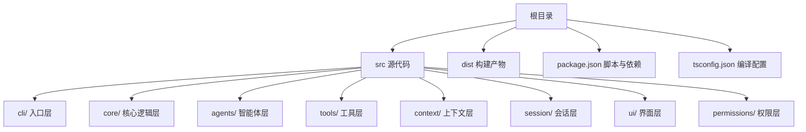
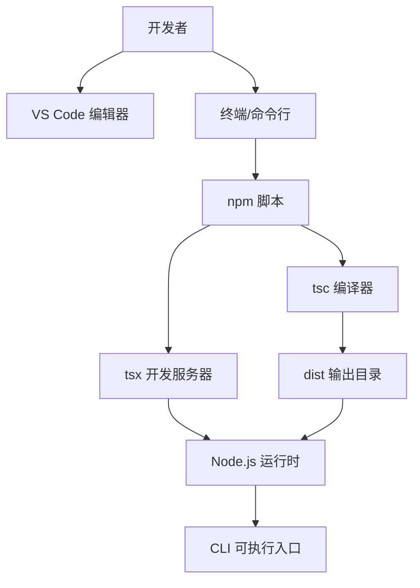
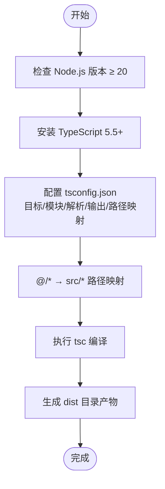
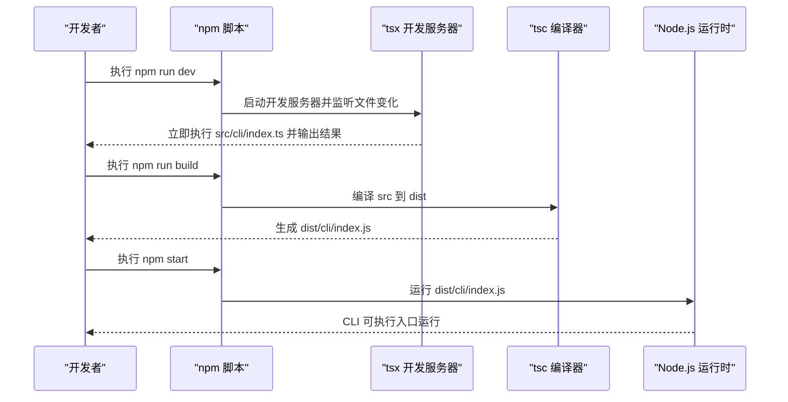
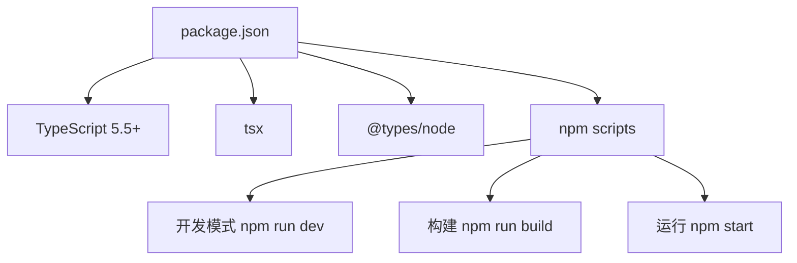

# 开发环境搭建

<cite>
**本文档引用的文件**
- [package.json](file://package.json)
- [tsconfig.json](file://tsconfig.json)
- [README.md](file://README.md)
- [AGENTS.md](file://AGENTS.md)
- [src/cli/index.ts](file://src/cli/index.ts)
</cite>

## 目录
1. [简介](#简介)
2. [项目结构](#项目结构)
3. [核心组件](#核心组件)
4. [架构总览](#架构总览)
5. [详细组件分析](#详细组件分析)
6. [依赖分析](#依赖分析)
7. [性能考虑](#性能考虑)
8. [故障排除指南](#故障排除指南)
9. [结论](#结论)
10. [附录](#附录)

## 简介
本指南面向首次参与 easy-agent-cli 项目的开发者，提供从零搭建开发环境的完整流程，涵盖 Node.js 20+ 版本要求、TypeScript 编译配置与路径映射、开发工具推荐（VS Code 配置、TypeScript 插件与调试工具）、依赖安装与开发脚本使用方法，并包含环境验证步骤与常见问题解决方案。

## 项目结构
该项目采用基于分层架构的 TypeScript + Node.js ESM 项目组织方式，源代码位于 src 目录下，按功能层级划分为多个子模块；构建产物输出到 dist 目录；开发与构建脚本由 npm scripts 统一管理。

图表来源
- [AGENTS.md:15-27](file://AGENTS.md#L15-L27)
- [tsconfig.json:21-23](file://tsconfig.json#L21-L23)

章节来源
- [AGENTS.md:15-27](file://AGENTS.md#L15-L27)
- [tsconfig.json:21-23](file://tsconfig.json#L21-L23)

## 核心组件
- Node.js 运行时：要求 20+ 版本，确保兼容 ES2022 语法与 ESM 模块系统。
- TypeScript：版本 5.5+，启用严格模式与声明文件生成，便于开发与发布。
- 构建与开发工具：tsc 用于编译，tsx 提供开发时热重载与即时执行。
- 包管理：npm，使用 package.json 中的 scripts 管理构建、开发与启动流程。

章节来源
- [AGENTS.md:7-13](file://AGENTS.md#L7-L13)
- [package.json:26-30](file://package.json#L26-L30)

## 架构总览
下图展示了开发环境中的关键角色与工具关系：开发者在本地通过 VS Code 或终端执行 npm 脚本，TypeScript 编译器根据 tsconfig.json 配置进行编译，tsx 在开发模式下提供热重载；最终通过 node 运行构建产物。

图表来源
- [package.json:10-14](file://package.json#L10-L14)
- [tsconfig.json:2-20](file://tsconfig.json#L2-L20)

章节来源
- [package.json:10-14](file://package.json#L10-L14)
- [tsconfig.json:2-20](file://tsconfig.json#L2-L20)

## 详细组件分析

### Node.js 20+ 版本要求与安装步骤
- 版本要求：项目技术栈明确要求 Node.js 20+，以支持 ES2022 语法与 ESM 模块系统。
- 安装建议：
  - Windows/macOS/Linux 推荐使用官方安装包或通过 nvm（Node Version Manager）进行安装与版本切换。
  - 安装完成后，在项目根目录执行环境验证步骤确认版本满足要求。

章节来源
- [AGENTS.md:10](file://AGENTS.md#L10)

### TypeScript 编译配置与路径映射
- 编译目标与模块系统：
  - 目标：ES2022
  - 模块：NodeNext
  - 模块解析：NodeNext
- 输出与源码组织：
  - 输出目录：dist
  - 根目录：src
- 关键编译选项：
  - 启用严格模式、声明文件与 sourcemap、跳过库检查、JSON 模块解析等。
- 路径映射：
  - baseUrl 设为项目根目录
  - paths 映射 @/* 到 src/*
  - 该映射便于在各层模块中使用相对清晰的绝对路径导入

图表来源
- [AGENTS.md:9](file://AGENTS.md#L9)
- [tsconfig.json:2-20](file://tsconfig.json#L2-L20)

章节来源
- [tsconfig.json:2-20](file://tsconfig.json#L2-L20)
- [AGENTS.md:9](file://AGENTS.md#L9)

### 开发工具推荐（VS Code 配置、TypeScript 插件与调试工具）
- VS Code 扩展建议：
  - 安装 TypeScript 和 JavaScript 语言特性扩展，确保对 ESM 与严格模式的良好支持。
  - 建议启用“自动导入”、“格式化”和“错误诊断”等基础功能。
- 调试配置：
  - 使用 VS Code 的 launch.json 配置 Node.js 调试任务，指向 CLI 入口文件或通过 tsx 启动参数进行调试。
  - 可结合 sourcemap 在源码断点进行调试，提升开发体验。
- 项目内 CLI 入口：
  - CLI 入口位于 src/cli/index.ts，提供 REPL 交互与命令路由，适合在开发阶段直接调试。

章节来源
- [src/cli/index.ts:1-65](file://src/cli/index.ts#L1-L65)

### 依赖安装流程与开发脚本使用
- 依赖安装：
  - 使用 npm install 安装开发与运行所需依赖（TypeScript、@types/node、tsx）。
- 开发脚本：
  - npm run dev：通过 tsx 即时执行 src/cli/index.ts，支持热重载与快速迭代。
  - npm run build：使用 tsc 编译 TypeScript 到 dist 目录。
  - npm start：使用 node 运行 dist/cli/index.js 作为最终可执行入口。
- CLI 可执行绑定：
  - package.json 中的 bin 字段将 dist/cli/index.js 暴露为 easy-agent 命令，便于全局或本地使用。

图表来源
- [package.json:10-14](file://package.json#L10-L14)
- [src/cli/index.ts:1-65](file://src/cli/index.ts#L1-L65)

章节来源
- [package.json:10-14](file://package.json#L10-L14)
- [AGENTS.md:68-82](file://AGENTS.md#L68-L82)

### 环境验证步骤
- Node.js 版本验证：在项目根目录执行命令检查 Node.js 版本是否满足 20+ 要求。
- TypeScript 安装验证：确认已安装 TypeScript 5.5+。
- 依赖安装验证：执行 npm install 后，确认 node_modules 存在且包含 @types/node、typescript、tsx。
- 编译验证：执行 npm run build，确认 dist 目录生成且包含编译后的 JS 文件。
- 开发运行验证：执行 npm run dev，观察 CLI 是否正常启动并响应命令。
- 生产运行验证：执行 npm start，确认 dist 产物可被 Node.js 正常运行。

章节来源
- [AGENTS.md:68-82](file://AGENTS.md#L68-L82)
- [package.json:10-14](file://package.json#L10-L14)

## 依赖分析
- 语言与运行时：TypeScript 5.5+、Node.js 20+
- 构建与开发：tsc（编译）、tsx（开发热重载）
- 类型支持：@types/node
- 包管理：npm（package.json）

图表来源
- [package.json:26-30](file://package.json#L26-L30)
- [package.json:10-14](file://package.json#L10-L14)

章节来源
- [package.json:26-30](file://package.json#L26-L30)
- [package.json:10-14](file://package.json#L10-L14)

## 性能考虑
- 使用 NodeNext 模块系统与 ES2022 目标可获得更优的模块加载与运行时性能。
- 启用 declaration 与 declarationMap 有助于 IDE 快速索引与增量编译。
- 在开发阶段使用 tsx 热重载减少频繁重启带来的等待时间。
- 构建时开启 sourceMap 便于定位问题，但生产环境可按需关闭以减小体积。

## 故障排除指南
- Node.js 版本过低
  - 症状：TypeScript 编译失败或运行时报错。
  - 处理：升级 Node.js 至 20+，重新安装依赖并清理缓存后重试。
- TypeScript 版本不匹配
  - 症状：编译报错或类型提示异常。
  - 处理：确保安装 TypeScript 5.5+，并保持与 @types/node 版本兼容。
- 路径映射无效
  - 症状：导入 @/* 报错或无法解析。
  - 处理：确认 tsconfig.json 中 baseUrl 与 paths 设置正确，重启编辑器或重新加载 TS 服务。
- 开发脚本无法执行
  - 症状：npm run dev/build/start 报错。
  - 处理：检查 package.json 中 scripts 配置，确认 CLI 入口路径与 bin 绑定一致；清理 node_modules 与 dist 后重新安装依赖。
- CLI 无法运行
  - 症状：npm start 或全局命令无法找到入口。
  - 处理：确认 dist 目录存在且包含可执行的 JS 文件；检查 package.json 的 bin 字段与 main 字段是否指向正确路径。

章节来源
- [tsconfig.json:16-19](file://tsconfig.json#L16-L19)
- [package.json:7-9](file://package.json#L7-L9)
- [package.json:10-14](file://package.json#L10-L14)

## 结论
通过遵循本指南，您可以快速搭建并验证 easy-agent-cli 的开发环境。重点在于满足 Node.js 20+ 与 TypeScript 5.5+ 的版本要求，正确配置 tsconfig.json 的编译选项与路径映射，配合 npm scripts 与 tsx 实现高效开发，并通过 dist 产物进行生产运行。遇到问题时，可依据故障排除指南逐项排查。

## 附录
- 项目名称与简述：见 README.md
- 开发规范与分层架构：见 AGENTS.md
- CLI 入口示例：见 src/cli/index.ts

章节来源
- [README.md:1-3](file://README.md#L1-L3)
- [AGENTS.md:1-101](file://AGENTS.md#L1-L101)
- [src/cli/index.ts:1-65](file://src/cli/index.ts#L1-L65)