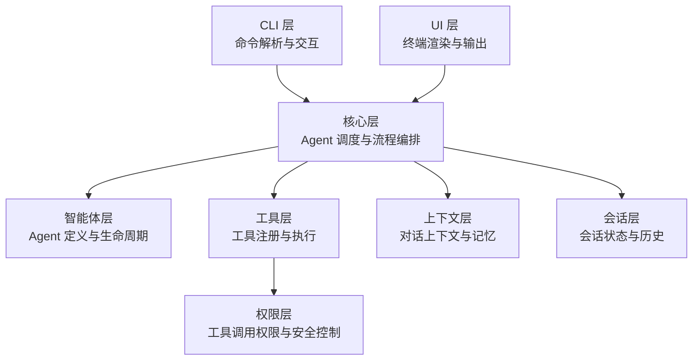
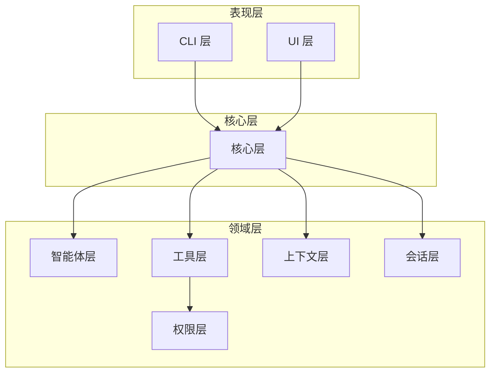
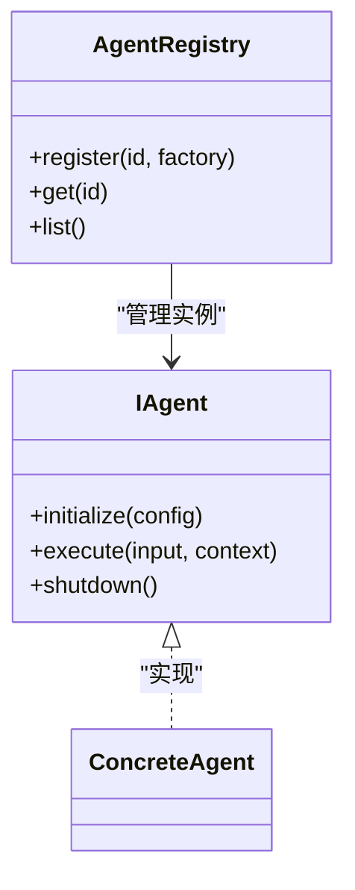
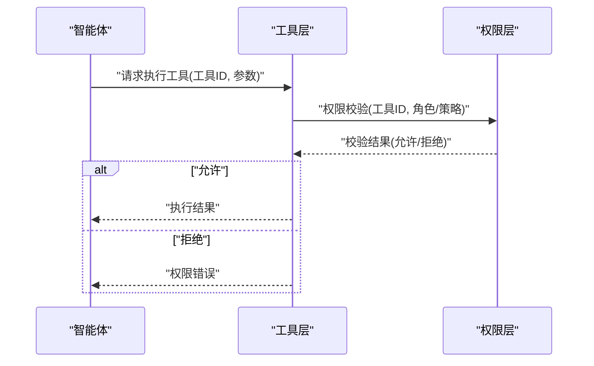
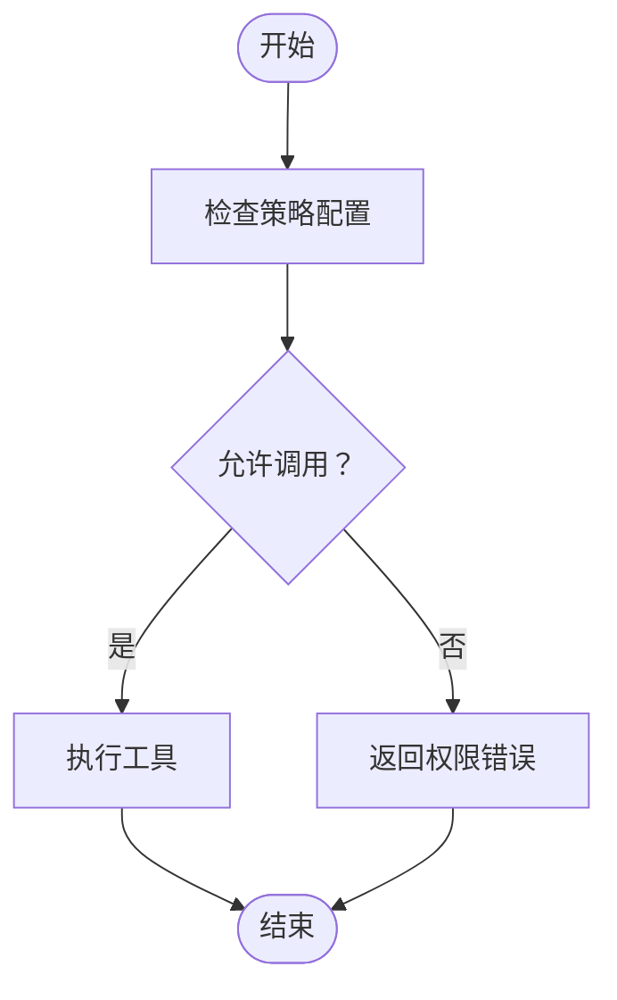
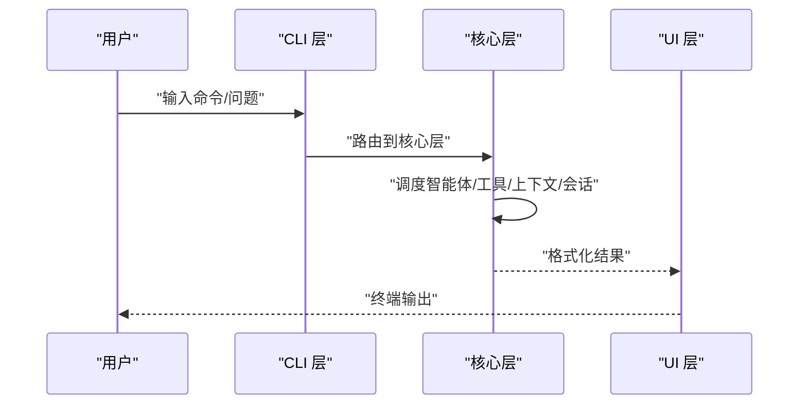
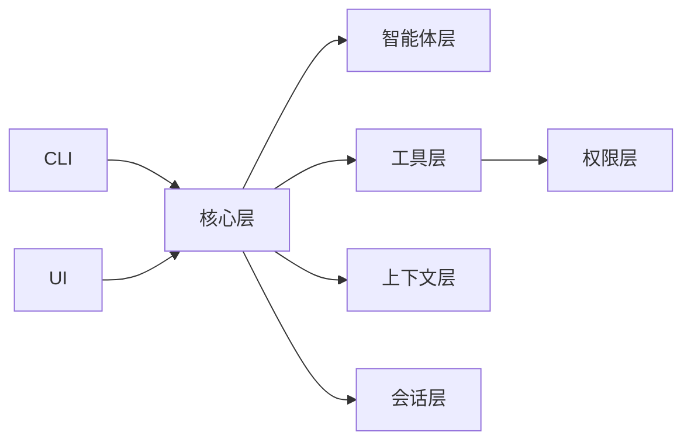

# 扩展开发指南

<cite>
**本文引用的文件**
- [package.json](file://package.json)
- [AGENTS.md](file://AGENTS.md)
- [src/cli/index.ts](file://src/cli/index.ts)
- [src/core/index.ts](file://src/core/index.ts)
- [src/agents/index.ts](file://src/agents/index.ts)
- [src/tools/index.ts](file://src/tools/index.ts)
- [src/context/index.ts](file://src/context/index.ts)
- [src/session/index.ts](file://src/session/index.ts)
- [src/ui/index.ts](file://src/ui/index.ts)
- [src/permissions/index.ts](file://src/permissions/index.ts)
</cite>

## 目录
1. [简介](#简介)
2. [项目结构](#项目结构)
3. [核心组件](#核心组件)
4. [架构总览](#架构总览)
5. [详细组件分析](#详细组件分析)
6. [依赖关系分析](#依赖关系分析)
7. [性能考量](#性能考量)
8. [故障排查指南](#故障排查指南)
9. [结论](#结论)
10. [附录](#附录)

## 简介
本指南面向希望在 easy-agent-cli 中进行扩展开发的工程师，重点覆盖以下主题：
- 如何添加新的智能体（Agent）：接口定义、注册机制与生命周期管理
- 工具系统的扩展：工具注册、执行机制与安全控制
- 权限控制系统的工作原理与自定义方法
- 最佳实践与常见陷阱规避
- 提供可复用的实现模板与示例路径（以源文件路径代替具体代码）

## 项目结构
项目采用分层架构，各层职责清晰、边界明确，遵循“上层可依赖下层”的依赖规则。CLI 层负责命令解析与交互；核心层负责 Agent 调度与流程编排；智能体层、工具层、上下文层、会话层、UI 层与权限层分别承担各自职责。

图表来源
- [AGENTS.md:29-42](file://AGENTS.md#L29-L42)

章节来源
- [AGENTS.md:15-27](file://AGENTS.md#L15-L27)
- [AGENTS.md:29-42](file://AGENTS.md#L29-L42)

## 核心组件
- CLI 层：提供命令式交互入口，当前包含帮助、退出、版本等基础命令，后续可扩展为代理选择、工具调用等入口。
- 核心层：作为调度中枢，协调智能体、工具、上下文、会话与 UI。
- 智能体层：承载 Agent 的定义、注册与生命周期管理。
- 工具层：承载工具的实现与注册，并向权限层提供校验接口。
- 上下文层：管理对话上下文与记忆。
- 会话层：管理会话状态与历史。
- UI 层：负责终端渲染与格式化输出。
- 权限层：对工具调用进行权限校验与安全控制。

章节来源
- [AGENTS.md:29-42](file://AGENTS.md#L29-L42)
- [src/cli/index.ts:6-19](file://src/cli/index.ts#L6-L19)

## 架构总览
下图展示了从 CLI 到核心层再到各子层的调用关系与职责分工：

图表来源
- [AGENTS.md:29-42](file://AGENTS.md#L29-L42)

## 详细组件分析

### 智能体（Agent）扩展指南
目标：新增一个可被核心层调度的智能体，具备注册与生命周期管理能力。

- 接口定义与命名规范
  - 使用 I 前缀的接口定义智能体能力契约，例如 IAgent。
  - 类型与常量遵循命名规范：PascalCase、UPPER_SNAKE_CASE。
  - 文件名采用 kebab-case.ts。
  - 参考命名与风格规范：[AGENTS.md:46-61](file://AGENTS.md#L46-L61)

- 注册机制
  - 在智能体层通过 index.ts 统一导出公共 API，内部实现不直接对外暴露。
  - 建议维护一个全局注册表（例如 Map 或数组），键为智能体标识符，值为构造器或实例工厂。
  - 示例路径参考：[src/agents/index.ts](file://src/agents/index.ts)

- 生命周期管理
  - 初始化：加载配置、建立上下文、准备资源。
  - 执行：接收输入，调用工具，生成响应。
  - 结束：释放资源、持久化状态。
  - 参考注意事项：[AGENTS.md:95-101](file://AGENTS.md#L95-L101)

- 与核心层协作
  - 核心层通过智能体标识符从注册表获取实例，再调用其执行方法。
  - 智能体可依赖工具层与上下文层提供的能力。
  - 参考依赖方向：[AGENTS.md:34-36](file://AGENTS.md#L34-L36)

- 实现模板与示例路径
  - 模板文件位置：[src/agents/index.ts](file://src/agents/index.ts)
  - 建议在该文件中定义 IAgent 接口、注册表与生命周期钩子。
  - 示例路径（仅作定位，非具体代码）：[src/agents/index.ts](file://src/agents/index.ts)

图表来源
- [AGENTS.md:46-61](file://AGENTS.md#L46-L61)
- [src/agents/index.ts](file://src/agents/index.ts)

章节来源
- [AGENTS.md:46-61](file://AGENTS.md#L46-L61)
- [AGENTS.md:34-36](file://AGENTS.md#L34-L36)
- [AGENTS.md:95-101](file://AGENTS.md#L95-L101)
- [src/agents/index.ts](file://src/agents/index.ts)

### 工具系统扩展指南
目标：新增工具并确保其可被智能体调用且受权限层保护。

- 工具注册
  - 在工具层通过 index.ts 统一导出公共 API。
  - 建议维护工具注册表（键为工具标识符，值为工具元数据与执行函数）。
  - 示例路径参考：[src/tools/index.ts](file://src/tools/index.ts)

- 工具执行机制
  - 工具执行前必须经过权限层校验。
  - 执行结果需返回给调用方（通常为智能体），由其决定下一步动作。
  - 参考依赖方向与约束：[AGENTS.md:36-37](file://AGENTS.md#L36-L37)

- 安全控制
  - 权限层负责校验工具调用是否被允许。
  - 工具调用必须经过 permissions 层校验，这是强制要求。
  - 示例路径参考：[src/permissions/index.ts](file://src/permissions/index.ts)

- 实现模板与示例路径
  - 模板文件位置：[src/tools/index.ts](file://src/tools/index.ts)
  - 示例路径（仅作定位，非具体代码）：[src/tools/index.ts](file://src/tools/index.ts)

图表来源
- [AGENTS.md:36-37](file://AGENTS.md#L36-L37)
- [AGENTS.md:98](file://AGENTS.md#L98)

章节来源
- [AGENTS.md:36-37](file://AGENTS.md#L36-L37)
- [AGENTS.md:98](file://AGENTS.md#L98)
- [src/tools/index.ts](file://src/tools/index.ts)
- [src/permissions/index.ts](file://src/permissions/index.ts)

### 权限控制系统工作原理与自定义
- 工作原理
  - 权限层对工具调用进行校验，确保调用符合安全策略。
  - 工具层在执行前必须调用权限层，返回允许或拒绝。
  - 参考约束：[AGENTS.md:98](file://AGENTS.md#L98)

- 自定义方法
  - 在权限层定义策略接口与默认策略实现。
  - 支持基于角色、IP、时间窗口、配额等多种维度的策略组合。
  - 将新策略注册到权限层的策略管理器中。
  - 示例路径参考：[src/permissions/index.ts](file://src/permissions/index.ts)

- 安全最佳实践
  - 默认拒绝（Deny by default）
  - 最小权限原则
  - 记录审计日志（建议在权限层增加日志记录）
  - 对高危工具设置更严格策略

图表来源
- [AGENTS.md:98](file://AGENTS.md#L98)
- [src/permissions/index.ts](file://src/permissions/index.ts)

章节来源
- [AGENTS.md:98](file://AGENTS.md#L98)
- [src/permissions/index.ts](file://src/permissions/index.ts)

### 会话与上下文集成
- 会话层
  - 管理会话状态与历史，支持多轮对话的连续性。
  - 参考职责：[AGENTS.md:38](file://AGENTS.md#L38)

- 上下文层
  - 构建与管理对话上下文，注意 token 限制管理。
  - 参考注意事项：[AGENTS.md:100](file://AGENTS.md#L100)

- 集成方式
  - 智能体在执行过程中读取上下文，必要时更新会话历史。
  - 工具执行结果回传给智能体，由其决定是否更新上下文。

章节来源
- [AGENTS.md:38](file://AGENTS.md#L38)
- [AGENTS.md:100](file://AGENTS.md#L100)
- [src/context/index.ts](file://src/context/index.ts)
- [src/session/index.ts](file://src/session/index.ts)

### UI 展示与 CLI 交互
- CLI 层
  - 当前提供帮助、退出、版本等命令，后续可扩展为代理选择、工具调用等入口。
  - 示例路径参考：[src/cli/index.ts](file://src/cli/index.ts)

- UI 层
  - 负责终端渲染与格式化输出，与核心层解耦。
  - 参考职责：[AGENTS.md:39](file://AGENTS.md#L39)

- 交互流程
  - CLI 解析用户输入，调用核心层，核心层协调各层完成任务，UI 输出结果。

图表来源
- [src/cli/index.ts](file://src/cli/index.ts)
- [AGENTS.md:39](file://AGENTS.md#L39)

章节来源
- [src/cli/index.ts](file://src/cli/index.ts)
- [AGENTS.md:39](file://AGENTS.md#L39)

## 依赖关系分析
- 依赖规则
  - 上层可依赖下层，下层不可依赖上层。
  - 同层之间尽量避免直接依赖。
  - 参考依赖方向与规则：[AGENTS.md:42-42](file://AGENTS.md#L42-L42)

- 关键依赖链
  - CLI → 核心层
  - 核心层 → 智能体层、工具层、上下文层、会话层
  - 工具层 → 权限层
  - UI 层 无下层依赖

图表来源
- [AGENTS.md:33-40](file://AGENTS.md#L33-L40)

章节来源
- [AGENTS.md:42-42](file://AGENTS.md#L42-L42)
- [AGENTS.md:33-40](file://AGENTS.md#L33-L40)

## 性能考量
- 模块化与懒加载
  - 通过 index.ts 统一导出，避免重复导入，减少启动开销。
  - 参考模块导出规范：[AGENTS.md:65-66](file://AGENTS.md#L65-L66)

- 资源管理
  - 智能体与工具在生命周期内合理分配与释放资源，避免内存泄漏。
  - 会话层需考虑持久化场景，平衡性能与可靠性。
  - 参考注意事项：[AGENTS.md:99](file://AGENTS.md#L99)

- 并发与异步
  - 统一使用 async/await，避免阻塞主线程。
  - 参考代码风格：[AGENTS.md:59-60](file://AGENTS.md#L59-L60)

## 故障排查指南
- 常见问题
  - 工具调用未经过权限层校验：检查工具层是否正确调用权限层。
    - 参考约束：[AGENTS.md:98](file://AGENTS.md#L98)
  - 会话状态异常：确认会话层的持久化策略与并发访问控制。
    - 参考注意事项：[AGENTS.md:99](file://AGENTS.md#L99)
  - 上下文越界或 token 超限：检查上下文层的 token 限制管理。
    - 参考注意事项：[AGENTS.md:100](file://AGENTS.md#L100)
  - CLI 层混入业务逻辑：保持 CLI 仅做命令路由，业务逻辑下沉至核心层。
    - 参考注意事项：[AGENTS.md:97](file://AGENTS.md#L97)

- 日志与调试
  - 在权限层与工具层增加必要的日志记录，便于追踪失败原因。
  - 使用开发脚本进行热重载调试。
    - 参考开发命令：[AGENTS.md:68-82](file://AGENTS.md#L68-L82)

章节来源
- [AGENTS.md:97-100](file://AGENTS.md#L97-L100)
- [AGENTS.md:68-82](file://AGENTS.md#L68-L82)

## 结论
通过本指南，开发者可以：
- 明确智能体、工具与权限的职责边界与协作方式
- 按照命名与模块化规范扩展新能力
- 在保证安全的前提下提升系统可扩展性与可维护性
- 避免常见的架构与安全陷阱

## 附录
- 开发命令
  - 安装依赖：npm install
  - 开发模式（热重载）：npm run dev
  - 构建：npm run build
  - 运行构建产物：npm start
  - 参考开发命令：[AGENTS.md:68-82](file://AGENTS.md#L68-L82)

- 包配置与入口
  - CLI 入口位于 bin.easy-agent 指向 dist/cli/index.js
  - 参考包配置：[package.json:7-13](file://package.json#L7-L13)

章节来源
- [AGENTS.md:68-82](file://AGENTS.md#L68-L82)
- [package.json:7-13](file://package.json#L7-L13)