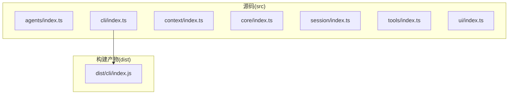
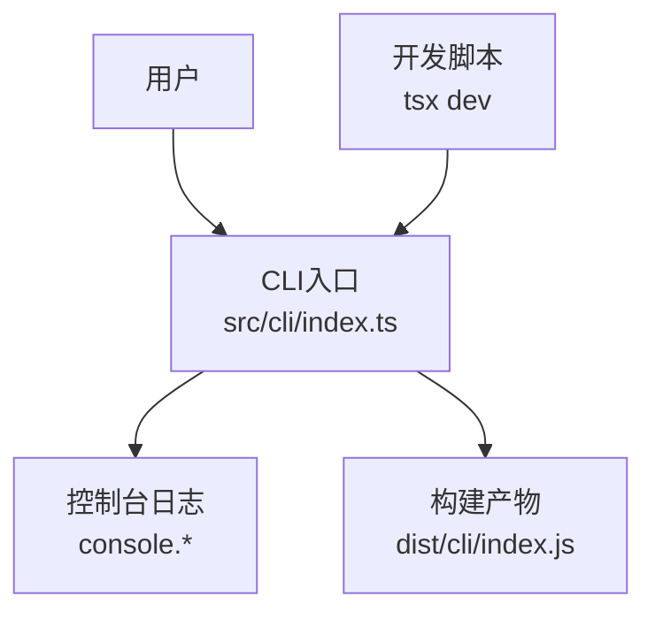
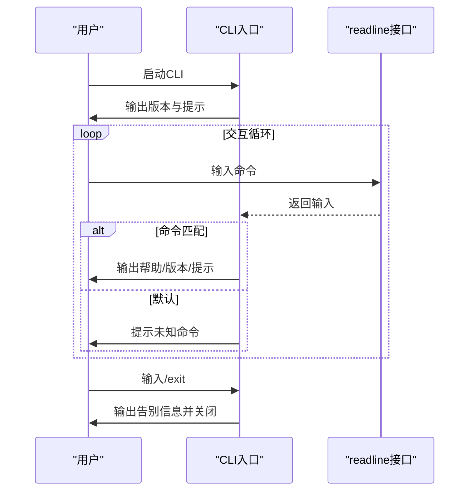
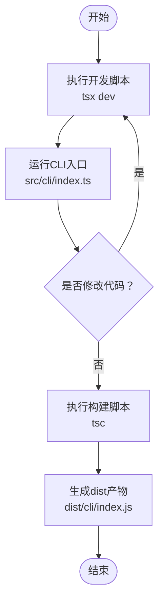
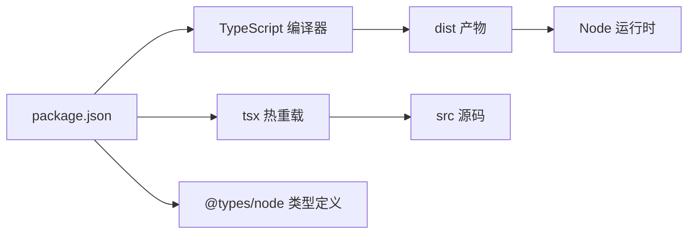

# 调试与测试

<cite>
**本文引用的文件**
- [package.json](file://package.json)
- [tsconfig.json](file://tsconfig.json)
- [README.md](file://README.md)
- [src/cli/index.ts](file://src/cli/index.ts)
- [src/core/index.ts](file://src/core/index.ts)
- [src/context/index.ts](file://src/context/index.ts)
- [src/session/index.ts](file://src/session/index.ts)
- [src/tools/index.ts](file://src/tools/index.ts)
- [src/ui/index.ts](file://src/ui/index.ts)
- [src/agents/index.ts](file://src/agents/index.ts)
</cite>

## 目录
1. [简介](#简介)
2. [项目结构](#项目结构)
3. [核心组件](#核心组件)
4. [架构总览](#架构总览)
5. [详细组件分析](#详细组件分析)
6. [依赖分析](#依赖分析)
7. [性能考虑](#性能考虑)
8. [故障排查指南](#故障排查指南)
9. [结论](#结论)
10. [附录](#附录)

## 简介
本指南面向TypeScript项目的调试与测试实践，结合当前仓库的脚本、编译配置与CLI入口，提供从本地开发到运行时调试、REPL调试技巧、日志输出策略、单元与集成测试编写建议，以及开发工具链（如tsx热重载）的使用方法与常见问题诊断思路。由于当前仓库未包含测试文件与专用调试配置，本指南在不改变现有配置的前提下，给出可直接落地的调试与测试最佳实践。

## 项目结构
该项目采用标准TypeScript模块化组织，源码位于src目录下，按功能分层：agents（智能体）、cli（命令行入口）、context（上下文）、core（核心逻辑）、session（会话）、tools（工具）、ui（界面）。构建产物输出至dist目录，入口为CLI模块。

图表来源
- [src/cli/index.ts:1-65](file://src/cli/index.ts#L1-L65)
- [tsconfig.json:1-24](file://tsconfig.json#L1-L24)

章节来源
- [package.json:1-32](file://package.json#L1-L32)
- [tsconfig.json:1-24](file://tsconfig.json#L1-L24)
- [README.md:1-3](file://README.md#L1-L3)

## 核心组件
- CLI入口：负责读取用户输入、解析命令、输出帮助/版本信息、处理退出流程；提供基础的REPL交互能力。
- 功能分层：agents/context/core/session/tools/ui作为后续扩展点预留，当前为占位文件，便于后续迭代中逐步填充业务逻辑。

章节来源
- [src/cli/index.ts:1-65](file://src/cli/index.ts#L1-L65)
- [src/core/index.ts:1-2](file://src/core/index.ts#L1-L2)
- [src/context/index.ts:1-2](file://src/context/index.ts#L1-L2)
- [src/session/index.ts:1-2](file://src/session/index.ts#L1-L2)
- [src/tools/index.ts:1-2](file://src/tools/index.ts#L1-L2)
- [src/ui/index.ts:1-2](file://src/ui/index.ts#L1-L2)
- [src/agents/index.ts:1-2](file://src/agents/index.ts#L1-L2)

## 架构总览
CLI模块作为应用入口，通过Node readline接口实现交互式REPL；控制台日志用于输出帮助、版本与错误信息；构建后以dist/cli/index.js作为可执行入口。

图表来源
- [src/cli/index.ts:1-65](file://src/cli/index.ts#L1-L65)
- [package.json:10-14](file://package.json#L10-L14)
- [tsconfig.json:1-24](file://tsconfig.json#L1-L24)

## 详细组件分析

### CLI组件（REPL与交互）
- REPL行为：循环读取输入，支持/help、/exit、/version等命令；默认情况下提示未知命令并引导查看帮助。
- 错误处理：顶层捕获异常并通过控制台输出错误信息并退出进程。
- 日志输出：使用console进行信息与错误输出，便于调试时快速定位问题。

图表来源
- [src/cli/index.ts:23-64](file://src/cli/index.ts#L23-L64)

章节来源
- [src/cli/index.ts:1-65](file://src/cli/index.ts#L1-L65)

### 开发工具链与热重载
- 开发脚本：通过tsx在开发时直接运行CLI入口，无需预先构建，适合快速迭代与调试。
- 构建脚本：TypeScript编译生成dist产物，供生产环境启动使用。
- 配置要点：启用sourceMap与declarationMap便于调试与类型声明定位；严格模式提升类型安全。

图表来源
- [package.json:10-14](file://package.json#L10-L14)
- [tsconfig.json:13-16](file://tsconfig.json#L13-L16)

章节来源
- [package.json:10-14](file://package.json#L10-L14)
- [tsconfig.json:1-24](file://tsconfig.json#L1-L24)

## 依赖分析
- 运行时依赖：Node内置模块（readline、process）。
- 开发时依赖：TypeScript、tsx、@types/node。
- 构建与运行关系：开发阶段由tsx直接执行源码；生产阶段由tsc编译至dist后由Node运行。

图表来源
- [package.json:26-30](file://package.json#L26-L30)
- [tsconfig.json:1-24](file://tsconfig.json#L1-L24)

章节来源
- [package.json:1-32](file://package.json#L1-L32)
- [tsconfig.json:1-24](file://tsconfig.json#L1-L24)

## 性能考虑
- I/O与REPL：频繁的readline问答可能成为瓶颈，建议在复杂逻辑前做输入校验与短路判断，避免不必要的等待。
- 构建优化：开启sourceMap与declarationMap便于调试，但会增加构建时间；发布前可按需调整。
- 内存管理：长生命周期的REPL应确保资源释放（如readline接口），当前实现已在finally块中关闭，保持良好实践。

## 故障排查指南
- 启动失败
  - 现象：CLI无法启动或报错退出。
  - 排查：确认开发脚本是否正确指向CLI入口；检查Node版本与模块解析配置。
  - 参考路径：[package.json:10-14](file://package.json#L10-L14)，[src/cli/index.ts:1-65](file://src/cli/index.ts#L1-L65)
- 构建失败
  - 现象：tsc编译报错或产物缺失。
  - 排查：检查tsconfig中的路径映射、输出目录与严格模式相关选项；确认src目录包含有效TS文件。
  - 参考路径：[tsconfig.json:1-24](file://tsconfig.json#L1-L24)
- 调试困难
  - 现象：难以定位运行时问题。
  - 解决：利用sourceMap与declarationMap配合浏览器/VS Code调试器；在关键分支添加console日志；对异常路径统一捕获并输出堆栈。
  - 参考路径：[tsconfig.json:13-16](file://tsconfig.json#L13-L16)，[src/cli/index.ts:61-64](file://src/cli/index.ts#L61-L64)
- REPL无响应
  - 现象：输入后无输出或卡死。
  - 排查：检查输入处理逻辑与终端编码；确认readline接口在异常路径被正确关闭。
  - 参考路径：[src/cli/index.ts:23-64](file://src/cli/index.ts#L23-L64)

章节来源
- [package.json:10-14](file://package.json#L10-L14)
- [tsconfig.json:1-24](file://tsconfig.json#L1-L24)
- [src/cli/index.ts:1-65](file://src/cli/index.ts#L1-L65)

## 结论
本指南基于现有仓库配置与CLI入口，给出了从开发到生产的调试与测试实践建议。建议在后续迭代中补充单元测试与集成测试框架，并在各功能层（agents/context/core/session/tools/ui）逐步完善测试覆盖与日志策略，以提升可维护性与稳定性。

## 附录

### 调试配置与断点设置（基于现有配置）
- 使用Node调试器：在CLI入口设置断点，运行开发脚本后在调试器中附加进程，即可在关键函数处中断。
- 控制台日志：在输入处理、命令分发与异常捕获处添加console输出，便于快速定位问题。
- 参考路径：
  - [src/cli/index.ts:23-64](file://src/cli/index.ts#L23-L64)
  - [tsconfig.json:13-16](file://tsconfig.json#L13-L16)

章节来源
- [src/cli/index.ts:1-65](file://src/cli/index.ts#L1-L65)
- [tsconfig.json:1-24](file://tsconfig.json#L1-L24)

### REPL调试技巧与日志输出
- REPL技巧：在交互中逐步验证命令分支，对边界输入（空字符串、特殊字符）进行测试；使用/version与/help快速确认运行状态。
- 日志输出：在异常路径输出错误对象与堆栈；在命令分支输出简要状态信息，便于回溯。
- 参考路径：
  - [src/cli/index.ts:33-64](file://src/cli/index.ts#L33-L64)

章节来源
- [src/cli/index.ts:1-65](file://src/cli/index.ts#L1-L65)

### 单元测试与集成测试编写指导
- 单元测试：针对CLI命令解析与分支逻辑编写测试，模拟输入并断言输出；对异常路径进行覆盖。
- 集成测试：在REPL场景下模拟完整交互流程，验证从输入到输出的端到端行为。
- 测试框架建议：可在后续引入测试框架（如vitest/jest）与Mock策略，结合现有CLI入口进行测试。
- 参考路径：
  - [src/cli/index.ts:39-54](file://src/cli/index.ts#L39-L54)

章节来源
- [src/cli/index.ts:1-65](file://src/cli/index.ts#L1-L65)

### 开发工具链使用（tsx热重载与构建验证）
- 热重载：使用开发脚本直接运行CLI入口，修改后自动重启，适合快速迭代。
- 构建验证：在合并前执行构建脚本，确保dist产物生成且无编译错误。
- 参考路径：
  - [package.json:10-14](file://package.json#L10-L14)
  - [tsconfig.json:1-24](file://tsconfig.json#L1-L24)

章节来源
- [package.json:10-14](file://package.json#L10-L14)
- [tsconfig.json:1-24](file://tsconfig.json#L1-L24)