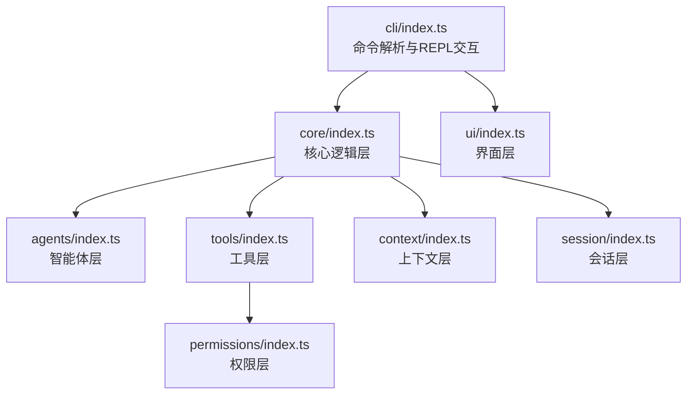
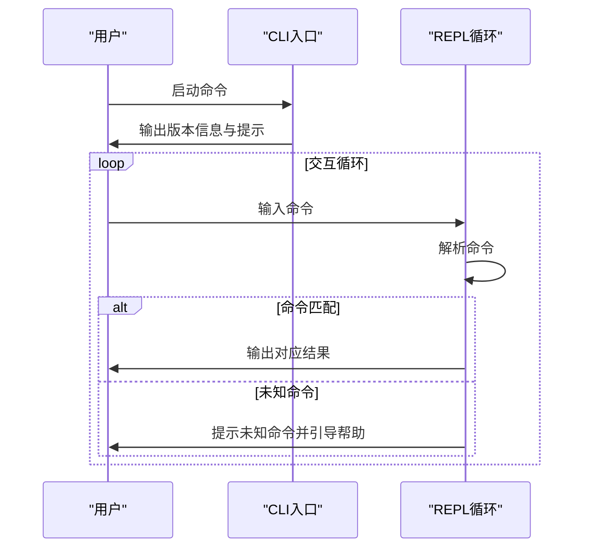
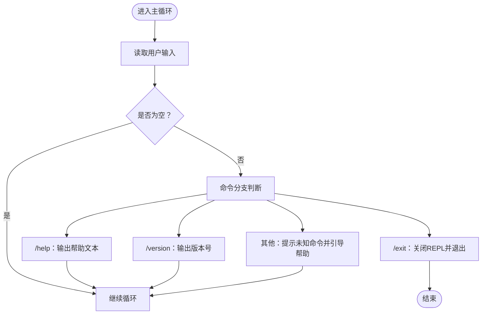

# 快速开始

<cite>
**本文引用的文件**
- [package.json](file://package.json)
- [tsconfig.json](file://tsconfig.json)
- [README.md](file://README.md)
- [AGENTS.md](file://AGENTS.md)
- [src/cli/index.ts](file://src/cli/index.ts)
- [src/core/index.ts](file://src/core/index.ts)
- [src/context/index.ts](file://src/context/index.ts)
- [src/session/index.ts](file://src/session/index.ts)
- [src/tools/index.ts](file://src/tools/index.ts)
- [src/ui/index.ts](file://src/ui/index.ts)
- [src/agents/index.ts](file://src/agents/index.ts)
- [src/permissions/index.ts](file://src/permissions/index.ts)
</cite>

## 目录
1. [简介](#简介)
2. [项目结构](#项目结构)
3. [环境要求](#环境要求)
4. [安装步骤](#安装步骤)
5. [首次使用](#首次使用)
6. [核心命令](#核心命令)
7. [常见使用场景与最佳实践](#常见使用场景与最佳实践)
8. [故障排除](#故障排除)
9. [结论](#结论)

## 简介
easy-agent-cli 是一个基于 TypeScript + Node.js 的轻量级命令行智能体工具，采用分层架构设计，支持多轮对话与工具调用。它提供了简洁的 REPL 交互界面，内置基础命令用于帮助、退出和版本查询，并为后续扩展（如智能体、工具、权限管理）预留了清晰的架构层次。

本快速开始指南面向初学者，涵盖环境准备、安装方式、基本使用、核心命令、常见场景与故障排除，帮助你在最短时间内上手并高效使用该工具。

**章节来源**
- [README.md:1-3](file://README.md#L1-L3)
- [AGENTS.md:3-6](file://AGENTS.md#L3-L6)

## 项目结构
项目采用分层架构，主要目录与职责如下：
- cli：CLI 入口层，负责命令解析与 REPL 交互
- core：核心逻辑层，负责 Agent 调度与流程控制
- agents：智能体层，负责 Agent 定义、注册与生命周期管理
- tools：工具层，负责内置工具与工具注册机制
- context：上下文层，负责对话上下文管理与记忆
- session：会话层，负责会话状态管理与持久化
- ui：界面层，负责终端渲染与用户交互
- permissions：权限层，负责工具调用权限与安全控制

**图表来源**
- [src/cli/index.ts:1-65](file://src/cli/index.ts#L1-L65)
- [src/core/index.ts:1-2](file://src/core/index.ts#L1-L2)
- [src/agents/index.ts:1-2](file://src/agents/index.ts#L1-L2)
- [src/tools/index.ts:1-2](file://src/tools/index.ts#L1-L2)
- [src/context/index.ts:1-2](file://src/context/index.ts#L1-L2)
- [src/session/index.ts:1-2](file://src/session/index.ts#L1-L2)
- [src/ui/index.ts:1-2](file://src/ui/index.ts#L1-L2)
- [src/permissions/index.ts:1-2](file://src/permissions/index.ts#L1-L2)

**章节来源**
- [AGENTS.md:15-27](file://AGENTS.md#L15-L27)
- [AGENTS.md:29-42](file://AGENTS.md#L29-L42)

## 环境要求
- Node.js 版本：20 或更高
- TypeScript 版本：5.5 或更高
- 模块系统：ESM（"type": "module"）
- 构建工具：tsc
- 开发工具：tsx（热重载）

这些要求由项目配置与技术栈声明决定，确保在现代 Node.js 环境中稳定运行。

**章节来源**
- [AGENTS.md:9-13](file://AGENTS.md#L9-L13)
- [package.json:5](file://package.json#L5)
- [tsconfig.json:3-4](file://tsconfig.json#L3-L4)

## 安装步骤
支持两种安装方式：全局安装与本地安装。

- 全局安装
  - 使用 npm 将包安装为全局可执行命令，便于在任意位置直接运行。
  - 安装后可通过命令别名直接启动。

- 本地安装
  - 在项目根目录安装依赖，适合将工具集成到现有项目或 CI/CD 流程中。
  - 可通过 npm scripts 或 npx 方式运行。

构建与运行
- 开发模式（热重载）：npm run dev
- 构建：npm run build
- 运行构建产物：npm start

注意：由于当前 CLI 仅提供基础命令与交互框架，安装后即可直接使用；后续扩展（如智能体、工具）需要在各层实现相应功能模块。

**章节来源**
- [AGENTS.md:68-82](file://AGENTS.md#L68-L82)
- [package.json:10-14](file://package.json#L10-L14)

## 首次使用
首次启动后，CLI 会显示版本信息与提示，等待你输入命令。你可以：
- 输入 /help 查看帮助信息
- 输入 /version 查看版本号
- 输入 /exit 退出程序
- 输入空行或无效命令会收到提示

交互流程如下所示：

**图表来源**
- [src/cli/index.ts:23-59](file://src/cli/index.ts#L23-L59)

**章节来源**
- [src/cli/index.ts:30-31](file://src/cli/index.ts#L30-L31)
- [src/cli/index.ts:39-54](file://src/cli/index.ts#L39-L54)

## 核心命令
当前 CLI 提供以下基础命令：
- /help：显示帮助信息，包含用法与可用命令列表
- /version：显示版本号
- /exit：退出程序

命令解析与处理流程如下：

**图表来源**
- [src/cli/index.ts:39-54](file://src/cli/index.ts#L39-L54)

**章节来源**
- [src/cli/index.ts:6-19](file://src/cli/index.ts#L6-L19)
- [src/cli/index.ts:21](file://src/cli/index.ts#L21)
- [src/cli/index.ts:40-49](file://src/cli/index.ts#L40-L49)

## 常见使用场景与最佳实践
- 快速验证安装：使用 /version 确认版本，使用 /help 查看可用命令
- 交互式调试：在 REPL 中逐条输入命令进行测试
- 退出工作：使用 /exit 结束会话，释放资源
- 扩展开发：遵循分层架构，在对应层添加功能（如在 agents 添加智能体、在 tools 添加工具、在 permissions 添加权限控制）

最佳实践建议
- 遵循分层依赖规则：上层可依赖下层，下层不可依赖上层
- 使用 ESM 导入导出，保持一致的模块风格
- 将业务逻辑集中在 core 层，cli 层仅做命令路由
- 工具调用必须经过权限层校验
- 考虑会话数据的持久化与上下文的 token 限制管理

**章节来源**
- [AGENTS.md:44-67](file://AGENTS.md#L44-L67)
- [AGENTS.md:95-101](file://AGENTS.md#L95-L101)

## 故障排除
- 无法找到命令
  - 症状：在终端输入命令后提示找不到命令或无法执行
  - 排查：确认已正确安装为全局可执行命令；检查 PATH 是否包含全局 bin 目录
  - 参考：包配置中的二进制映射字段

- Node.js 版本过低
  - 症状：运行时报错或功能异常
  - 排查：确认 Node.js 版本满足 20+ 要求
  - 参考：技术栈声明

- TypeScript 版本不匹配
  - 症状：构建失败或类型错误
  - 排查：确认 TypeScript 版本满足 5.5+ 要求
  - 参考：tsconfig 配置

- REPL 无响应或卡死
  - 症状：输入命令后无输出或无法继续输入
  - 排查：检查是否有未捕获的异常；尝试重启 CLI；查看错误日志
  - 参考：错误处理回调

- 构建产物无法运行
  - 症状：npm start 失败
  - 排查：先执行 npm run build 生成 dist；确认 dist 目录存在且包含可执行文件
  - 参考：构建脚本与输出目录

**章节来源**
- [package.json:7-9](file://package.json#L7-L9)
- [AGENTS.md:9-13](file://AGENTS.md#L9-L13)
- [tsconfig.json:6](file://tsconfig.json#L6)
- [src/cli/index.ts:61-64](file://src/cli/index.ts#L61-L64)
- [AGENTS.md:77-82](file://AGENTS.md#L77-L82)

## 结论
通过本指南，你已经完成了 easy-agent-cli 的环境准备、安装与首次使用，掌握了核心命令与常见场景的最佳实践，并了解了常见问题的排查方法。随着对分层架构的理解加深，你可以逐步扩展智能体、工具与权限体系，构建更强大的命令行智能体应用。