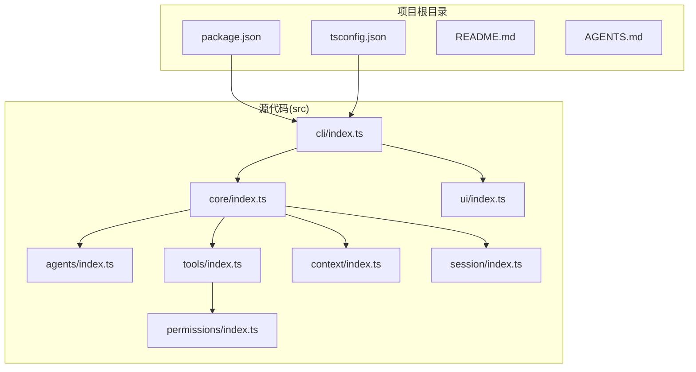
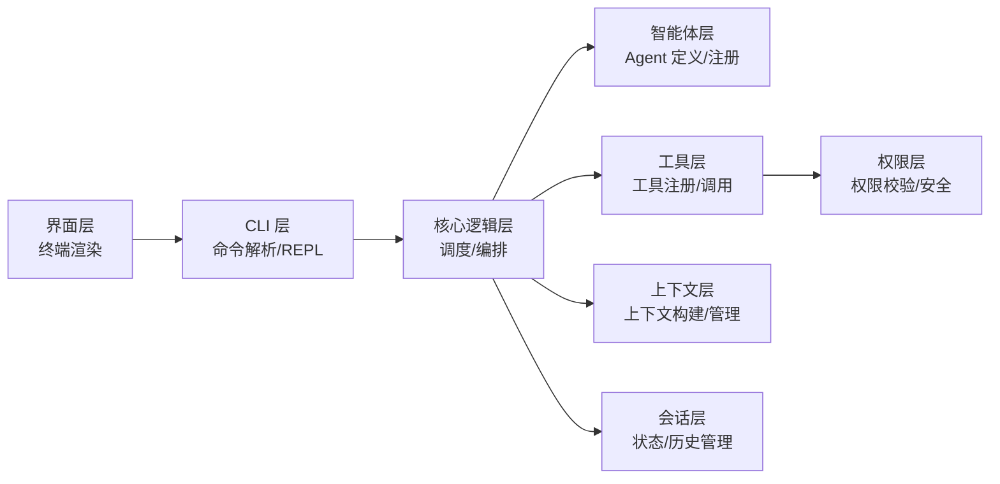
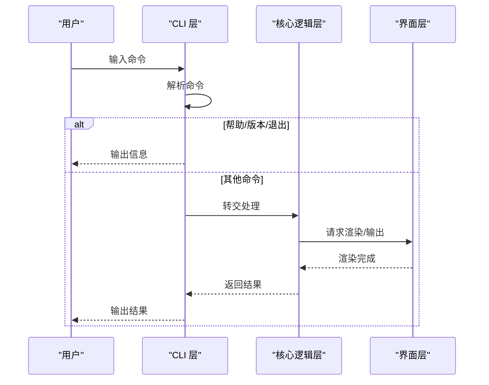
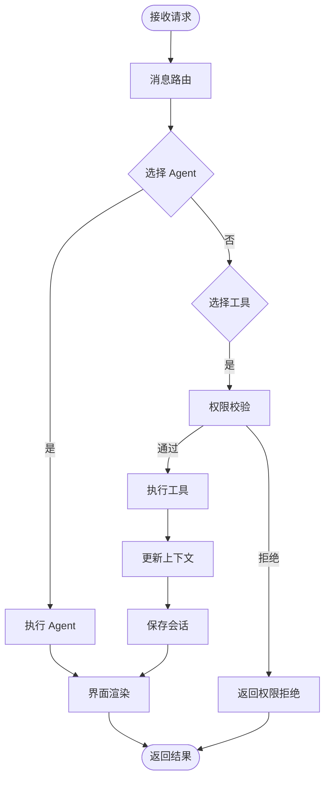
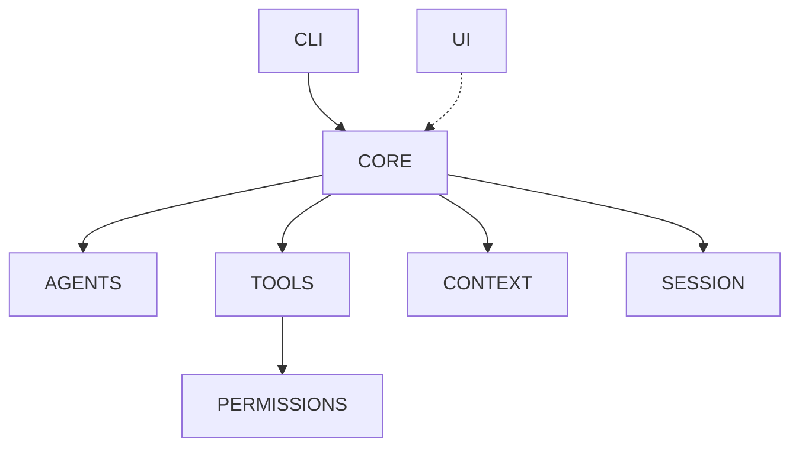

# 分层架构设计

<cite>
**本文引用的文件**
- [src/cli/index.ts](file://src/cli/index.ts)
- [src/core/index.ts](file://src/core/index.ts)
- [src/agents/index.ts](file://src/agents/index.ts)
- [src/tools/index.ts](file://src/tools/index.ts)
- [src/context/index.ts](file://src/context/index.ts)
- [src/session/index.ts](file://src/session/index.ts)
- [src/ui/index.ts](file://src/ui/index.ts)
- [src/permissions/index.ts](file://src/permissions/index.ts)
- [package.json](file://package.json)
- [tsconfig.json](file://tsconfig.json)
- [README.md](file://README.md)
- [AGENTS.md](file://AGENTS.md)
</cite>

## 目录
1. [简介](#简介)
2. [项目结构](#项目结构)
3. [核心组件](#核心组件)
4. [架构总览](#架构总览)
5. [详细组件分析](#详细组件分析)
6. [依赖分析](#依赖分析)
7. [性能考量](#性能考量)
8. [故障排查指南](#故障排查指南)
9. [结论](#结论)
10. [附录](#附录)

## 简介
本项目是一个基于 TypeScript + Node.js 的轻量级命令行智能体工具，采用分层架构设计，支持多轮对话与工具调用。当前仓库已实现 CLI 入口层（src/cli），其余层（core、agents、tools、context、session、ui、permissions）以占位文件形式存在，为后续扩展预留了清晰的分层边界与依赖方向。

## 项目结构
项目采用按层组织的目录结构，每个层通过自身的 index.ts 统一导出公共 API，并在层内隐藏内部实现细节。顶层配置文件定义了构建、开发与运行脚本，以及二进制入口映射。

图表来源
- [package.json:1-32](file://package.json#L1-L32)
- [tsconfig.json:1-24](file://tsconfig.json#L1-L24)
- [src/cli/index.ts:1-65](file://src/cli/index.ts#L1-L65)
- [src/core/index.ts:1-2](file://src/core/index.ts#L1-L2)
- [src/agents/index.ts:1-2](file://src/agents/index.ts#L1-L2)
- [src/tools/index.ts:1-2](file://src/tools/index.ts#L1-L2)
- [src/context/index.ts:1-2](file://src/context/index.ts#L1-L2)
- [src/session/index.ts:1-2](file://src/session/index.ts#L1-L2)
- [src/ui/index.ts:1-2](file://src/ui/index.ts#L1-L2)
- [src/permissions/index.ts:1-2](file://src/permissions/index.ts#L1-L2)

章节来源
- [package.json:1-32](file://package.json#L1-L32)
- [tsconfig.json:1-24](file://tsconfig.json#L1-L24)
- [README.md:1-3](file://README.md#L1-L3)
- [AGENTS.md:15-27](file://AGENTS.md#L15-L27)

## 核心组件
- CLI 层：负责命令解析、REPL 交互与基础命令路由（/help、/exit、/version）。当前实现为最小可用版本，后续将接入核心调度层。
- 核心逻辑层：作为 Agent 调度与流程编排中心，向上承接 CLI/UI，向下协调 agents、tools、context、session。
- 智能体层：承载 Agent 的定义、注册与生命周期管理，依赖 tools 与 context。
- 工具层：内置工具与工具注册机制，依赖权限层进行调用校验。
- 上下文层：对话上下文构建与管理，关注 token 限制与上下文压缩策略。
- 会话层：会话状态与历史管理，建议考虑持久化方案。
- 界面层：终端渲染与格式化输出，独立于业务逻辑。
- 权限层：工具调用权限与安全策略，是工具调用的前置校验。

章节来源
- [src/cli/index.ts:6-19](file://src/cli/index.ts#L6-L19)
- [src/cli/index.ts:23-59](file://src/cli/index.ts#L23-L59)
- [AGENTS.md:29-43](file://AGENTS.md#L29-L43)

## 架构总览
分层架构遵循“上层可依赖下层，下层不可依赖上层”的原则，同层之间尽量避免直接依赖。CLI 层仅承担入口与命令路由职责；核心层负责调度与编排；各功能层通过清晰的依赖方向实现解耦。

图表来源
- [AGENTS.md:29-43](file://AGENTS.md#L29-L43)
- [src/cli/index.ts:33-54](file://src/cli/index.ts#L33-L54)
- [src/core/index.ts:1-2](file://src/core/index.ts#L1-L2)
- [src/agents/index.ts:1-2](file://src/agents/index.ts#L1-L2)
- [src/tools/index.ts:1-2](file://src/tools/index.ts#L1-L2)
- [src/context/index.ts:1-2](file://src/context/index.ts#L1-L2)
- [src/session/index.ts:1-2](file://src/session/index.ts#L1-L2)
- [src/ui/index.ts:1-2](file://src/ui/index.ts#L1-L2)
- [src/permissions/index.ts:1-2](file://src/permissions/index.ts#L1-L2)

## 详细组件分析

### CLI 层（命令行入口）
- 职责边界
  - 接收用户输入，提供 /help、/exit、/version 等基础命令。
  - 保持与核心层和界面层的松耦合，不直接参与业务逻辑。
- 接口定义
  - REPL 循环：持续读取用户输入并分发到命令处理器。
  - 命令路由：根据输入字符串匹配预定义命令分支。
- 依赖关系
  - 依赖 Node 内置 readline 与 process。
  - 后续将依赖核心层与界面层以完成多轮对话与渲染。
- 扩展点与自定义
  - 可扩展命令集，增加新的命令分支。
  - 可注入自定义提示文本与版本号。
- 代码示例路径
  - [src/cli/index.ts:23-59](file://src/cli/index.ts#L23-L59)

图表来源
- [src/cli/index.ts:33-54](file://src/cli/index.ts#L33-L54)
- [src/core/index.ts:1-2](file://src/core/index.ts#L1-L2)
- [src/ui/index.ts:1-2](file://src/ui/index.ts#L1-L2)

章节来源
- [src/cli/index.ts:6-19](file://src/cli/index.ts#L6-L19)
- [src/cli/index.ts:23-59](file://src/cli/index.ts#L23-L59)

### 核心逻辑层（调度与编排）
- 职责边界
  - 负责 Agent 的调度、消息路由与流程编排。
  - 作为上层（CLI/UI）与下层（agents/tools/context/session）之间的桥梁。
- 接口定义
  - 接收来自上层的请求，按流程调用下层组件。
  - 将下层返回的结果整合后回传给上层。
- 依赖关系
  - 依赖 agents、tools、context、session。
  - 不依赖上层，保证解耦。
- 扩展点与自定义
  - 可自定义调度策略（如并发、串行、条件分支）。
  - 可扩展消息路由规则与异常处理策略。
- 代码示例路径
  - [src/core/index.ts:1-2](file://src/core/index.ts#L1-L2)

图表来源
- [src/core/index.ts:1-2](file://src/core/index.ts#L1-L2)
- [src/agents/index.ts:1-2](file://src/agents/index.ts#L1-L2)
- [src/tools/index.ts:1-2](file://src/tools/index.ts#L1-L2)
- [src/context/index.ts:1-2](file://src/context/index.ts#L1-L2)
- [src/session/index.ts:1-2](file://src/session/index.ts#L1-L2)
- [src/permissions/index.ts:1-2](file://src/permissions/index.ts#L1-L2)
- [src/ui/index.ts:1-2](file://src/ui/index.ts#L1-L2)

章节来源
- [AGENTS.md:29-43](file://AGENTS.md#L29-L43)
- [src/core/index.ts:1-2](file://src/core/index.ts#L1-L2)

### 智能体层（Agent 定义与注册）
- 职责边界
  - 定义 Agent 的能力与行为，负责生命周期管理。
  - 依赖工具层与上下文层以完成任务。
- 接口定义
  - 注册/注销 Agent。
  - 执行任务并返回结果。
- 依赖关系
  - 依赖 tools、context。
- 扩展点与自定义
  - 支持多种 Agent 策略（如规则驱动、LLM 驱动）。
  - 可扩展 Agent 注册表与动态加载机制。
- 代码示例路径
  - [src/agents/index.ts:1-2](file://src/agents/index.ts#L1-L2)

章节来源
- [AGENTS.md:29-43](file://AGENTS.md#L29-L43)
- [src/agents/index.ts:1-2](file://src/agents/index.ts#L1-L2)

### 工具层（工具注册与调用）
- 职责边界
  - 提供工具注册与调用机制。
  - 所有工具调用必须经过权限层校验。
- 接口定义
  - 注册工具（名称、参数、返回值）。
  - 调用工具（带参数与上下文）。
- 依赖关系
  - 依赖权限层。
- 扩展点与自定义
  - 支持插件式工具扩展。
  - 可自定义工具参数校验与返回值标准化。
- 代码示例路径
  - [src/tools/index.ts:1-2](file://src/tools/index.ts#L1-L2)

章节来源
- [AGENTS.md:29-43](file://AGENTS.md#L29-L43)
- [src/tools/index.ts:1-2](file://src/tools/index.ts#L1-L2)

### 上下文层（上下文构建与管理）
- 职责边界
  - 构建与管理对话上下文，控制 token 用量。
- 接口定义
  - 添加/清理上下文项。
  - 计算 token 并进行上下文压缩。
- 依赖关系
  - 无下层依赖。
- 扩展点与自定义
  - 可自定义上下文模板与压缩算法。
  - 可扩展多模态上下文（文本/图像等）。
- 代码示例路径
  - [src/context/index.ts:1-2](file://src/context/index.ts#L1-L2)

章节来源
- [AGENTS.md:29-43](file://AGENTS.md#L29-L43)
- [src/context/index.ts:1-2](file://src/context/index.ts#L1-L2)

### 会话层（会话状态与历史）
- 职责边界
  - 管理会话状态与历史记录。
- 接口定义
  - 创建/恢复会话。
  - 保存/加载会话历史。
- 依赖关系
  - 无下层依赖。
- 扩展点与自定义
  - 可扩展持久化存储（内存/文件/数据库）。
  - 可自定义会话过期与清理策略。
- 代码示例路径
  - [src/session/index.ts:1-2](file://src/session/index.ts#L1-L2)

章节来源
- [AGENTS.md:29-43](file://AGENTS.md#L29-L43)
- [src/session/index.ts:1-2](file://src/session/index.ts#L1-L2)

### 界面层（终端渲染与输出）
- 职责边界
  - 负责终端渲染与格式化输出。
- 接口定义
  - 接收核心层的数据，进行格式化输出。
- 依赖关系
  - 无下层依赖。
- 扩展点与自定义
  - 可扩展主题与输出样式。
  - 可对接富文本/表格等渲染器。
- 代码示例路径
  - [src/ui/index.ts:1-2](file://src/ui/index.ts#L1-L2)

章节来源
- [AGENTS.md:29-43](file://AGENTS.md#L29-L43)
- [src/ui/index.ts:1-2](file://src/ui/index.ts#L1-L2)

### 权限层（权限校验与安全）
- 职责边界
  - 对工具调用进行权限校验与安全策略控制。
- 接口定义
  - 校验调用者身份与工具访问权限。
  - 拒绝高风险操作。
- 依赖关系
  - 无下层依赖。
- 扩展点与自定义
  - 可扩展白名单/黑名单策略。
  - 可对接外部鉴权服务。
- 代码示例路径
  - [src/permissions/index.ts:1-2](file://src/permissions/index.ts#L1-L2)

章节来源
- [AGENTS.md:29-43](file://AGENTS.md#L29-L43)
- [src/permissions/index.ts:1-2](file://src/permissions/index.ts#L1-L2)

## 依赖分析
- 依赖方向
  - 上层可依赖下层，下层不可依赖上层。
  - 同层之间尽量避免直接依赖。
- 关键依赖链
  - CLI → CORE → AGENTS/TOOLS/CONTEXT/SESSION
  - TOOLS → PERMS
  - UI 与 CORE 解耦，通过接口交互。
- 外部依赖
  - Node.js 运行时与 ESM 模块系统。
  - TypeScript 编译与声明映射。

图表来源
- [AGENTS.md:29-43](file://AGENTS.md#L29-L43)
- [src/cli/index.ts:33-54](file://src/cli/index.ts#L33-L54)
- [src/core/index.ts:1-2](file://src/core/index.ts#L1-L2)
- [src/agents/index.ts:1-2](file://src/agents/index.ts#L1-L2)
- [src/tools/index.ts:1-2](file://src/tools/index.ts#L1-L2)
- [src/context/index.ts:1-2](file://src/context/index.ts#L1-L2)
- [src/session/index.ts:1-2](file://src/session/index.ts#L1-L2)
- [src/ui/index.ts:1-2](file://src/ui/index.ts#L1-L2)
- [src/permissions/index.ts:1-2](file://src/permissions/index.ts#L1-L2)

章节来源
- [AGENTS.md:29-43](file://AGENTS.md#L29-L43)
- [package.json:1-32](file://package.json#L1-L32)
- [tsconfig.json:1-24](file://tsconfig.json#L1-L24)

## 性能考量
- I/O 优化
  - CLI 层使用异步 readline，避免阻塞主线程。
  - 会话层建议采用批量写入与延迟刷新，减少磁盘 I/O。
- 上下文管理
  - 上下文层需控制 token 数量，避免超限导致性能下降。
  - 可引入 LRU 或滑动窗口压缩策略。
- 工具调用
  - 工具层调用前进行快速权限校验，减少无效调用。
  - 对高耗时工具建议异步执行与进度反馈。
- 渲染效率
  - 界面层对大段输出进行分页或流式渲染，提升用户体验。

## 故障排查指南
- CLI 层常见问题
  - 输入为空：当前实现会忽略空输入，确保后续逻辑健壮性。
  - 未识别命令：输出提示信息并引导用户查看帮助。
- 核心层常见问题
  - 下层依赖缺失：检查 agents、tools、context、session 是否正确初始化。
  - 调用链中断：确认核心层对上层与下层的依赖注入是否完整。
- 工具与权限
  - 工具调用失败：检查权限层策略与工具注册状态。
- 会话与上下文
  - 会话丢失：确认会话持久化策略与存储介质可用性。
  - 上下文溢出：调整上下文压缩策略与 token 限额。

章节来源
- [src/cli/index.ts:33-54](file://src/cli/index.ts#L33-L54)
- [AGENTS.md:95-101](file://AGENTS.md#L95-L101)

## 结论
本项目以清晰的分层架构为基础，CLI 层专注于入口与命令路由，核心层承担调度与编排，其他功能层通过明确的依赖方向实现解耦。当前仓库提供了良好的扩展骨架，后续可在各层中逐步填充具体实现，严格遵循“上层可依赖下层”的依赖规则与编码规范，即可构建出稳定、可维护且可扩展的命令行智能体系统。

## 附录
- 开发与运行
  - 安装依赖：npm install
  - 开发模式（热重载）：npm run dev
  - 构建：npm run build
  - 运行构建产物：npm start
- 目录结构参考
  - src/cli、src/core、src/agents、src/tools、src/context、src/session、src/ui、src/permissions

章节来源
- [AGENTS.md:68-82](file://AGENTS.md#L68-L82)
- [AGENTS.md:15-27](file://AGENTS.md#L15-L27)