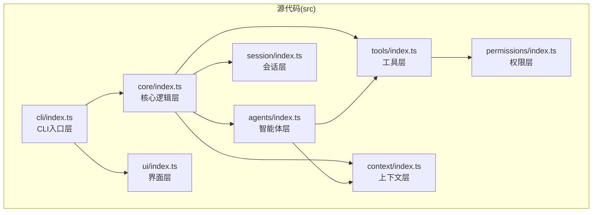
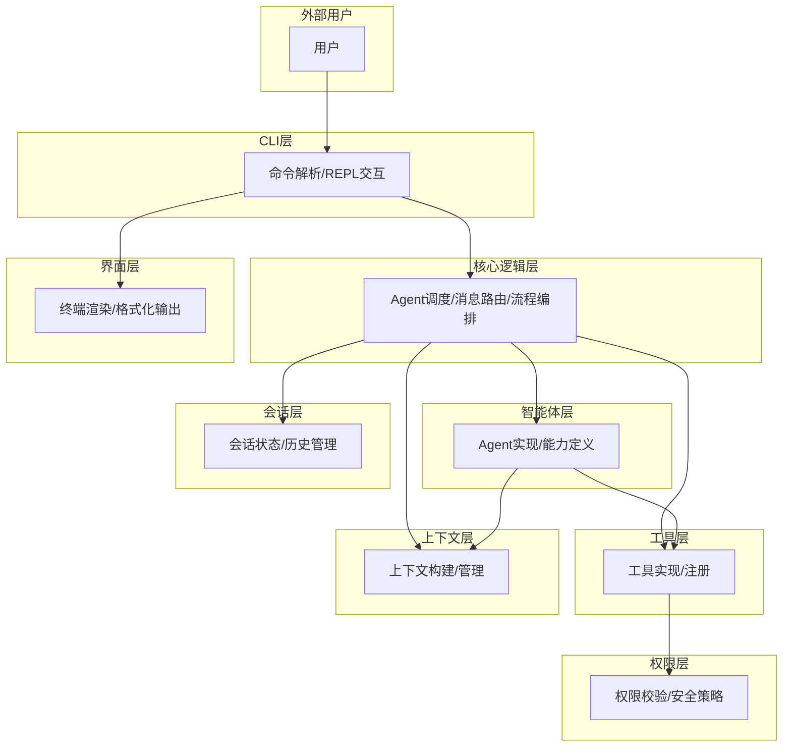
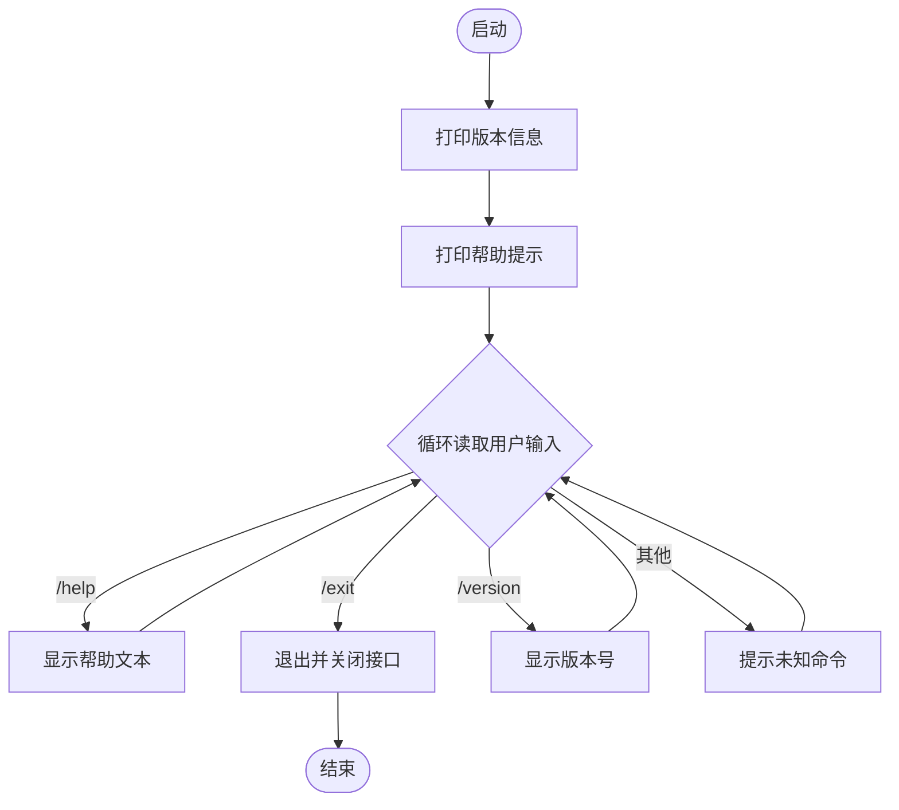
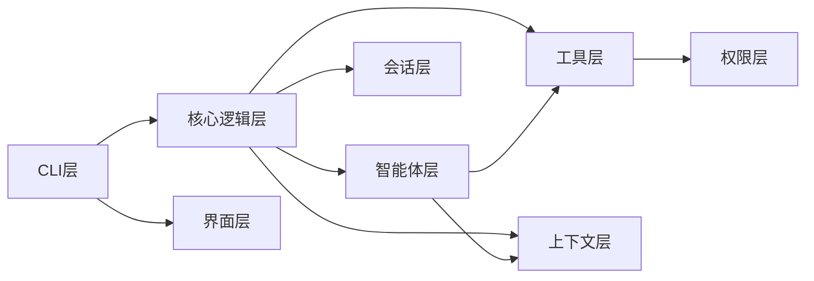

# 整体架构概览

<cite>
**本文引用的文件列表**
- [README.md](file://README.md)
- [AGENTS.md](file://AGENTS.md)
- [package.json](file://package.json)
- [tsconfig.json](file://tsconfig.json)
- [src/cli/index.ts](file://src/cli/index.ts)
- [src/core/index.ts](file://src/core/index.ts)
- [src/agents/index.ts](file://src/agents/index.ts)
- [src/tools/index.ts](file://src/tools/index.ts)
- [src/context/index.ts](file://src/context/index.ts)
- [src/session/index.ts](file://src/session/index.ts)
- [src/ui/index.ts](file://src/ui/index.ts)
- [src/permissions/index.ts](file://src/permissions/index.ts)
</cite>

## 目录
1. [简介](#简介)
2. [项目结构](#项目结构)
3. [核心组件](#核心组件)
4. [架构总览](#架构总览)
5. [详细组件分析](#详细组件分析)
6. [依赖关系分析](#依赖关系分析)
7. [性能考量](#性能考量)
8. [故障排查指南](#故障排查指南)
9. [结论](#结论)
10. [附录](#附录)

## 简介
本项目是一个基于 TypeScript + Node.js 的轻量级命令行智能体工具，采用分层架构设计，支持多轮对话与工具调用。项目通过清晰的分层职责划分，确保 CLI 层专注于命令解析与交互，核心逻辑层负责 Agent 调度与流程编排，智能体层、工具层、上下文层、会话层、界面层与权限层分别承担各自领域的功能，形成高内聚、低耦合的模块化体系。

## 项目结构
项目采用按“层”组织的目录结构，每个层通过各自的 index.ts 文件统一导出公共 API，内部实现文件不直接对外暴露，便于维护与扩展。

图表来源
- [AGENTS.md:15-27](file://AGENTS.md#L15-L27)
- [src/cli/index.ts:1-65](file://src/cli/index.ts#L1-L65)
- [src/core/index.ts:1-2](file://src/core/index.ts#L1-L2)
- [src/agents/index.ts:1-2](file://src/agents/index.ts#L1-L2)
- [src/tools/index.ts:1-2](file://src/tools/index.ts#L1-L2)
- [src/context/index.ts:1-2](file://src/context/index.ts#L1-L2)
- [src/session/index.ts:1-2](file://src/session/index.ts#L1-L2)
- [src/ui/index.ts:1-1](file://src/ui/index.ts#L1-L1)
- [src/permissions/index.ts:1-1](file://src/permissions/index.ts#L1-L1)

章节来源
- [AGENTS.md:15-27](file://AGENTS.md#L15-L27)
- [package.json:1-32](file://package.json#L1-L32)

## 核心组件
- CLI 层：负责命令解析、REPL 交互与基础帮助/版本信息展示，当前实现为最小可用版本，后续将接入核心逻辑层以支持多轮对话与工具调用。
- 核心逻辑层：作为 Agent 调度与流程编排的核心，向上层提供统一的执行接口，向下依赖智能体、工具、上下文与会话等模块。
- 智能体层：承载 Agent 的定义、注册与生命周期管理，依赖工具与上下文。
- 工具层：提供内置工具与工具注册机制，所有工具调用需经权限层校验。
- 上下文层：负责对话上下文的构建与管理，需关注 token 限制。
- 会话层：负责会话状态与历史管理，建议考虑持久化场景。
- 界面层：负责终端渲染与格式化输出。
- 权限层：负责工具调用权限校验与安全策略。

章节来源
- [AGENTS.md:29-43](file://AGENTS.md#L29-L43)
- [src/cli/index.ts:23-59](file://src/cli/index.ts#L23-L59)
- [src/core/index.ts:1-2](file://src/core/index.ts#L1-L2)
- [src/agents/index.ts:1-2](file://src/agents/index.ts#L1-L2)
- [src/tools/index.ts:1-2](file://src/tools/index.ts#L1-L2)
- [src/context/index.ts:1-2](file://src/context/index.ts#L1-L2)
- [src/session/index.ts:1-2](file://src/session/index.ts#L1-L2)
- [src/ui/index.ts:1-1](file://src/ui/index.ts#L1-L1)
- [src/permissions/index.ts:1-1](file://src/permissions/index.ts#L1-L1)

## 架构总览
分层架构的设计理念与技术考量：
- 分层架构：通过清晰的职责边界，降低模块间的耦合度，提升可维护性与可测试性。
- 模块化设计：每层通过 index.ts 统一导出 API，内部实现隐藏，便于演进与替换。
- 依赖方向：上层可依赖下层，下层不可依赖上层；同层之间尽量避免直接依赖，遵循单向依赖原则。
- 可扩展性：新增 Agent、工具或 UI 组件时，只需在对应层内扩展，无需修改其他层。
- 安全性：工具调用必须经过权限层校验，确保安全可控。

系统边界与组件交互（概念示意）：

图表来源
- [AGENTS.md:29-43](file://AGENTS.md#L29-L43)

## 详细组件分析

### CLI 层分析
职责与行为：
- 初始化 REPL 交互环境，打印版本与帮助信息。
- 处理基础命令：/help、/exit、/version。
- 当前未接入核心逻辑层，后续将在此层发起与核心逻辑层的交互。

控制流程（当前实现）：

图表来源
- [src/cli/index.ts:23-59](file://src/cli/index.ts#L23-L59)

章节来源
- [src/cli/index.ts:1-65](file://src/cli/index.ts#L1-L65)

### 核心逻辑层分析
职责与行为：
- 作为 Agent 调度与流程编排的核心，协调智能体、工具、上下文与会话模块。
- 提供统一的执行接口，屏蔽下层细节，向上层暴露简洁 API。

依赖关系：
- 依赖智能体层、工具层、上下文层、会话层。
- 与 UI 层协作进行终端渲染与输出格式化。

章节来源
- [AGENTS.md:29-43](file://AGENTS.md#L29-L43)
- [src/core/index.ts:1-2](file://src/core/index.ts#L1-L2)

### 智能体层分析
职责与行为：
- 定义 Agent 的能力与生命周期。
- 与工具层、上下文层协作完成任务执行。

依赖关系：
- 依赖工具层与上下文层。
- 为工具层提供能力封装与调用入口。

章节来源
- [AGENTS.md:29-43](file://AGENTS.md#L29-L43)
- [src/agents/index.ts:1-2](file://src/agents/index.ts#L1-L2)

### 工具层分析
职责与行为：
- 提供内置工具与工具注册机制。
- 所有工具调用需经权限层校验。

依赖关系：
- 依赖权限层进行安全校验。

章节来源
- [AGENTS.md:29-43](file://AGENTS.md#L29-L43)
- [src/tools/index.ts:1-2](file://src/tools/index.ts#L1-L2)
- [src/permissions/index.ts:1-1](file://src/permissions/index.ts#L1-L1)

### 上下文层分析
职责与行为：
- 负责对话上下文的构建与管理。
- 需关注 token 限制，避免超出模型上下文窗口。

章节来源
- [AGENTS.md:95-100](file://AGENTS.md#L95-L100)
- [src/context/index.ts:1-2](file://src/context/index.ts#L1-L2)

### 会话层分析
职责与行为：
- 负责会话状态与历史管理。
- 建议考虑持久化场景，以便跨进程恢复会话。

章节来源
- [AGENTS.md:95-100](file://AGENTS.md#L95-L100)
- [src/session/index.ts:1-2](file://src/session/index.ts#L1-L2)

### 界面层分析
职责与行为：
- 负责终端渲染与格式化输出。
- 与 CLI 层协同提供良好的用户体验。

章节来源
- [AGENTS.md:29-43](file://AGENTS.md#L29-L43)
- [src/ui/index.ts:1-1](file://src/ui/index.ts#L1-L1)

### 权限层分析
职责与行为：
- 负责工具调用权限校验与安全策略。
- 保证工具调用的安全性与可控性。

章节来源
- [AGENTS.md:95-100](file://AGENTS.md#L95-L100)
- [src/permissions/index.ts:1-1](file://src/permissions/index.ts#L1-L1)

## 依赖关系分析
分层依赖规则与约束：
- 上层可依赖下层，下层不可依赖上层。
- 同层之间尽量避免直接依赖。
- 工具调用必须经过权限层校验。
- 会话数据应考虑持久化场景。
- 上下文层需注意 token 限制管理。

依赖关系图：

图表来源
- [AGENTS.md:29-43](file://AGENTS.md#L29-L43)

章节来源
- [AGENTS.md:29-43](file://AGENTS.md#L29-L43)

## 性能考量
- I/O 密集型：CLI 层与核心逻辑层的交互主要受终端 I/O 影响，建议优化输入输出缓冲与渲染频率。
- 上下文窗口：上下文层需关注 token 限制，避免频繁截断与重复计算，可引入 LRU 缓存与摘要策略。
- 会话持久化：会话层建议采用异步写入与增量更新，减少对主线程的影响。
- 并发控制：工具层调用可能涉及外部服务，建议引入并发队列与超时控制，防止阻塞核心调度。

## 故障排查指南
常见问题与定位思路：
- CLI 层错误：检查 REPL 初始化与异常捕获逻辑，确保错误信息输出到标准错误流。
- 权限层校验失败：确认工具调用是否正确通过权限层校验，检查权限配置与策略。
- 上下文溢出：监控 token 使用情况，必要时启用上下文压缩与历史裁剪。
- 会话恢复失败：检查持久化存储路径与格式，确保序列化/反序列化兼容性。

章节来源
- [src/cli/index.ts:61-64](file://src/cli/index.ts#L61-L64)
- [AGENTS.md:95-100](file://AGENTS.md#L95-L100)

## 结论
本项目通过分层架构实现了 CLI 层与核心逻辑层的清晰分离，并为智能体层、工具层、上下文层、会话层、界面层与权限层预留了扩展空间。当前 CLI 层处于最小可用阶段，后续可通过接入核心逻辑层实现多轮对话与工具调用。整体架构具备良好的可维护性、可扩展性与安全性，适合进一步演进为完整的命令行智能体平台。

## 附录
- 技术栈选择理由与约束：
  - TypeScript：强类型保障与更好的开发体验，便于大型项目演进。
  - Node.js：命令行工具的天然运行时，生态丰富且易于部署。
  - ESM：现代模块系统，与 TypeScript 模块解析兼容良好。
  - tsc：稳定可靠的编译器，适合生产构建。
  - tsx：开发期热重载，提升迭代效率。
- 开发与运行脚本：
  - npm run dev：开发模式，使用 tsx 热重载运行 CLI。
  - npm run build：使用 tsc 编译至 dist 目录。
  - npm start：运行已构建的 CLI 入口。

章节来源
- [AGENTS.md:7-13](file://AGENTS.md#L7-L13)
- [package.json:10-13](file://package.json#L10-L13)
- [tsconfig.json:1-24](file://tsconfig.json#L1-L24)