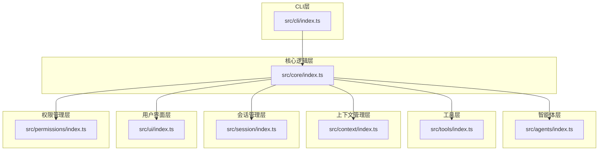
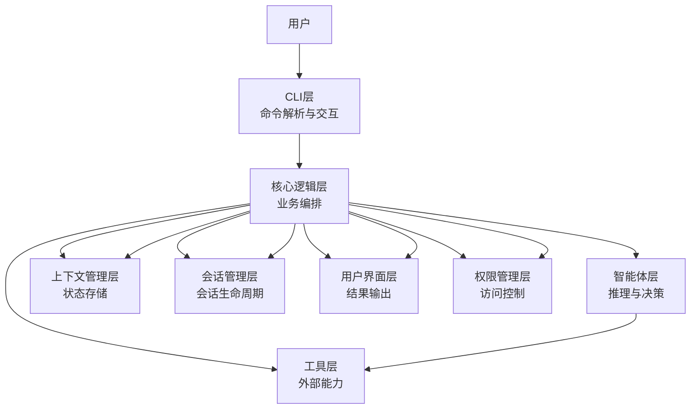
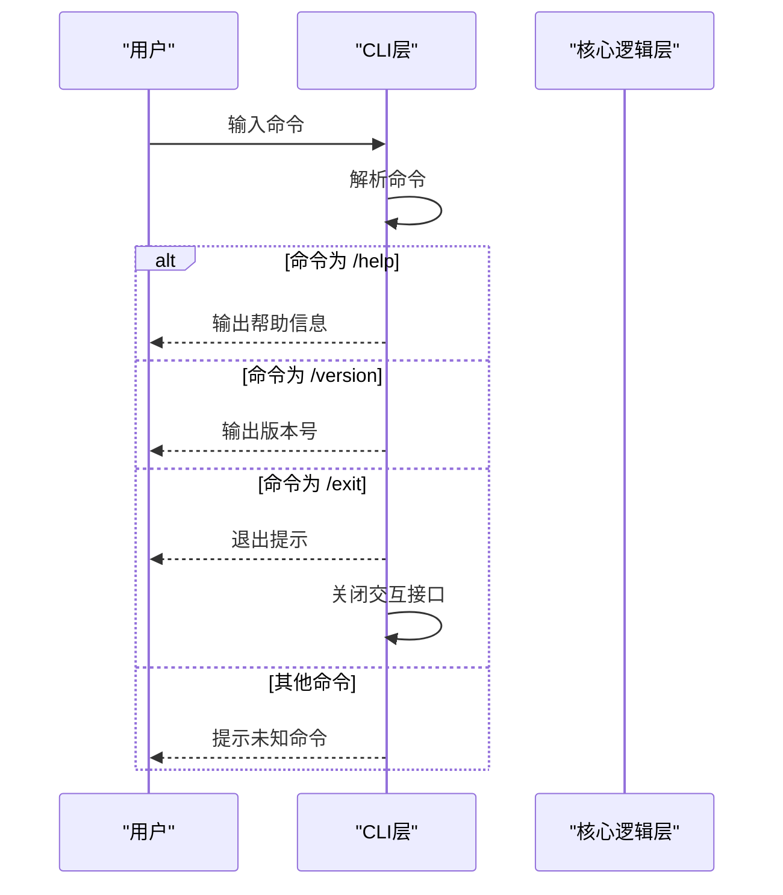
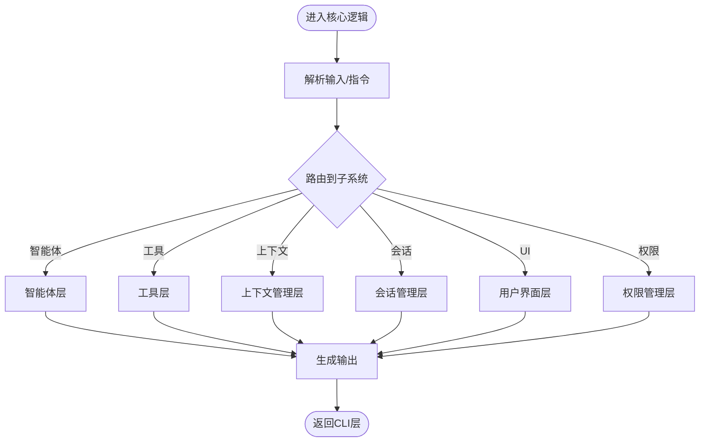
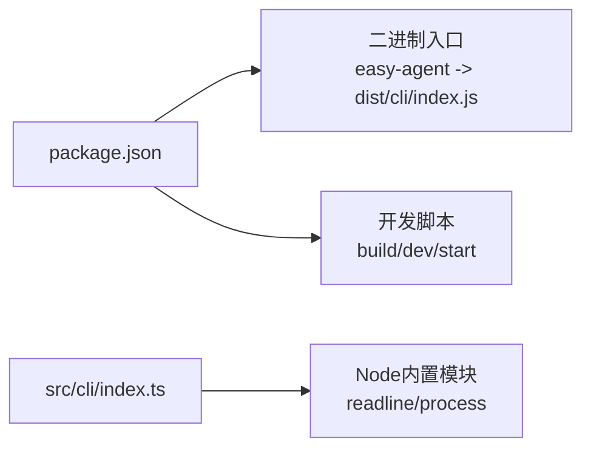

# 架构设计

<cite>
**本文档引用的文件**
- [src/cli/index.ts](file://src/cli/index.ts)
- [src/core/index.ts](file://src/core/index.ts)
- [src/agents/index.ts](file://src/agents/index.ts)
- [src/tools/index.ts](file://src/tools/index.ts)
- [src/context/index.ts](file://src/context/index.ts)
- [src/session/index.ts](file://src/session/index.ts)
- [src/ui/index.ts](file://src/ui/index.ts)
- [src/permissions/index.ts](file://src/permissions/index.ts)
- [package.json](file://package.json)
- [README.md](file://README.md)
</cite>

## 目录
1. [简介](#简介)
2. [项目结构](#项目结构)
3. [核心组件](#核心组件)
4. [架构总览](#架构总览)
5. [详细组件分析](#详细组件分析)
6. [依赖分析](#依赖分析)
7. [性能考虑](#性能考虑)
8. [故障排除指南](#故障排除指南)
9. [结论](#结论)
10. [附录](#附录)

## 简介
本项目是一个“简易CLI智能体”，当前处于早期开发阶段，采用分层架构模式组织代码，包含CLI层、核心逻辑层、智能体层、工具层、上下文管理、会话管理、用户界面以及权限管理等模块。尽管当前各模块文件内容为空白占位符，但通过包配置与项目命名可知其目标是构建一个支持多轮对话与工具调用的命令行智能体。

项目入口位于CLI层，负责读取用户输入并解析命令；核心逻辑层作为业务编排中心，协调智能体、工具、上下文与会话等模块；智能体层承载智能体行为与推理能力；工具层提供可复用的外部能力；上下文与会话管理负责状态持久化与历史记录；UI层用于输出格式化结果；权限层负责访问控制与安全策略。

## 项目结构
项目采用按功能域划分的目录结构，每个子目录代表一个独立的功能层或领域模块，便于后续扩展与维护。

图表来源
- [src/cli/index.ts:1-65](file://src/cli/index.ts#L1-L65)
- [src/core/index.ts:1-2](file://src/core/index.ts#L1-L2)
- [src/agents/index.ts:1-2](file://src/agents/index.ts#L1-L2)
- [src/tools/index.ts:1-2](file://src/tools/index.ts#L1-L2)
- [src/context/index.ts:1-2](file://src/context/index.ts#L1-L2)
- [src/session/index.ts:1-2](file://src/session/index.ts#L1-L2)
- [src/ui/index.ts:1-2](file://src/ui/index.ts#L1-L2)
- [src/permissions/index.ts:1-2](file://src/permissions/index.ts#L1-L2)

章节来源
- [src/cli/index.ts:1-65](file://src/cli/index.ts#L1-L65)
- [package.json:1-32](file://package.json#L1-L32)

## 核心组件
- CLI层：负责命令行交互、输入解析与帮助信息展示，当前仅包含基础命令（/help、/exit、/version）。
- 核心逻辑层：作为业务编排中心，协调智能体、工具、上下文、会话、UI与权限模块。
- 智能体层：承载智能体行为与推理能力，为对话与任务执行提供决策支持。
- 工具层：封装可复用的外部能力（如网络请求、文件操作等），供核心逻辑层调用。
- 上下文管理层：保存与恢复对话上下文，确保多轮对话的一致性与连贯性。
- 会话管理层：管理用户会话生命周期，包括会话创建、更新与销毁。
- 用户界面层：负责输出格式化结果，提升用户体验。
- 权限管理层：控制访问与操作范围，保障系统安全。

章节来源
- [src/cli/index.ts:6-19](file://src/cli/index.ts#L6-L19)
- [src/core/index.ts:1-2](file://src/core/index.ts#L1-L2)
- [src/agents/index.ts:1-2](file://src/agents/index.ts#L1-L2)
- [src/tools/index.ts:1-2](file://src/tools/index.ts#L1-L2)
- [src/context/index.ts:1-2](file://src/context/index.ts#L1-L2)
- [src/session/index.ts:1-2](file://src/session/index.ts#L1-L2)
- [src/ui/index.ts:1-2](file://src/ui/index.ts#L1-L2)
- [src/permissions/index.ts:1-2](file://src/permissions/index.ts#L1-L2)

## 架构总览
整体采用自顶向下的分层架构，CLI层面向用户，核心逻辑层作为中枢，向下连接智能体、工具、上下文、会话、UI与权限等子系统。数据流从CLI进入，经核心逻辑层编排后，调用相应子系统完成具体任务，并将结果通过UI层返回给用户。

图表来源
- [src/cli/index.ts:23-59](file://src/cli/index.ts#L23-L59)
- [src/core/index.ts:1-2](file://src/core/index.ts#L1-L2)
- [src/agents/index.ts:1-2](file://src/agents/index.ts#L1-L2)
- [src/tools/index.ts:1-2](file://src/tools/index.ts#L1-L2)
- [src/context/index.ts:1-2](file://src/context/index.ts#L1-L2)
- [src/session/index.ts:1-2](file://src/session/index.ts#L1-L2)
- [src/ui/index.ts:1-2](file://src/ui/index.ts#L1-L2)
- [src/permissions/index.ts:1-2](file://src/permissions/index.ts#L1-L2)

## 详细组件分析

### CLI层分析
- 职责：处理用户输入、显示帮助信息、版本查询与退出流程。
- 控制流：循环读取用户输入，根据命令分支执行对应逻辑；/exit关闭交互接口并退出进程。
- 错误处理：异常捕获并以非零退出码终止，避免静默失败。
- 可扩展点：新增命令时只需在switch中添加分支，并在帮助文本中补充说明。

图表来源
- [src/cli/index.ts:33-54](file://src/cli/index.ts#L33-L54)

章节来源
- [src/cli/index.ts:1-65](file://src/cli/index.ts#L1-L65)

### 核心逻辑层分析
- 职责：作为业务编排中心，协调智能体、工具、上下文、会话、UI与权限模块。
- 设计模式：当前为占位实现，建议引入命令模式（将命令抽象为对象）、策略模式（根据场景选择不同策略）、工厂模式（统一创建复杂对象）。
- 扩展性：通过接口抽象与依赖注入，降低模块耦合度，提升可测试性与可维护性。

图表来源
- [src/core/index.ts:1-2](file://src/core/index.ts#L1-L2)
- [src/agents/index.ts:1-2](file://src/agents/index.ts#L1-L2)
- [src/tools/index.ts:1-2](file://src/tools/index.ts#L1-L2)
- [src/context/index.ts:1-2](file://src/context/index.ts#L1-L2)
- [src/session/index.ts:1-2](file://src/session/index.ts#L1-L2)
- [src/ui/index.ts:1-2](file://src/ui/index.ts#L1-L2)
- [src/permissions/index.ts:1-2](file://src/permissions/index.ts#L1-L2)

章节来源
- [src/core/index.ts:1-2](file://src/core/index.ts#L1-L2)

### 智能体层分析
- 职责：承载智能体行为与推理能力，支持多轮对话与任务执行。
- 设计模式：可采用策略模式为不同智能体类型提供可插拔实现；使用命令模式将对话动作封装为可执行对象。
- 可扩展性：通过插件化机制接入第三方模型或本地推理引擎。

章节来源
- [src/agents/index.ts:1-2](file://src/agents/index.ts#L1-L2)

### 工具层分析
- 职责：封装可复用的外部能力（如网络请求、文件操作、系统命令等）。
- 设计模式：工厂模式用于统一创建工具实例；适配器模式用于兼容不同外部API。
- 可扩展性：通过注册表机制动态加载新工具，支持热插拔。

章节来源
- [src/tools/index.ts:1-2](file://src/tools/index.ts#L1-L2)

### 上下文管理层分析
- 职责：保存与恢复对话上下文，确保多轮对话的一致性与连贯性。
- 设计模式：可采用观察者模式监听上下文变化；备忘录模式用于快照与回滚。
- 性能：对大体量上下文进行分页存储与增量更新，减少内存占用。

章节来源
- [src/context/index.ts:1-2](file://src/context/index.ts#L1-L2)

### 会话管理层分析
- 职责：管理用户会话生命周期，包括会话创建、更新与销毁。
- 设计模式：状态机模式管理会话状态转换；工厂模式创建不同类型会话。
- 安全：结合权限层对会话进行鉴权与审计。

章节来源
- [src/session/index.ts:1-2](file://src/session/index.ts#L1-L2)

### 用户界面层分析
- 职责：负责输出格式化结果，提升用户体验。
- 设计模式：模板方法模式统一输出格式；策略模式根据不同场景选择渲染策略。
- 可扩展性：支持多种输出格式（文本、JSON、表格等）。

章节来源
- [src/ui/index.ts:1-2](file://src/ui/index.ts#L1-L2)

### 权限管理层分析
- 职责：控制访问与操作范围，保障系统安全。
- 设计模式：责任链模式处理权限审批流程；策略模式根据角色分配权限。
- 合规：遵循最小权限原则与审计日志要求。

章节来源
- [src/permissions/index.ts:1-2](file://src/permissions/index.ts#L1-L2)

## 依赖分析
- 包依赖：项目使用TypeScript与Node.js运行时，开发脚本支持TS编译与本地调试。
- 运行时依赖：当前未声明运行时依赖，CLI层直接使用Node内置模块（readline、process）。
- 入口映射：CLI入口通过二进制名称绑定至dist/cli/index.js，开发时可通过tsx直接运行源码。

图表来源
- [package.json:6-13](file://package.json#L6-L13)
- [src/cli/index.ts:3-4](file://src/cli/index.ts#L3-L4)

章节来源
- [package.json:1-32](file://package.json#L1-L32)
- [src/cli/index.ts:1-65](file://src/cli/index.ts#L1-L65)

## 性能考虑
- I/O优化：CLI层使用异步接口读取输入，避免阻塞主线程。
- 内存管理：上下文与会话应采用分页与懒加载策略，减少内存峰值。
- 并发控制：工具层调用外部服务时应限制并发数，防止资源耗尽。
- 缓存策略：对频繁使用的工具结果进行缓存，降低重复计算成本。
- 日志与监控：在核心逻辑层埋点，记录关键路径耗时与错误统计。

## 故障排除指南
- CLI异常：捕获顶层错误并以非零退出码终止，便于CI/CD识别失败。
- 命令无效：当输入不在已知命令列表时，提示用户查看帮助信息。
- 退出流程：/exit命令需确保资源清理与交互接口关闭，避免句柄泄漏。
- 权限问题：权限层拒绝非法操作时，应返回明确的错误信息与建议。

章节来源
- [src/cli/index.ts:61-64](file://src/cli/index.ts#L61-L64)
- [src/cli/index.ts:43-46](file://src/cli/index.ts#L43-L46)

## 结论
本项目采用清晰的分层架构，CLI层负责交互，核心逻辑层承担编排职责，其余模块分别覆盖智能体、工具、上下文、会话、UI与权限。当前为早期占位实现，建议尽快填充各模块的具体逻辑，并引入命令模式、策略模式、工厂模式等设计模式以增强可扩展性与可维护性。通过接口抽象与依赖注入，逐步实现模块解耦与插件化扩展，为后续功能演进奠定坚实基础。

## 附录
- 系统边界：CLI层对外暴露命令接口；核心逻辑层为内部中枢；各子系统边界由接口契约定义。
- 最佳实践：优先使用接口而非具体实现；通过配置驱动替换策略；为关键路径增加可观测性；严格区分同步与异步操作。