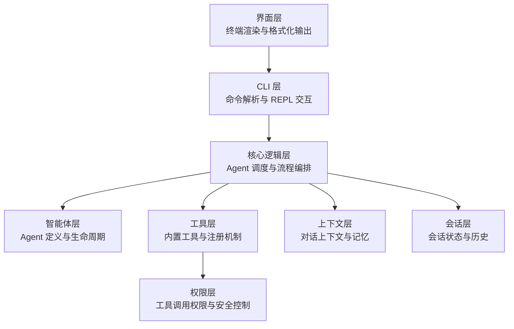
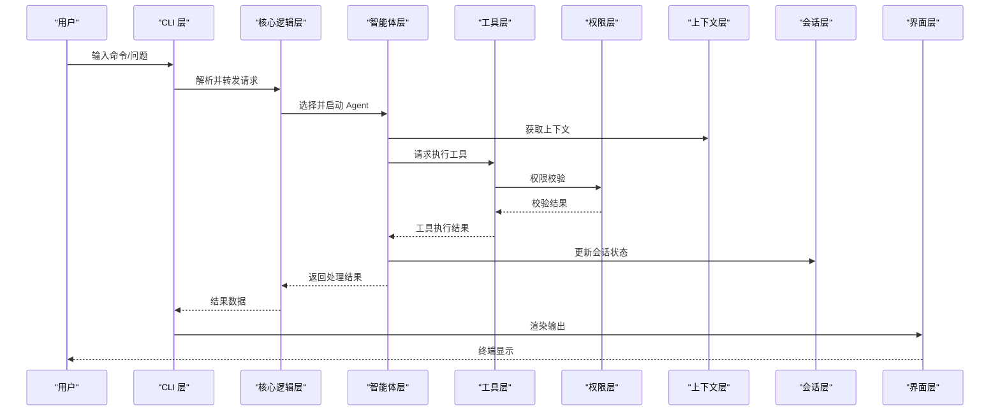
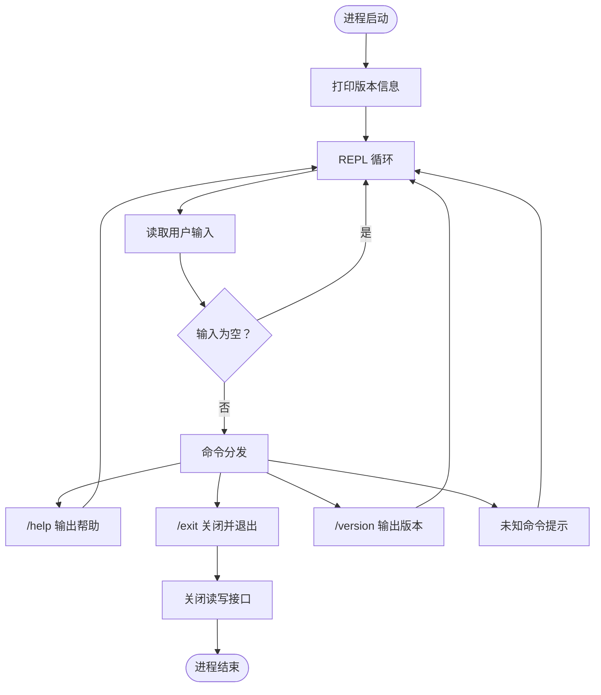
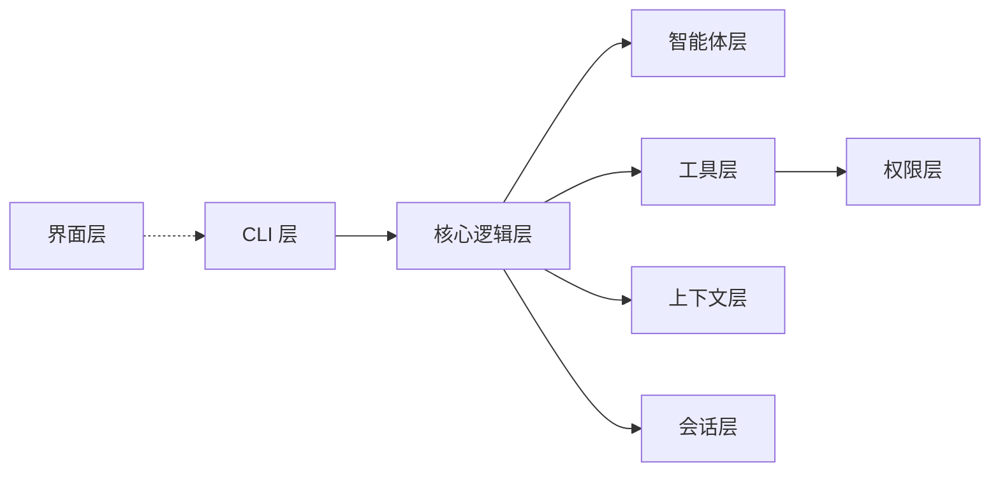

# 模块交互机制

<cite>
**本文档引用的文件**
- [src/cli/index.ts](file://src/cli/index.ts)
- [src/core/index.ts](file://src/core/index.ts)
- [src/agents/index.ts](file://src/agents/index.ts)
- [src/tools/index.ts](file://src/tools/index.ts)
- [src/context/index.ts](file://src/context/index.ts)
- [src/session/index.ts](file://src/session/index.ts)
- [src/ui/index.ts](file://src/ui/index.ts)
- [src/permissions/index.ts](file://src/permissions/index.ts)
- [package.json](file://package.json)
- [README.md](file://README.md)
- [AGENTS.md](file://AGENTS.md)
</cite>

## 目录
1. [引言](#引言)
2. [项目结构](#项目结构)
3. [核心组件](#核心组件)
4. [架构总览](#架构总览)
5. [详细组件分析](#详细组件分析)
6. [依赖关系分析](#依赖关系分析)
7. [性能考量](#性能考量)
8. [故障排除指南](#故障排除指南)
9. [结论](#结论)
10. [附录](#附录)

## 引言
本文件面向 easy-agent-cli 的模块交互机制，系统性阐述各模块间的交互方式、通信协议、依赖关系、接口契约与数据交换格式；说明模块初始化顺序与生命周期管理；给出错误处理与异常传播机制；并提供模块扩展与插件化实现方案，以及模块解耦与接口抽象的设计原则。内容基于仓库现有源码与开发规范文档整理而成。

## 项目结构
项目采用分层架构，按职责划分为 CLI、核心逻辑、智能体、工具、上下文、会话、界面与权限八层。每层通过统一的 index.ts 文件对外暴露公共 API，内部实现文件不直接对外暴露，遵循“上层可依赖下层，下层不可依赖上层”的依赖规则。

图表来源
- [AGENTS.md:31-42](file://AGENTS.md#L31-L42)

章节来源
- [AGENTS.md:15-27](file://AGENTS.md#L15-L27)
- [AGENTS.md:29-42](file://AGENTS.md#L29-L42)

## 核心组件
- CLI 层：负责命令解析、REPL 交互与主流程入口，当前实现仅处理帮助、退出、版本等基础命令，后续将接入核心逻辑层进行消息路由与流程编排。
- 核心逻辑层：作为 Agent 调度中心，负责消息路由、流程编排，并协调智能体、工具、上下文与会话模块。
- 智能体层：承载 Agent 的定义、注册与生命周期管理，依赖工具与上下文模块。
- 工具层：提供内置工具与注册机制，依赖权限层进行调用校验。
- 上下文层：管理对话上下文与记忆，无下层依赖。
- 会话层：管理会话状态与历史，无下层依赖。
- 界面层：负责终端渲染与格式化输出，无下层依赖。
- 权限层：提供权限校验与安全策略，无下层依赖。

章节来源
- [AGENTS.md:29-42](file://AGENTS.md#L29-L42)
- [src/cli/index.ts:23-64](file://src/cli/index.ts#L23-L64)

## 架构总览
下图展示模块间典型交互路径：CLI 层接收用户输入后，委托核心逻辑层进行消息路由；核心逻辑层根据配置选择合适的 Agent 并驱动其执行；Agent 在执行过程中可能调用工具层提供的工具，工具调用前需经权限层校验；上下文层与会话层分别提供记忆与状态管理；最终由界面层进行终端渲染输出。

图表来源
- [AGENTS.md:31-42](file://AGENTS.md#L31-L42)
- [src/cli/index.ts:33-58](file://src/cli/index.ts#L33-L58)

## 详细组件分析

### CLI 层（命令入口）
- 职责：命令解析、REPL 循环、帮助/退出/版本等基础命令处理。
- 当前实现：仅处理 /help、/exit、/version 三类命令；未接入核心逻辑层的消息路由。
- 生命周期：进程启动即进入 REPL 循环，收到 /exit 后关闭读写接口并退出。
- 错误处理：顶层 catch 捕获异常并以非零退出码终止进程。

图表来源
- [src/cli/index.ts:23-64](file://src/cli/index.ts#L23-L64)

章节来源
- [src/cli/index.ts:23-64](file://src/cli/index.ts#L23-L64)

### 核心逻辑层（Agent 调度）
- 职责：消息路由、流程编排、与智能体/工具/上下文/会话协作。
- 接口契约：接收来自 CLI 的请求，返回标准化结果对象；对 Agent 的生命周期进行编排；对工具调用进行统一调度。
- 数据交换格式：请求/响应采用 JSON 结构，字段包含消息文本、元数据、上下文标识等；工具调用参数与返回值以键值对形式传递。
- 初始化顺序：在 CLI 层完成命令解析后，由核心逻辑层接管；若涉及外部服务，应在核心层内进行延迟初始化。
- 生命周期管理：核心逻辑层负责 Agent 的创建、执行、清理；工具调用前后进行状态更新；上下文与会话在每次交互中同步更新。

章节来源
- [AGENTS.md:34](file://AGENTS.md#L34)
- [src/core/index.ts:1-2](file://src/core/index.ts#L1-L2)

### 智能体层（Agent 管理）
- 职责：Agent 定义、注册、能力声明与生命周期管理。
- 依赖关系：依赖工具层进行能力调用，依赖上下文层进行记忆与上下文构建。
- 接口契约：提供 Agent 注册接口、执行接口与状态查询接口；支持并发安全与超时控制。
- 数据交换格式：Agent 输入为标准化消息对象；输出为结构化结果对象，包含工具调用记录、上下文片段与最终结论。

章节来源
- [AGENTS.md:35](file://AGENTS.md#L35)
- [src/agents/index.ts:1-2](file://src/agents/index.ts#L1-L2)

### 工具层（工具注册与执行）
- 职责：内置工具实现与注册机制；提供统一的工具调用接口。
- 依赖关系：依赖权限层进行调用校验；工具清单与配置由核心逻辑层下发。
- 接口契约：工具注册需声明名称、参数、返回值与权限要求；调用时需提供参数字典与上下文标识。
- 数据交换格式：工具参数为键值对集合；返回值包含执行状态、结果数据与日志片段。

章节来源
- [AGENTS.md:36](file://AGENTS.md#L36)
- [src/tools/index.ts:1-2](file://src/tools/index.ts#L1-L2)

### 权限层（安全与校验）
- 职责：工具调用权限校验、安全策略实施。
- 接口契约：提供权限校验接口，支持白名单/黑名单、角色授权与动态策略。
- 数据交换格式：校验请求包含工具名、调用者身份、上下文标识与参数摘要；返回布尔值与拒绝原因。
- 错误处理：拒绝调用时返回明确错误码与提示；异常情况统一转换为安全失败策略。

章节来源
- [AGENTS.md:36](file://AGENTS.md#L36)
- [src/permissions/index.ts:1-2](file://src/permissions/index.ts#L1-L2)

### 上下文层（对话记忆）
- 职责：构建与维护对话上下文，管理记忆片段与 token 限额。
- 接口契约：提供上下文构建接口、片段追加接口与裁剪接口；支持多轮对话的记忆保持。
- 数据交换格式：上下文对象包含消息列表、摘要与统计信息；裁剪时按策略移除低价值片段。
- 性能考量：需关注 token 计算与内存占用，必要时进行压缩与持久化。

章节来源
- [AGENTS.md:37](file://AGENTS.md#L37)
- [src/context/index.ts:1-2](file://src/context/index.ts#L1-L2)

### 会话层（状态与历史）
- 职责：会话状态管理与历史记录持久化。
- 接口契约：提供会话创建、更新、查询与销毁接口；支持批量历史检索与清理。
- 数据交换格式：会话对象包含标识、时间戳、状态与历史条目；历史条目包含消息与结果。
- 生命周期管理：会话在首次交互时创建，在空闲超时或显式关闭时销毁。

章节来源
- [AGENTS.md:38](file://AGENTS.md#L38)
- [src/session/index.ts:1-2](file://src/session/index.ts#L1-L2)

### 界面层（终端渲染）
- 职责：终端渲染、格式化输出与用户交互反馈。
- 接口契约：提供统一的输出接口，支持文本、表格、JSON 等多种格式；具备换行与截断策略。
- 数据交换格式：输入为结构化结果对象；输出为终端可读字符串流。
- 错误处理：渲染异常不影响主流程，记录日志并降级输出。

章节来源
- [AGENTS.md:39](file://AGENTS.md#L39)
- [src/ui/index.ts:1-2](file://src/ui/index.ts#L1-L2)

## 依赖关系分析
- 依赖方向：上层可依赖下层，下层不可依赖上层；同层之间尽量避免直接依赖。
- 典型依赖链：CLI → 核心逻辑 → 智能体/工具/上下文/会话；工具 → 权限；界面独立于上层。
- 外部依赖：Node.js ESM 运行时、TypeScript 编译器、开发工具 tsx。

图表来源
- [AGENTS.md:31-42](file://AGENTS.md#L31-L42)
- [package.json:1-32](file://package.json#L1-L32)

章节来源
- [AGENTS.md:42](file://AGENTS.md#L42)
- [package.json:1-32](file://package.json#L1-L32)

## 性能考量
- 模块初始化：优先采用延迟初始化策略，避免一次性加载过多资源；核心逻辑层在首次请求时完成必要的环境准备。
- 数据交换：统一使用 JSON 序列化/反序列化，减少不必要的拷贝；对大对象进行分片传输或流式处理。
- 内存管理：上下文层与会话层需定期清理无效片段与历史；工具执行结果缓存设置 TTL。
- 并发控制：智能体与工具调用需限制并发数，防止资源争用；对阻塞操作采用异步化与超时控制。

## 故障排除指南
- CLI 层错误：顶层捕获异常并输出错误信息，随后以非零退出码退出；建议增加日志记录以便定位问题。
- 权限层错误：工具调用被拒绝时，返回明确的错误码与原因；排查权限配置与调用参数是否匹配。
- 工具层错误：工具执行失败时，记录参数摘要与返回值；检查工具实现与依赖环境。
- 上下文/会话错误：上下文长度超限或会话状态异常时，触发裁剪或重建流程；检查 token 计算与存储策略。
- 界面层错误：渲染失败不影响主流程，但需记录异常并降级输出；检查终端编码与格式化参数。

章节来源
- [src/cli/index.ts:61-64](file://src/cli/index.ts#L61-L64)
- [AGENTS.md:95-101](file://AGENTS.md#L95-L101)

## 结论
easy-agent-cli 采用清晰的分层架构与严格的依赖规则，为模块交互提供了稳定的基础。当前 CLI 层尚未接入核心逻辑层，后续应完善消息路由与流程编排，以充分发挥智能体、工具、上下文与会话模块的协同能力。通过统一的接口契约与数据交换格式，结合完善的错误处理与生命周期管理，系统可在保证可维护性的同时实现良好的扩展性与插件化能力。

## 附录

### 模块初始化顺序与生命周期
- 初始化顺序：CLI 层启动 → 核心逻辑层初始化（按需）→ 智能体/工具/上下文/会话模块按需加载。
- 生命周期：CLI 层维持 REPL 循环；核心逻辑层在每次请求时编排 Agent 执行；工具调用完成后更新上下文与会话；界面层负责渲染；退出时释放资源。

章节来源
- [AGENTS.md:29-42](file://AGENTS.md#L29-L42)
- [src/cli/index.ts:23-64](file://src/cli/index.ts#L23-L64)

### 模块扩展与插件化方案
- 插件注册：工具层提供统一注册接口，支持动态加载与卸载；权限层对新工具进行白名单配置。
- Agent 扩展：智能体层提供注册与发现机制，支持多 Agent 并行与切换。
- 配置驱动：通过配置文件或环境变量控制模块启用/禁用与参数覆盖。
- 接口抽象：定义稳定的接口契约，确保插件与核心模块的兼容性。

章节来源
- [AGENTS.md:44-67](file://AGENTS.md#L44-L67)