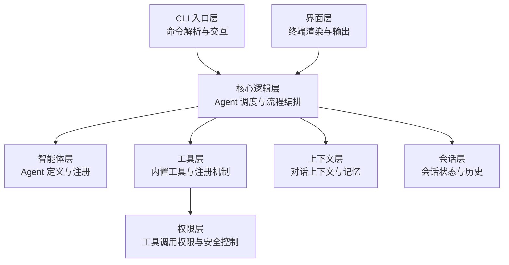
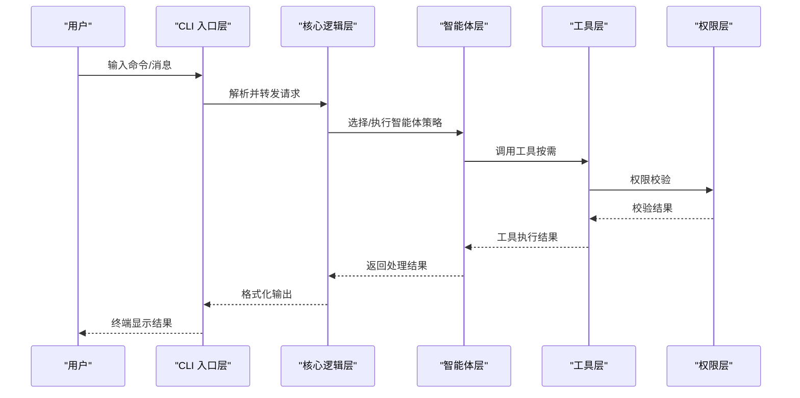
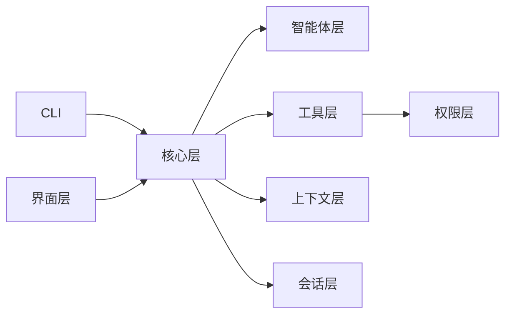

# 设计模式应用

<cite>
**本文引用的文件**
- [src/cli/index.ts](file://src/cli/index.ts)
- [src/agents/index.ts](file://src/agents/index.ts)
- [src/tools/index.ts](file://src/tools/index.ts)
- [src/context/index.ts](file://src/context/index.ts)
- [src/core/index.ts](file://src/core/index.ts)
- [src/session/index.ts](file://src/session/index.ts)
- [src/ui/index.ts](file://src/ui/index.ts)
- [src/permissions/index.ts](file://src/permissions/index.ts)
- [package.json](file://package.json)
- [README.md](file://README.md)
- [AGENTS.md](file://AGENTS.md)
</cite>

## 目录
1. [引言](#引言)
2. [项目结构](#项目结构)
3. [核心组件](#核心组件)
4. [架构总览](#架构总览)
5. [详细组件分析](#详细组件分析)
6. [依赖分析](#依赖分析)
7. [性能考量](#性能考量)
8. [故障排查指南](#故障排查指南)
9. [结论](#结论)
10. [附录](#附录)

## 引言
本文件面向 easy-agent-cli 项目，系统梳理其在分层架构基础上所应用的设计模式，重点覆盖命令模式（CLI 命令处理）、策略模式（不同智能体实现）、工厂模式（工具与智能体创建）等，并结合项目当前实现与未来演进建议，给出技术选型考量、替代方案与最佳实践。

## 项目结构
项目采用清晰的分层架构：CLI 入口层负责命令解析与 REPL 交互；核心层负责 Agent 调度与流程编排；智能体层、工具层、上下文层、会话层、界面层与权限层分别承担各自职责。层间依赖遵循“上层可依赖下层”的原则，确保高内聚低耦合。

图表来源
- [AGENTS.md:31-42](file://AGENTS.md#L31-L42)

章节来源
- [AGENTS.md:15-42](file://AGENTS.md#L15-L42)
- [package.json:1-32](file://package.json#L1-L32)

## 核心组件
- CLI 入口层：提供命令式交互与基础命令（帮助、退出、版本），作为系统的唯一入口。
- 核心逻辑层：承载 Agent 调度、消息路由与流程编排，是各层交互的中枢。
- 智能体层：抽象 Agent 接口与具体实现，支持多策略并存与动态切换。
- 工具层：封装工具注册与调用机制，为智能体提供能力扩展点。
- 上下文层：管理对话上下文与记忆，支撑多轮对话与上下文压缩。
- 会话层：维护会话状态与历史，支持持久化与恢复。
- 权限层：对工具调用进行权限校验，保障安全性。
- 界面层：负责终端渲染与格式化输出，保持与核心逻辑解耦。

章节来源
- [AGENTS.md:15-42](file://AGENTS.md#L15-L42)
- [src/cli/index.ts:1-65](file://src/cli/index.ts#L1-L65)
- [src/agents/index.ts:1-2](file://src/agents/index.ts#L1-L2)
- [src/tools/index.ts:1-2](file://src/tools/index.ts#L1-L2)
- [src/context/index.ts:1-2](file://src/context/index.ts#L1-L2)
- [src/core/index.ts:1-2](file://src/core/index.ts#L1-L2)
- [src/session/index.ts:1-2](file://src/session/index.ts#L1-L2)
- [src/ui/index.ts:1-2](file://src/ui/index.ts#L1-L2)
- [src/permissions/index.ts:1-2](file://src/permissions/index.ts#L1-L2)

## 架构总览
下图展示了 CLI 与核心层之间的交互关系，以及核心层如何协调各子层完成一次典型的消息处理流程。

图表来源
- [src/cli/index.ts:23-65](file://src/cli/index.ts#L23-L65)
- [src/core/index.ts:1-2](file://src/core/index.ts#L1-L2)
- [src/agents/index.ts:1-2](file://src/agents/index.ts#L1-L2)
- [src/tools/index.ts:1-2](file://src/tools/index.ts#L1-L2)
- [src/permissions/index.ts:1-2](file://src/permissions/index.ts#L1-L2)

## 详细组件分析

### 命令模式：CLI 命令处理
- 应用场景
  - 将用户输入的命令封装为对象，统一由 CLI 层解析与分发，避免在入口处堆积条件分支逻辑。
  - 支持未来扩展新的命令而不破坏现有代码，符合开闭原则。
- 实现方式
  - CLI 入口层通过循环读取用户输入，使用条件判断或映射表将命令转换为对应处理动作。
  - 当前实现以简单分支处理帮助、退出、版本等基础命令；后续可引入命令对象与命令注册表，将处理逻辑封装为独立对象。
- 带来的好处
  - 降低 CLI 入口层的复杂度，提升可测试性与可维护性。
  - 便于统一错误处理、日志记录与命令历史。
- 代码示例路径
  - [src/cli/index.ts:33-55](file://src/cli/index.ts#L33-L55)
- 替代方案与考量
  - 可采用命令注册表 + 中央分发器，减少分支数量，提高扩展性。
  - 若命令数量较多，可引入命令解析器（如词法/语法分析）以支持更复杂的参数与子命令。
- 最佳实践
  - 命令对象应包含执行、回滚、验证等方法，便于统一管理。
  - 对外部副作用（如文件写入、网络请求）进行隔离，便于测试与审计。

章节来源
- [src/cli/index.ts:1-65](file://src/cli/index.ts#L1-L65)

### 策略模式：不同智能体实现
- 应用场景
  - 需要根据上下文动态选择不同的智能体策略（如不同模型、不同推理模式），并在运行期切换。
- 实现方式
  - 在智能体层定义统一的策略接口，不同智能体实现该接口，核心层通过配置或上下文选择具体策略实例。
  - 工具层与上下文层为策略提供通用能力与数据支持。
- 带来的好处
  - 提升系统灵活性，便于快速替换或组合不同智能体。
  - 便于针对特定任务优化策略，同时保持调用方一致。
- 代码示例路径
  - [src/agents/index.ts:1-2](file://src/agents/index.ts#L1-L2)
  - [src/core/index.ts:1-2](file://src/core/index.ts#L1-L2)
  - [src/tools/index.ts:1-2](file://src/tools/index.ts#L1-L2)
  - [src/context/index.ts:1-2](file://src/context/index.ts#L1-L2)
- 替代方案与考量
  - 可引入策略工厂或策略注册表，集中管理策略创建与切换。
  - 若策略差异较大，可考虑插件化加载，进一步解耦。
- 最佳实践
  - 策略接口应最小化，避免过度耦合。
  - 对策略执行结果进行标准化封装，便于核心层统一处理。

章节来源
- [AGENTS.md:29-42](file://AGENTS.md#L29-L42)
- [src/agents/index.ts:1-2](file://src/agents/index.ts#L1-L2)
- [src/core/index.ts:1-2](file://src/core/index.ts#L1-L2)

### 工厂模式：工具与智能体创建
- 应用场景
  - 工具与智能体需要按需创建与复用，且存在多种变体（如不同参数、不同后端）。
- 实现方式
  - 在工具层与智能体层提供工厂函数或工厂类，根据配置或上下文创建具体实例。
  - 工厂内部可缓存已创建实例，避免重复初始化。
- 带来的好处
  - 将创建细节隐藏在工厂内部，调用方仅依赖抽象。
  - 便于统一资源管理（如连接池、缓存）与生命周期控制。
- 代码示例路径
  - [src/tools/index.ts:1-2](file://src/tools/index.ts#L1-L2)
  - [src/agents/index.ts:1-2](file://src/agents/index.ts#L1-L2)
- 替代方案与考量
  - 可引入依赖注入容器，集中管理对象创建与依赖关系。
  - 对于复杂创建过程，可考虑建造者模式细化步骤。
- 最佳实践
  - 工厂应支持默认配置与覆盖配置，便于灵活定制。
  - 对异常创建进行捕获与降级处理，保证系统稳定性。

章节来源
- [AGENTS.md:29-42](file://AGENTS.md#L29-L42)
- [src/tools/index.ts:1-2](file://src/tools/index.ts#L1-L2)
- [src/agents/index.ts:1-2](file://src/agents/index.ts#L1-L2)

### 组合模式与模板方法：流程编排
- 应用场景
  - 多轮对话与工具调用需要稳定的流程骨架，同时允许策略与工具在不同阶段插入。
- 实现方式
  - 核心层提供流程模板（如“接收输入 -> 选择策略 -> 调用工具 -> 生成输出”），智能体与工具作为可插拔组件参与。
  - 上下文层与会话层为流程提供状态与记忆。
- 带来的好处
  - 固定流程骨架降低复杂度，提升一致性。
  - 插拔式组件增强扩展性与可测试性。
- 代码示例路径
  - [src/core/index.ts:1-2](file://src/core/index.ts#L1-L2)
  - [src/context/index.ts:1-2](file://src/context/index.ts#L1-L2)
  - [src/session/index.ts:1-2](file://src/session/index.ts#L1-L2)
- 替代方案与考量
  - 可引入工作流引擎或状态机，进一步细粒度控制流程与异常恢复。
- 最佳实践
  - 流程中的每个步骤应有明确的输入输出契约，便于监控与调试。
  - 对关键节点增加可观测性（日志、指标），便于问题定位。

章节来源
- [AGENTS.md:29-42](file://AGENTS.md#L29-L42)
- [src/core/index.ts:1-2](file://src/core/index.ts#L1-L2)

### 单例与外观模式：权限与界面
- 应用场景
  - 权限校验与终端渲染需要全局一致的行为与简洁的对外接口。
- 实现方式
  - 权限层以单例形式提供统一校验服务；界面层以外观模式封装渲染细节，供核心层调用。
- 带来的好处
  - 权限校验的一致性与可审计性。
  - 界面渲染与核心逻辑解耦，便于替换渲染后端。
- 代码示例路径
  - [src/permissions/index.ts:1-2](file://src/permissions/index.ts#L1-L2)
  - [src/ui/index.ts:1-2](file://src/ui/index.ts#L1-L2)
- 替代方案与考量
  - 权限层可引入策略化校验（如白名单/黑名单、角色授权），提升灵活性。
  - 界面层可抽象为渲染器接口，支持多种输出格式（JSON、Markdown、HTML）。
- 最佳实践
  - 单例应避免全局状态污染，必要时提供初始化与重置接口。
  - 外观模式应保持薄层，避免退化为核心层。

章节来源
- [AGENTS.md:29-42](file://AGENTS.md#L29-L42)
- [src/permissions/index.ts:1-2](file://src/permissions/index.ts#L1-L2)
- [src/ui/index.ts:1-2](file://src/ui/index.ts#L1-L2)

## 依赖分析
- 层间依赖方向严格遵循“上层可依赖下层”，避免反向依赖。
- 核心层聚合多个子层能力，形成稳定接口；其余层保持独立演进。
- 权限层仅被工具层依赖，确保安全策略集中管理。

图表来源
- [AGENTS.md:31-42](file://AGENTS.md#L31-L42)

章节来源
- [AGENTS.md:31-42](file://AGENTS.md#L31-L42)

## 性能考量
- 命令模式的分支数量与命令解析复杂度成正比，建议引入命令注册表与预编译解析器，降低每次输入的处理成本。
- 策略模式的切换与工具调用应避免频繁创建对象，可通过对象池或缓存复用实例。
- 工厂模式的创建成本应尽量下沉到初始化阶段，运行期仅做选择与装配。
- 上下文与会话的状态管理应考虑内存占用与序列化开销，必要时引入分页与增量更新。

## 故障排查指南
- CLI 命令无效
  - 检查命令是否在入口层正确注册与分发。
  - 参考路径：[src/cli/index.ts:39-54](file://src/cli/index.ts#L39-L54)
- 工具调用失败
  - 确认权限层校验通过，查看工具与权限的依赖关系。
  - 参考路径：[src/tools/index.ts:1-2](file://src/tools/index.ts#L1-L2)、[src/permissions/index.ts:1-2](file://src/permissions/index.ts#L1-L2)
- 智能体未生效
  - 核对核心层策略选择逻辑与智能体注册情况。
  - 参考路径：[src/core/index.ts:1-2](file://src/core/index.ts#L1-L2)、[src/agents/index.ts:1-2](file://src/agents/index.ts#L1-L2)
- 会话状态异常
  - 检查会话层的初始化与持久化策略，确认上下文长度与令牌限制。
  - 参考路径：[src/session/index.ts:1-2](file://src/session/index.ts#L1-L2)、[src/context/index.ts:1-2](file://src/context/index.ts#L1-L2)

章节来源
- [src/cli/index.ts:33-55](file://src/cli/index.ts#L33-L55)
- [src/tools/index.ts:1-2](file://src/tools/index.ts#L1-L2)
- [src/permissions/index.ts:1-2](file://src/permissions/index.ts#L1-L2)
- [src/core/index.ts:1-2](file://src/core/index.ts#L1-L2)
- [src/agents/index.ts:1-2](file://src/agents/index.ts#L1-L2)
- [src/session/index.ts:1-2](file://src/session/index.ts#L1-L2)
- [src/context/index.ts:1-2](file://src/context/index.ts#L1-L2)

## 结论
easy-agent-cli 通过清晰的分层架构与多种设计模式的协同应用，实现了命令处理、策略选择、工厂创建与流程编排的解耦与扩展。当前实现以 CLI 命令处理与分层职责为主，后续可在命令对象化、策略工厂化、工具与智能体工厂化等方面深化，进一步提升可维护性与可扩展性。

## 附录
- 快速开始
  - 安装依赖：npm install
  - 开发模式：npm run dev
  - 构建：npm run build
  - 运行：npm start
- 项目概述与目录结构参考：[AGENTS.md:15-27](file://AGENTS.md#L15-L27)

章节来源
- [AGENTS.md:68-82](file://AGENTS.md#L68-L82)
- [README.md:1-3](file://README.md#L1-L3)