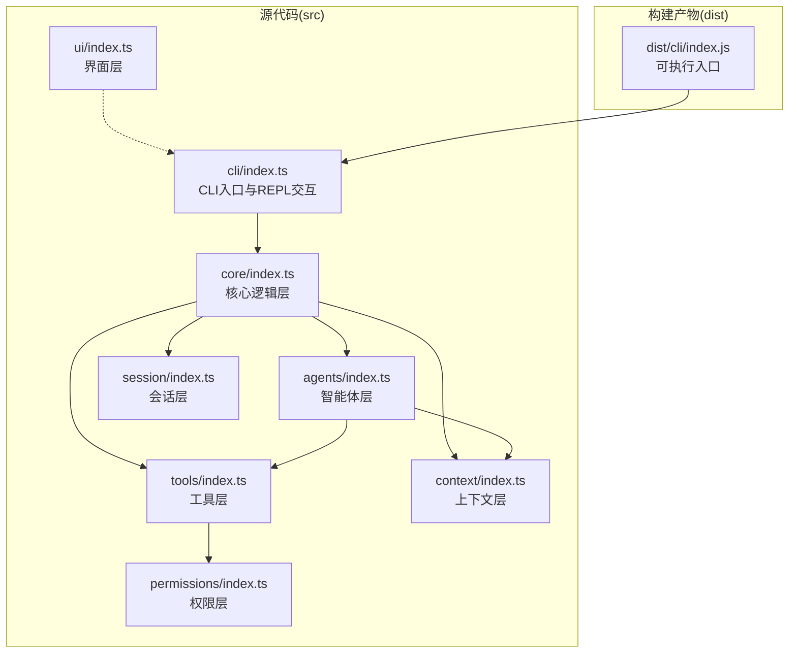
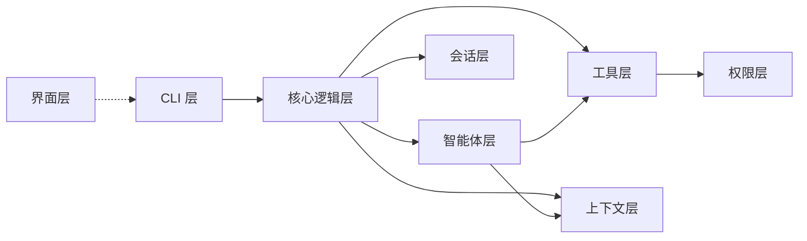
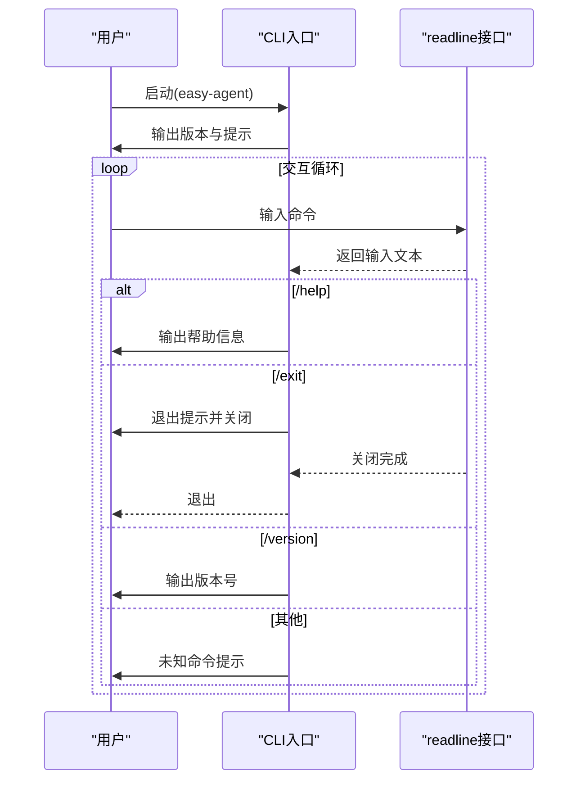
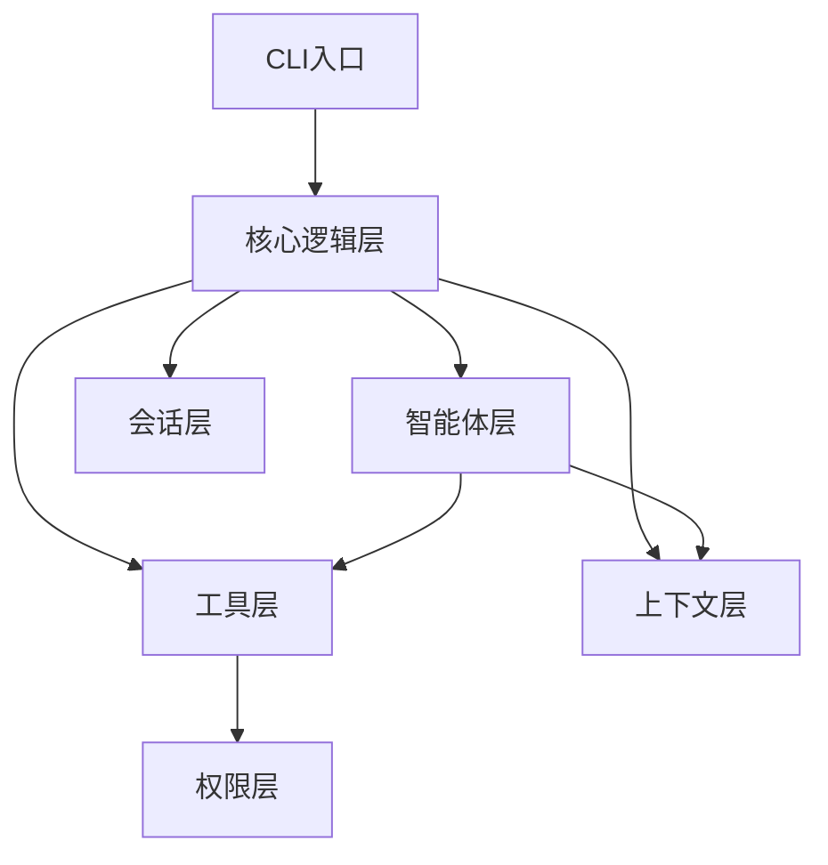
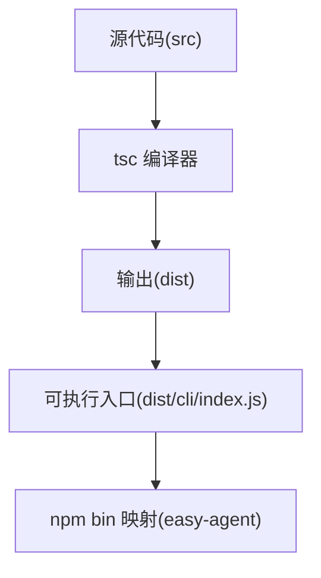
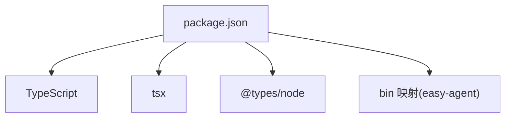

# 部署运维

<cite>
**本文引用的文件**
- [package.json](file://package.json)
- [tsconfig.json](file://tsconfig.json)
- [README.md](file://README.md)
- [AGENTS.md](file://AGENTS.md)
- [src/cli/index.ts](file://src/cli/index.ts)
- [src/core/index.ts](file://src/core/index.ts)
- [src/agents/index.ts](file://src/agents/index.ts)
- [src/context/index.ts](file://src/context/index.ts)
- [src/session/index.ts](file://src/session/index.ts)
- [src/tools/index.ts](file://src/tools/index.ts)
- [src/ui/index.ts](file://src/ui/index.ts)
- [src/permissions/index.ts](file://src/permissions/index.ts)
</cite>

## 目录
1. [简介](#简介)
2. [项目结构](#项目结构)
3. [核心组件](#核心组件)
4. [架构总览](#架构总览)
5. [详细组件分析](#详细组件分析)
6. [依赖分析](#依赖分析)
7. [性能考量](#性能考量)
8. [故障排查指南](#故障排查指南)
9. [版本管理与更新升级](#版本管理与更新升级)
10. [生产环境配置与安全](#生产环境配置与安全)
11. [备份恢复与灾难恢复](#备份恢复与灾难恢复)
12. [附录](#附录)

## 简介
本项目为一个基于 TypeScript 与 Node.js 的轻量级命令行智能体工具，采用 ESM 模块系统与分层架构设计，支持多轮对话与工具调用。CLI 入口提供基础的交互式 REPL 体验，并通过分层职责划分实现良好的可维护性与扩展性。

- 项目名称：easy-agent-cli
- 版本：1.0.0（当前）
- 运行时要求：Node.js 20+
- 模块系统：ESM（"type": "module"）

章节来源
- [README.md:1-3](file://README.md#L1-L3)
- [AGENTS.md:3-14](file://AGENTS.md#L3-L14)

## 项目结构
项目采用按“层”组织的目录结构，便于职责分离与依赖控制。核心入口位于 CLI 层，其余层在构建后通过统一的 index.ts 导出公共 API。

图表来源
- [AGENTS.md:15-27](file://AGENTS.md#L15-L27)
- [AGENTS.md:29-42](file://AGENTS.md#L29-L42)
- [package.json:6-9](file://package.json#L6-L9)

章节来源
- [AGENTS.md:15-27](file://AGENTS.md#L15-L27)
- [AGENTS.md:29-42](file://AGENTS.md#L29-L42)
- [package.json:6-9](file://package.json#L6-L9)

## 核心组件
- CLI 入口：提供命令解析与交互式 REPL，负责用户输入输出与基础命令（帮助、退出、版本）。
- 核心逻辑层：负责 Agent 调度、消息路由与流程编排，向上依赖 agents、tools、context、session。
- 智能体层：定义 Agent 的能力与生命周期，依赖 tools 与 context。
- 工具层：提供工具实现与注册机制，依赖权限层进行安全校验。
- 上下文层：负责对话上下文的构建与管理。
- 会话层：负责会话状态与历史数据的管理。
- 界面层：负责终端渲染与格式化输出。
- 权限层：负责工具调用的权限校验与安全策略。

章节来源
- [AGENTS.md:29-42](file://AGENTS.md#L29-L42)
- [src/cli/index.ts:1-65](file://src/cli/index.ts#L1-L65)
- [src/core/index.ts:1-2](file://src/core/index.ts#L1-L2)
- [src/agents/index.ts:1-2](file://src/agents/index.ts#L1-L2)
- [src/tools/index.ts:1-2](file://src/tools/index.ts#L1-L2)
- [src/context/index.ts:1-2](file://src/context/index.ts#L1-L2)
- [src/session/index.ts:1-2](file://src/session/index.ts#L1-L2)
- [src/ui/index.ts:1-2](file://src/ui/index.ts#L1-L2)
- [src/permissions/index.ts:1-2](file://src/permissions/index.ts#L1-L2)

## 架构总览
系统采用自上而下的依赖关系，确保上层仅依赖下层，降低耦合度。CLI 作为入口层，负责与用户交互；核心层协调各子系统完成任务；工具与权限层保障安全性与可扩展性。

图表来源
- [AGENTS.md:29-42](file://AGENTS.md#L29-L42)

## 详细组件分析

### CLI 组件分析
- 职责：命令解析、REPL 交互、帮助与版本展示、退出流程。
- 关键行为：循环读取用户输入，根据命令分支执行相应逻辑；异常捕获后退出进程。
- 性能与资源：基于 readline 的同步阻塞式交互，适合 CLI 场景；注意长耗时操作应异步化或提示进度。

图表来源
- [src/cli/index.ts:23-59](file://src/cli/index.ts#L23-L59)

章节来源
- [src/cli/index.ts:1-65](file://src/cli/index.ts#L1-L65)

### 核心逻辑层与分层依赖
- 职责：Agent 调度、消息路由、流程编排。
- 依赖关系：依赖 agents、tools、context、session；向上不依赖其他层。
- 设计原则：严格遵循“上层依赖下层”的依赖规则，避免反向依赖。

图表来源
- [AGENTS.md:29-42](file://AGENTS.md#L29-L42)

章节来源
- [AGENTS.md:29-42](file://AGENTS.md#L29-L42)

### 构建与打包流程
- 模块系统：ESM（"type": "module"），使用 NodeNext 模块与解析策略。
- 编译目标：ES2022，输出目录 dist，根目录 src。
- 类型声明：生成 .d.ts 与声明映射，便于 IDE 与二次开发。
- 路径别名：通过 baseUrl 与 paths 配置实现 "@/*" 到 "src/*" 的映射。
- 构建脚本：npm run build 使用 tsc；npm run dev 使用 tsx 实现热重载；npm start 运行已构建产物。

图表来源
- [tsconfig.json:1-24](file://tsconfig.json#L1-L24)
- [package.json:10-14](file://package.json#L10-L14)

章节来源
- [tsconfig.json:1-24](file://tsconfig.json#L1-L24)
- [package.json:10-14](file://package.json#L10-L14)
- [AGENTS.md:68-82](file://AGENTS.md#L68-L82)

## 依赖分析
- 运行时依赖：无（仅 devDependencies）。
- 开发依赖：TypeScript、tsx、@types/node。
- 可执行映射：npm bin 将 dist/cli/index.js 映射为 easy-agent 命令。

图表来源
- [package.json:26-30](file://package.json#L26-L30)
- [package.json:7-9](file://package.json#L7-L9)

章节来源
- [package.json:26-30](file://package.json#L26-L30)
- [package.json:7-9](file://package.json#L7-L9)

## 性能考量
- 编译优化
  - 目标版本 ES2022，充分利用现代运行时特性。
  - 启用严格模式与类型声明，提升运行时稳定性与可维护性。
- 运行时优化
  - CLI 交互采用 readline，适合短时交互；若引入长耗时任务，建议异步化并在 UI 层反馈进度。
  - 工具调用需经权限层校验，避免不必要的计算开销。
- 内存管理最佳实践
  - 控制上下文与会话的数据规模，避免无限增长。
  - 对大对象及时释放引用，结合 Node.js 的垃圾回收策略进行压力测试。
  - 在工具层对第三方调用设置超时与重试上限，防止资源泄露。
- 日志与监控
  - 使用结构化日志记录关键事件与错误堆栈，便于审计与定位。
  - 结合进程指标（CPU、内存、句柄数）与业务指标（请求量、响应时间）进行监控告警。

[本节为通用指导，无需列出章节来源]

## 故障排查指南
- 构建失败
  - 检查 TypeScript 版本与 Node.js 版本是否满足要求。
  - 清理 node_modules 并重新安装依赖。
- 运行异常
  - 使用 npm run dev 观察热重载过程中的错误信息。
  - 通过 npm start 运行构建产物，确认二进制可执行文件可用。
- CLI 交互问题
  - 确认终端支持颜色与换行；必要时设置 NO_COLOR 或 NODE_DISABLE_COLORS。
  - 检查 PATH 环境变量，确保 easy-agent 命令可被识别。
- 权限与工具调用
  - 若工具调用失败，检查权限层策略与外部服务可用性。
- 日志与诊断
  - 记录 CLI 与核心层的关键路径日志，保留错误堆栈与上下文信息。
  - 使用性能分析工具定位热点函数与内存占用。

章节来源
- [AGENTS.md:95-101](file://AGENTS.md#L95-L101)
- [src/cli/index.ts:61-64](file://src/cli/index.ts#L61-L64)

## 版本管理与更新升级
- 版本语义
  - 当前版本：1.0.0。
  - 建议遵循语义化版本控制，小版本用于兼容功能，主版本用于破坏性变更。
- 升级流程
  - 更新依赖：npm install --save-dev typescript@latest tsx@latest。
  - 重新构建：npm run build。
  - 验证运行：npm start 或使用本地链接验证。
- 发布准备
  - 更新版本号与变更日志。
  - 确保构建产物完整且可执行入口可用。

章节来源
- [package.json:2-4](file://package.json#L2-L4)
- [AGENTS.md:84-93](file://AGENTS.md#L84-L93)

## 生产环境配置与安全
- 运行环境
  - Node.js 20+，ESM 模块系统。
  - 确保系统具备稳定的网络访问能力以支持工具调用。
- 安全考虑
  - 工具调用必须经过权限层校验，避免未授权操作。
  - 会话数据应考虑持久化场景，注意敏感信息脱敏与加密存储。
  - 上下文层需关注 token 限制与配额控制，防止滥用。
- 配置建议
  - 使用环境变量管理敏感参数（如密钥、超时等）。
  - 在容器中设置合理的资源限制与健康检查。
  - 对外暴露的工具调用接口需增加鉴权与速率限制。

章节来源
- [AGENTS.md:95-101](file://AGENTS.md#L95-L101)
- [AGENTS.md:7-14](file://AGENTS.md#L7-L14)

## 备份恢复与灾难恢复
- 数据备份
  - 会话与上下文数据建议定期备份，采用增量与全量结合策略。
  - 对备份数据进行加密与异地存放，确保可恢复性。
- 恢复演练
  - 定期进行恢复演练，验证备份数据的完整性与可还原性。
- 灾难恢复
  - 制定故障分级与响应流程，明确恢复优先级。
  - 保持构建产物与依赖清单的可追溯性，缩短故障恢复时间。

[本节为通用指导，无需列出章节来源]

## 附录

### 构建与运行命令
- 安装依赖：npm install
- 开发模式（热重载）：npm run dev
- 构建：npm run build
- 运行构建产物：npm start

章节来源
- [AGENTS.md:68-82](file://AGENTS.md#L68-L82)

### 可执行入口与映射
- 可执行文件：dist/cli/index.js
- 命令映射：easy-agent -> dist/cli/index.js

章节来源
- [package.json:6-9](file://package.json#L6-L9)