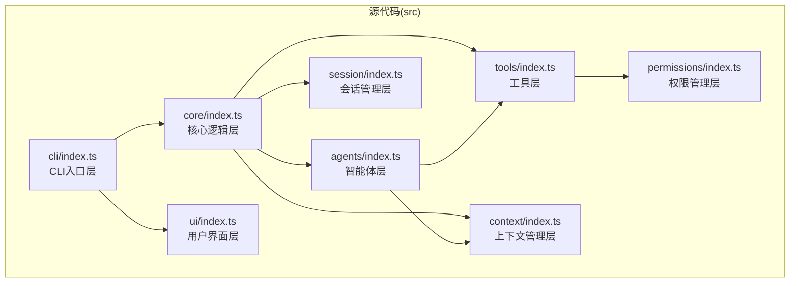
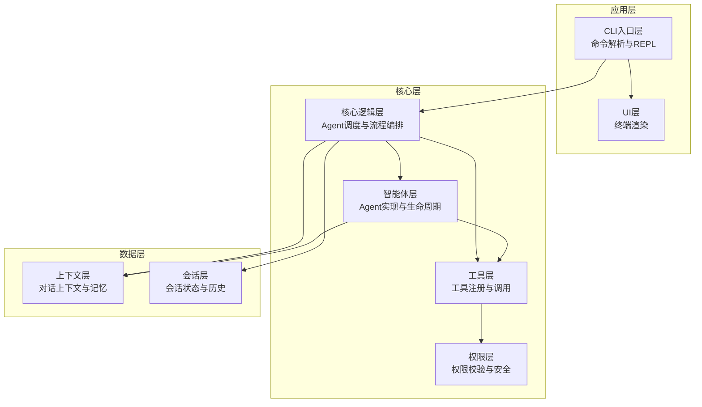
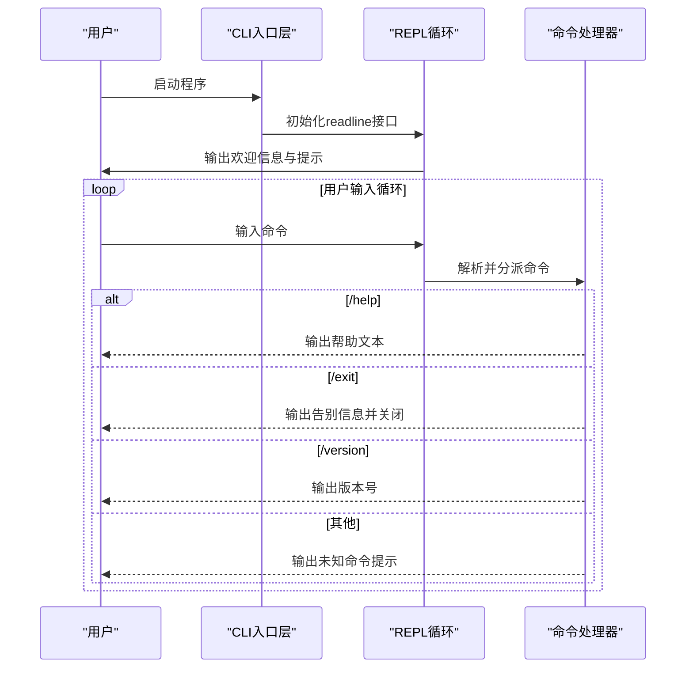
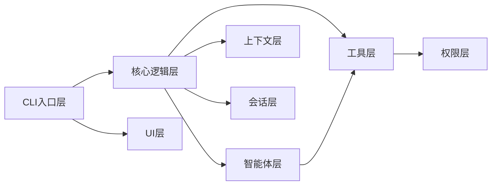

# 项目概述

<cite>
**本文档引用的文件**
- [README.md](file://README.md)
- [package.json](file://package.json)
- [tsconfig.json](file://tsconfig.json)
- [AGENTS.md](file://AGENTS.md)
- [src/cli/index.ts](file://src/cli/index.ts)
- [src/core/index.ts](file://src/core/index.ts)
- [src/agents/index.ts](file://src/agents/index.ts)
- [src/context/index.ts](file://src/context/index.ts)
- [src/session/index.ts](file://src/session/index.ts)
- [src/tools/index.ts](file://src/tools/index.ts)
- [src/ui/index.ts](file://src/ui/index.ts)
- [src/permissions/index.ts](file://src/permissions/index.ts)
</cite>

## 目录
1. [引言](#引言)
2. [项目结构](#项目结构)
3. [核心组件](#核心组件)
4. [架构总览](#架构总览)
5. [详细组件分析](#详细组件分析)
6. [依赖关系分析](#依赖关系分析)
7. [性能考量](#性能考量)
8. [故障排查指南](#故障排查指南)
9. [结论](#结论)
10. [附录](#附录)

## 引言
easy-agent-cli 是一个基于 TypeScript + Node.js 的轻量级命令行智能体工具，旨在提供简洁、可扩展且易于维护的 CLI 智能体解决方案。项目采用分层架构设计，支持多轮对话与工具调用，当前已实现基础 REPL 交互与命令路由，为后续扩展智能体能力、工具系统与权限控制奠定基础。

项目定位：
- 轻量级：以最小必要功能起步，降低学习与使用成本
- 可扩展：分层模块化设计，便于按需扩展智能体、工具与 UI
- 易维护：严格的依赖方向与编码规范，确保代码质量与演进稳定性

## 项目结构
项目采用“按层组织”的目录结构，每个层级通过独立的 index.ts 文件统一导出公共 API，内部实现文件不直接对外暴露，形成清晰的边界与职责划分。

图表来源
- [AGENTS.md:15-27](file://AGENTS.md#L15-L27)
- [src/cli/index.ts:1-65](file://src/cli/index.ts#L1-L65)
- [src/core/index.ts:1-2](file://src/core/index.ts#L1-L2)
- [src/agents/index.ts:1-2](file://src/agents/index.ts#L1-L2)
- [src/tools/index.ts:1-2](file://src/tools/index.ts#L1-L2)
- [src/context/index.ts:1-2](file://src/context/index.ts#L1-L2)
- [src/session/index.ts:1-2](file://src/session/index.ts#L1-L2)
- [src/ui/index.ts:1-2](file://src/ui/index.ts#L1-L2)
- [src/permissions/index.ts:1-2](file://src/permissions/index.ts#L1-L2)

章节来源
- [AGENTS.md:15-27](file://AGENTS.md#L15-L27)
- [AGENTS.md:29-42](file://AGENTS.md#L29-L42)

## 核心组件
- CLI 入口层（cli）：负责命令解析、REPL 交互与基础命令路由，当前包含帮助、退出、版本等基础命令。
- 核心逻辑层（core）：作为 Agent 调度与流程编排中心，协调智能体、工具、上下文与会话等模块。
- 智能体层（agents）：定义 Agent 的实现与生命周期管理，依赖工具与上下文。
- 工具层（tools）：内置工具与工具注册机制，依赖权限层进行调用校验。
- 上下文管理层（context）：管理对话上下文与记忆，关注 Token 限制。
- 会话管理层（session）：管理会话状态与历史，考虑持久化场景。
- 用户界面层（ui）：终端渲染与格式化输出。
- 权限管理层（permissions）：工具调用权限与安全策略。

章节来源
- [AGENTS.md:29-42](file://AGENTS.md#L29-L42)
- [src/cli/index.ts:6-19](file://src/cli/index.ts#L6-L19)
- [src/cli/index.ts:23-59](file://src/cli/index.ts#L23-L59)

## 架构总览
项目采用严格的“上层依赖下层”的分层架构，确保依赖方向清晰、模块边界明确。CLI 层仅负责命令路由与交互，核心逻辑层承担调度与编排，工具与权限层提供能力与安全保障，上下文与会话层支撑对话记忆与状态管理。

图表来源
- [AGENTS.md:29-42](file://AGENTS.md#L29-L42)
- [src/cli/index.ts:1-65](file://src/cli/index.ts#L1-L65)

## 详细组件分析

### CLI 入口层（REPL 交互）
- 职责：提供命令行交互入口，支持帮助、退出、版本等基础命令；当前未接入核心调度与工具调用。
- 关键点：使用 readline/promises 构建 REPL 循环，对空输入进行跳过处理，统一错误捕获与退出流程。
- 当前能力：基础命令路由与提示信息输出。

图表来源
- [src/cli/index.ts:23-59](file://src/cli/index.ts#L23-L59)

章节来源
- [src/cli/index.ts:1-65](file://src/cli/index.ts#L1-L65)

### 核心逻辑层（core）
- 职责：作为 Agent 调度与流程编排中心，协调智能体、工具、上下文与会话模块。
- 设计原则：遵循“上层依赖下层”的依赖方向，避免反向依赖破坏模块边界。
- 当前状态：占位文件，具体实现将在后续迭代中完善。

章节来源
- [src/core/index.ts:1-2](file://src/core/index.ts#L1-L2)
- [AGENTS.md:29-42](file://AGENTS.md#L29-L42)

### 智能体层（agents）
- 职责：定义 Agent 的实现与生命周期管理，依赖工具与上下文完成任务执行。
- 设计原则：与工具层、上下文层松耦合，通过统一接口进行协作。
- 当前状态：占位文件，后续将实现具体 Agent 类型与注册机制。

章节来源
- [src/agents/index.ts:1-2](file://src/agents/index.ts#L1-L2)
- [AGENTS.md:29-42](file://AGENTS.md#L29-L42)

### 工具层（tools）
- 职责：内置工具与工具注册机制，提供可复用的能力集合。
- 安全约束：工具调用必须经过权限层校验，确保安全可控。
- 当前状态：占位文件，后续将实现具体工具与注册表。

章节来源
- [src/tools/index.ts:1-2](file://src/tools/index.ts#L1-L2)
- [AGENTS.md:29-42](file://AGENTS.md#L29-L42)

### 上下文管理层（context）
- 职责：管理对话上下文与记忆，关注 Token 限制与上下文压缩策略。
- 设计原则：与智能体层解耦，仅提供上下文构建与查询能力。
- 当前状态：占位文件，后续将实现上下文存储与优化。

章节来源
- [src/context/index.ts:1-2](file://src/context/index.ts#L1-L2)
- [AGENTS.md:29-42](file://AGENTS.md#L29-L42)

### 会话管理层（session）
- 职责：管理会话状态与历史，考虑持久化场景以提升用户体验。
- 设计原则：与核心层解耦，提供会话创建、更新、查询与持久化接口。
- 当前状态：占位文件，后续将实现会话存储与恢复。

章节来源
- [src/session/index.ts:1-2](file://src/session/index.ts#L1-L2)
- [AGENTS.md:29-42](file://AGENTS.md#L29-L42)

### 用户界面层（ui）
- 职责：终端渲染与格式化输出，提供一致的交互体验。
- 设计原则：与 CLI 层配合，专注于输出格式与终端适配。
- 当前状态：占位文件，后续将实现主题、样式与响应式输出。

章节来源
- [src/ui/index.ts:1-2](file://src/ui/index.ts#L1-L2)
- [AGENTS.md:29-42](file://AGENTS.md#L29-L42)

### 权限管理层（permissions）
- 职责：工具调用权限与安全策略，确保工具调用符合预设规则。
- 设计原则：独立于业务逻辑，提供统一的权限校验接口。
- 当前状态：占位文件，后续将实现权限模型与策略配置。

章节来源
- [src/permissions/index.ts:1-2](file://src/permissions/index.ts#L1-L2)
- [AGENTS.md:29-42](file://AGENTS.md#L29-L42)

## 依赖关系分析
- 依赖方向：上层可依赖下层，下层不可依赖上层；同层之间尽量避免直接依赖。
- 关键依赖链：
  - CLI → 核心逻辑层 → 智能体层 → 工具层 → 权限层
  - 核心逻辑层 → 上下文层、会话层
  - CLI → UI 层
- 依赖可视化：

图表来源
- [AGENTS.md:29-42](file://AGENTS.md#L29-L42)

章节来源
- [AGENTS.md:29-42](file://AGENTS.md#L29-L42)

## 性能考量
- 启动与交互：REPL 循环基于 readline/promises，建议在大规模输出时启用缓冲与节流策略，避免阻塞主线程。
- 上下文与 Token：上下文层需关注 Token 限制，建议实现上下文压缩与截断策略，减少无效信息占用。
- 会话持久化：会话层应考虑异步写入与批量提交，降低磁盘 IO 压力。
- 工具调用：工具层调用需进行权限校验，建议缓存权限结果以减少重复计算。
- 构建与运行：ESM + NodeNext 配置带来更好的模块化与类型推断，建议在生产环境开启声明文件与 source map 以便调试。

## 故障排查指南
- CLI 启动异常
  - 症状：启动时报错或无法进入 REPL。
  - 排查：检查 Node.js 版本是否满足要求，确认 ESM 配置正确。
  - 参考：[package.json:10-14](file://package.json#L10-L14)，[tsconfig.json:3-5](file://tsconfig.json#L3-L5)
- REPL 无响应
  - 症状：输入命令后无输出或卡死。
  - 排查：确认 readline 接口初始化成功，检查命令分支逻辑与异常捕获。
  - 参考：[src/cli/index.ts:23-59](file://src/cli/index.ts#L23-L59)
- 权限校验失败
  - 症状：工具调用被拒绝。
  - 排查：确认权限层策略配置，检查工具注册与调用路径。
  - 参考：[AGENTS.md:95-101](file://AGENTS.md#L95-L101)，[src/permissions/index.ts:1-2](file://src/permissions/index.ts#L1-L2)
- 构建失败
  - 症状：tsc 编译报错或产物缺失。
  - 排查：检查 tsconfig.json 配置，确认路径映射与模块解析设置。
  - 参考：[tsconfig.json:17-20](file://tsconfig.json#L17-L20)，[package.json:10-14](file://package.json#L10-L14)

章节来源
- [src/cli/index.ts:61-64](file://src/cli/index.ts#L61-L64)
- [AGENTS.md:95-101](file://AGENTS.md#L95-L101)
- [tsconfig.json:17-20](file://tsconfig.json#L17-L20)

## 结论
easy-agent-cli 以“轻量、可扩展、易维护”为核心目标，采用分层架构与严格的依赖方向，为 CLI 智能体提供了清晰的演进路径。当前已实现基础 REPL 交互与命令路由，后续可在核心逻辑层引入智能体调度、工具注册与权限校验，并完善上下文与会话管理，逐步实现多轮对话与工具调用能力。

## 附录

### 技术栈与配置
- 语言与运行时：TypeScript 5.5+，Node.js 20+
- 模块系统：ESM（"type": "module"）
- 构建工具：tsc
- 开发工具：tsx（热重载）
- 路径别名：@/* -> src/*

章节来源
- [AGENTS.md:7-14](file://AGENTS.md#L7-L14)
- [package.json:26-30](file://package.json#L26-L30)
- [tsconfig.json:17-20](file://tsconfig.json#L17-L20)

### 开发与运行命令
- 安装依赖：npm install
- 开发模式（热重载）：npm run dev
- 构建：npm run build
- 运行构建产物：npm start

章节来源
- [AGENTS.md:68-82](file://AGENTS.md#L68-L82)
- [package.json:10-14](file://package.json#L10-L14)

### 项目发展路线图与未来规划
- 短期目标（v0.x）
  - 完善核心逻辑层：实现 Agent 调度与流程编排
  - 增强 CLI 功能：支持更多命令与参数解析
  - 完成上下文与会话层：实现上下文管理与会话持久化
- 中期目标（v1.x）
  - 工具系统：实现工具注册、调用与权限校验
  - UI 层：终端渲染与格式化输出
  - 插件化：支持外部插件与扩展
- 长期目标（v2.x+）
  - 多 Agent 协作：支持多智能体协同与任务编排
  - 云端集成：支持远程工具与模型服务
  - 生态建设：提供 SDK 与示例项目

章节来源
- [AGENTS.md:3-5](file://AGENTS.md#L3-L5)
- [AGENTS.md:29-42](file://AGENTS.md#L29-L42)